# Day 3 - Computer Compression Algorithms

Friday - August 26, 2022

In the previous lecture we looked at the 4 elements of computational thinking, which included **Algorithm Design**.

We'll explore algorithms by looking at file compression and [sorting cards](https://deck.of.cards/old/).

## Algorithms

An **algorithm** is a set of well defined steps or rules that if followed will yield a pre-determined result.
In other words, it's a recipe.

Computers can only execute a small set of instructions. Therefore it's important to tell them **exactly** what to do.

The [game we created in the previous class](https://makecode.com/_VeKVRoYrzTxm) is an example of an **algorithm**.

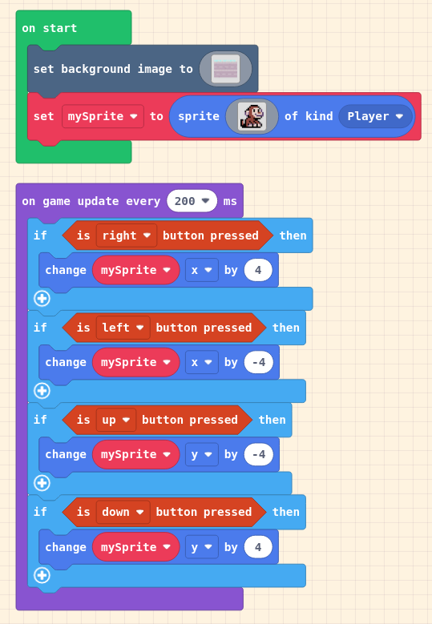


### Card Sorting Algorithms

There is a subset of Computer Science that studies the sorting algorithms (speed, memory usage, complexity, etc).

Below are two of these sorting algorithms:

- Insertion-sort
- Select-sort

To illustrate these algorithms, let's sort [a deck of cards](https://deck.of.cards/old/).

> We'll briefly look at insertion-sort and select-sort as examples of algorithms.
> **You will not be tested** on the details of how these algorithms work.

#### Insertion-sort

1. Loop over all cards, starting with the first card.
2. At each position, consider the card's value.
3. Move the card to the left until it is in the correct position*.
4. "Correct position" means its value is more than the card to its left and less than the card to its right.

Below is a dance enacting insertion-sort. 

<iframe width="560" height="315" src="https://www.youtube.com/embed/ROalU379l3U" title="YouTube video player" frameborder="0" allow="accelerometer; autoplay; clipboard-write; encrypted-media; gyroscope; picture-in-picture" allowfullscreen></iframe>

#### Selection-sort

1. Select the first card and note its value.
2. Loop over all cards.
3. If a card is found whose value is lower than the selected card (step 1), swap the cards.
4. Select the next card in the sequence.
5. Repeat steps 2 to 4 until all cards are sorted.

Below is a dance enacting selection-sort:

<iframe width="560" height="315" src="https://www.youtube.com/embed/Ns4TPTC8whw" title="YouTube video player" frameborder="0" allow="accelerometer; autoplay; clipboard-write; encrypted-media; gyroscope; picture-in-picture" allowfullscreen></iframe>


The next algorithm we'll look at is used in the compression of files. 

## Creating a zip file

### Why?

Program and data files are getting larger and larger as computer storage becomes cheaper and cheaper. However, copying files from one location to another can take a long time.

By 'zipping' or compressing a file, we can reduce the overall size of the file, without losing any information. This will not only reduce the required storage space for the file, but also speed up information transfer (such as a web page being loaded into the browser).

### How?

There are many different ways and utilities used to create a compressed file (`zip`, `7zip`, `gzip`, `rar`, `pkzip`, `gif` etc).  The different applications may use different algorithms, where one algorithm is better for text, some for pictures, etc.

On Windows 10, the easiest way to compress a file (or files) is to:

1. open `file explorer` and select the file (or files, or folder) that you want to compress
2. Right click on your selection
3. Choose `send to` and then `compressed (zipped) folder`.
- Note that you can use `7zip`, but it is not installed on Windows or MAC by default. There's a risk that the person you are sending your files to may not be able to access the data.

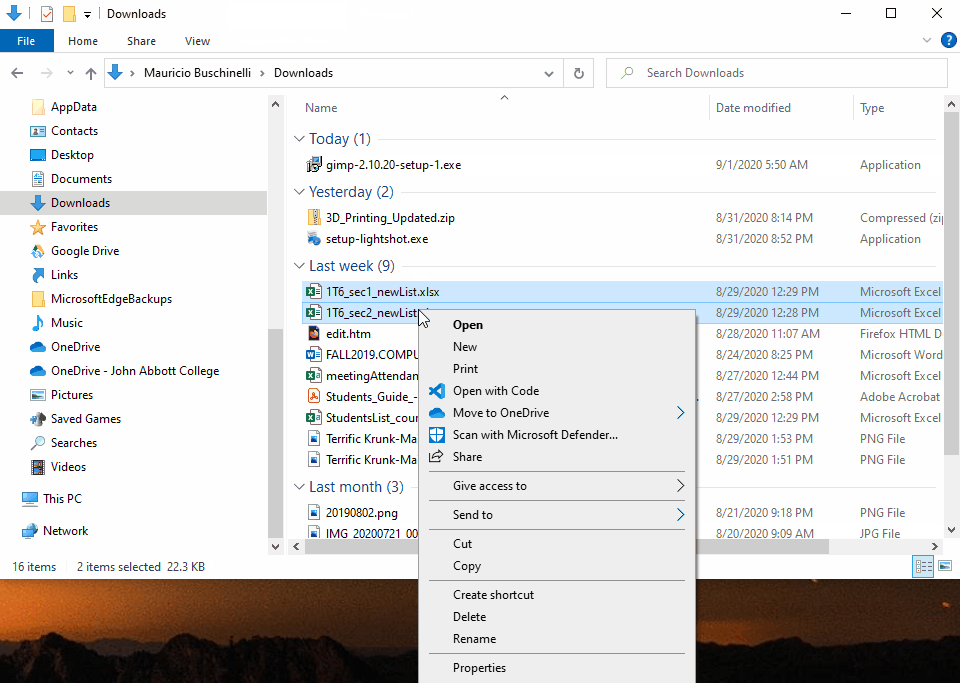


On a MAC, the easiest way to compress a file (or files) is to

* open `Finder` and select the file (or files, or folder) that you want to compress
* Right click on your selection
* Select `compress`
* A zip file containing all of the contents of your files will be created

On a MAC, more advanced options, use the command line

* open a terminal window
* use the `zip` command
  * To see all of the various options, type `man zip` on the command line


## Huffman Compression Algorithm

The following lyric is 21 characters long.

> i will sing a lullaby  

To transmit this lyric from one computer to another, we would need to use one *byte* (8 bits) per character.

So the number of bits that would need to be sent ( ```21 * 8```)  which is **168** bits

### Goal

Is there any way we can compress this to fewer bits? Bandwidth along a wire is a resource, and I want to: **minimize the required number of bits**.

Let’s use **Huffman Codes** and see what happens:


#### Creating the tree

**Step 1**: Write out frequency table of each unique character

| The unique character | Number of times it appears in the string |
| ---------------------| --------------- --------------------- |
| i                               | 3 |
| “ “ (*blank space character*) | 4 |
| w                               | 1 |
| l                               | 5 |
| s                               | 1 |
| n                               | 1 |
| g                               | 1 |
| a                               | 2 |
| u                               | 1 |
| b                               | 1 |
| y                               | 1 |

**Step 2:**

Sort the table by frequency (the number of times the letter appears, from least frequency to most frequency)

| Character                       | Frequency |
| ------------------------------- | --------- |
| w                               | 1         |
| s                               | 1         |
| n                               | 1         |
| g                               | 1         |
| u                               | 1         |
| b                               | 1         |
| y                               | 1         |
| a                               | 2         |
| i                               | 3         |
| “ “ ….the blank space character | 4         |
| l                               | 5         |

**Step 3**:

Use a notepad and paper, or any on-line writing web app (example: [a whiteboard application](https://miro.com/) )

Build a “tree” for each character, combining the lowest frequency characters together – you must prioritize untouched trees.

> This step is broken down into smaller steps below.

 For a detailed description, see [Huffman coding on Wikipedia](https://en.wikipedia.org/wiki/Huffman_coding#Basic_technique)

**Step 3.1**

* Merge the least two frequent letters together (in this case 'w' and 's') and add the frequency together
   (`1 + 1 = 2`).
* Resort your table

| Character                       | Frequency |
| ------------------------------- | --------- |
| n                               | 1         |
| g                               | 1         |
| u                               | 1         |
| b                               | 1         |
| y                               | 1         |
| a                               | 2         |
| **sw**                          | **2**     |
| i                               | 3         |
| “ “ ….the blank space character | 4         |
| l                               | 5         |

* We now have that '**sw**' is called twice.  

* Create a partial tree for '**sw**'.

  The *root* is 'sw', and from it, we branch to left to '**s**' and right to '**w**'. Label the branch that goes 'left' as ```0``` and the branch that goes right as ```1```

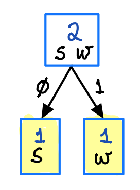

**Step 3.2**

* Repeat the last process with your new table. Merge the least two frequent letters together (in this case 'n' and 'g') and add the frequency together
  (`1 + 1 = 2`).
* Resort your table

| Character                       | Frequency |
| ------------------------------- | --------- |
| u                               | 1         |
| b                               | 1         |
| y                               | 1         |
| a                               | 2         |
| sw                              | 2         |
| **gn**                          | **2**     |
| i                               | 3         |
| “ “ ….the blank space character | 4         |
| l                               | 5         |

* We now have that '**gn**' is called twice.  

* Create a partial tree for '**gn**'.

  The *root* is 'gn', and from it, we branch left to '**g**' and right to '**n**'. Label the branch that goes 'left' as ```0``` and the branch that goes right as ```1```

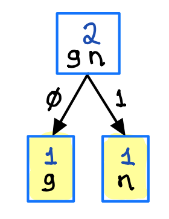

**Step 3.3 - 3.4**

* Repeat the last process for 'u' and 'b', then for 'y' and 'a'

| Character                       | Frequency |
| ------------------------------- | --------- |
| y                               | 1         |
| a                               | 2         |
| sw                              | 2         |
| gn                              | 2         |
| **bu**                          | **2**     |
| i                               | 3         |
| “ “ ….the blank space character | 4         |
| l                               | 5         |


| Character                       | Frequency |
| ------------------------------- | --------- |
| sw                              | 2         |
| gn                              | 2         |
| bu                              | 2         |
| i                               | 3         |
| **ay**                          | **3**     |
| “ “ ….the blank space character | 4         |
| l                               | 5         |

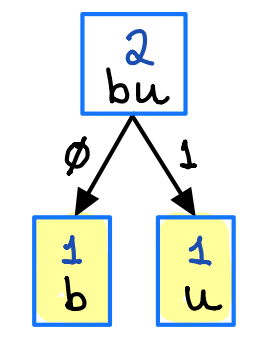

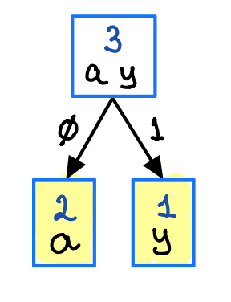


**Step 3.5**

* Merge the least two frequent letters (or groups of letters) together (in this case 'ws' and 'gn') and add the frequency together
   (`2 + 2 = 4`).
* Resort your table

| Character                       | Frequency |
| ------------------------------- | --------- |
| bu                              | 2         |
| i                               | 3         |
| ay                              | 3         |
| **gnws**                        | **4**     |
| “ “ ….the blank space character | 4         |
| l                               | 5         |


* We now have that '**gnsw**' is called four times.  

* Create a partial tree for '**gnsw**', using the partial trees 'gn' and 'sw' at their appropriate places.

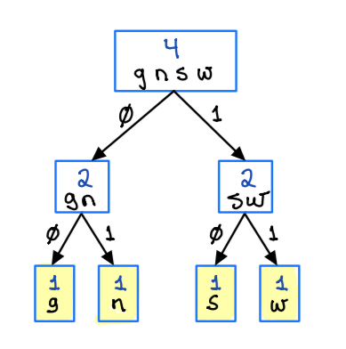

[//]: <> "            gnsw                  "
[//]: <> "         0/      \1                "
[//]: <> "         sw       gn  "
[//]: <> "       0/ \1    0/ \1   "
[//]: <> "       g    n  s     w "

**Step 3.6**

* Merge the least two frequent letters (or groups of letters) together (in this case 'bu' and 'i') and add the frequency together
   (`2 + 3 = 5`).
* Resort your table

| Character                       | Frequency |
| ------------------------------- | --------- |
| ay                              | 3         |
| “ “ ….the blank space character | 4         |
| gnws                            | 4         |
| l                               | 5         |
| **ibu**                         | **5**     |

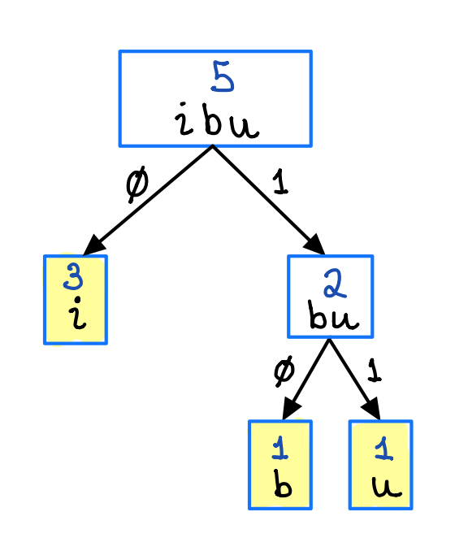

[//]: <> "        GRAPH TREE               "
[//]: <> "                                 "
[//]: <> "            ibu                  "
[//]: <> "         0/      \1              "
[//]: <> "          i       bu             "
[//]: <> "                0/ \1            "
[//]: <> "               b     u           "

**Step 3.7**

* Merge the least two frequent letters (or groups of letters) together (in this case 'ay' and '*space*') and add the frequency together
   (`3 + 4 = 7`).
* Resort your table

| Character                       | Frequency |
| ------------------------------- | --------- |
| gnws                            | 4         |
| l                               | 5         |
| ibu                             | 5         |
| **" " ay**                      | **7**     |

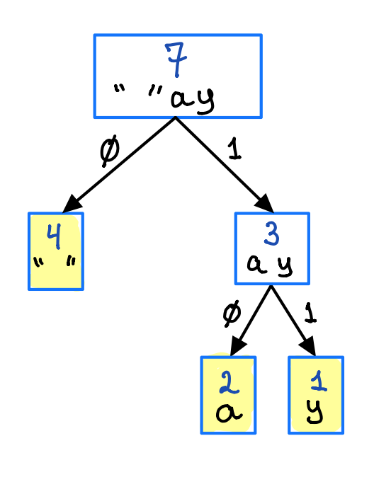

[//]: <> "        GRAPH TREE               "
[//]: <> "                                 "
[//]: <> "           ' 'ay                  "
[//]: <> "         0/      \1               "
[//]: <> "        ' '       ay              "
[//]: <> "                0/ \1             "
[//]: <> "               a     y            "

**Step 3.8**

* Merge the least two frequent letters (or groups of letters) together (in this case 'gnsw' and 'l') and add the frequency together
   (`4 + 5 = 9`).
* Resort your table

| Character                       | Frequency |
| ------------------------------- | --------- |
| ibu                             | 5         |
| " " ay                          | 7         |
| **lgnws**                       | **9**     |

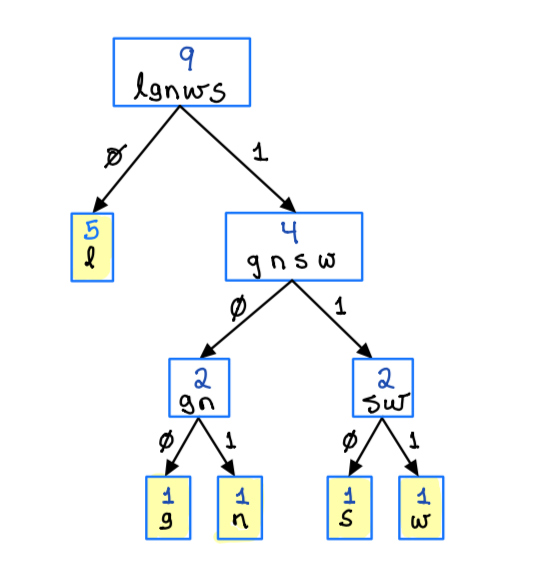

[//]: <> "            GRAPH TREE               "
[//]: <> "                                     "
[//]: <> "              lgnws                  "
[//]: <> "           0/      \1                "
[//]: <> "           l        gnsw             "
[//]: <> "                 0/      \1          "
[//]: <> "                 gn       sw         "
[//]: <> "               0/ \1    0/ \1        "
[//]: <> "               g    n  s     w       "


**Step 3.9**

* Merge the least two frequent letters (or groups of letters) together (in this case 'ibu' and ' " " ay') and add the frequency together
   (`5 + 7 = 12`).
* Resort your table

| Character                       | Frequency |
| ------------------------------- | --------- |
| lgnws                           | 9         |
| **" " ayibu**                   | **12**    |


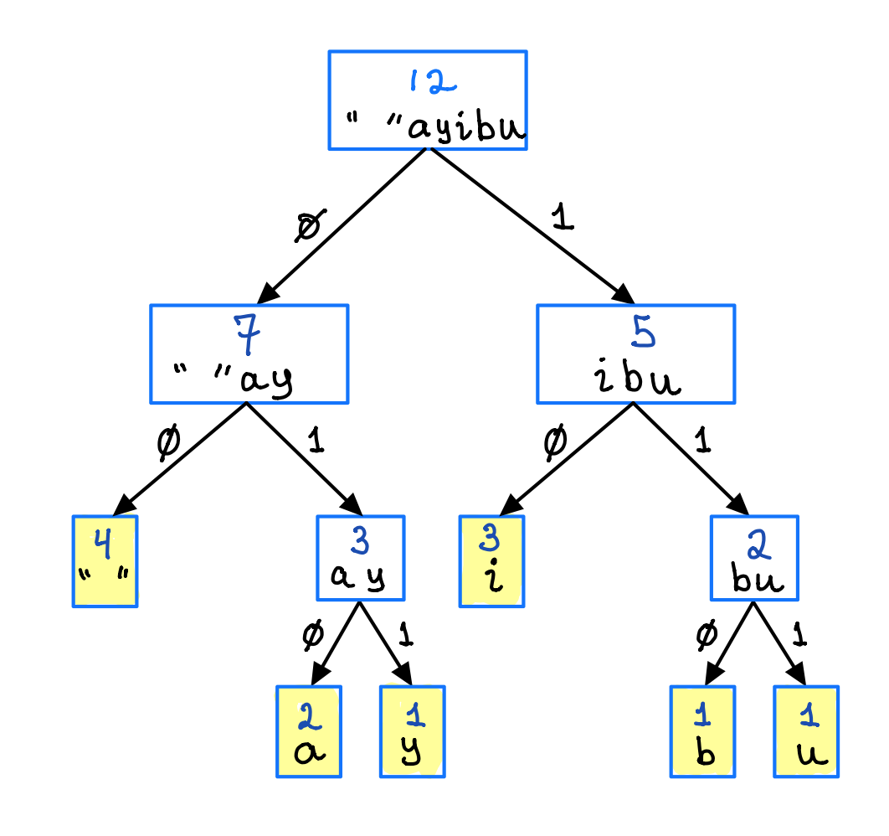

[//]: <> "                  GRAPH TREE               "
[//]: <> "                                           "
[//]: <> "                  ' 'ayibu                 "
[//]: <> "             0/              \1            "
[//]: <> "         ' 'ay                  ibu        "
[//]: <> "       0/      \1           0/      \1     "
[//]: <> "      ' '       ay           i       bu    "
[//]: <> "              0/ \1                 0/ \1  "
[//]: <> "             a     y               b     u "


**Step 3.10**

* Finally, merge 'lgnws', and ' " " ayibu'.


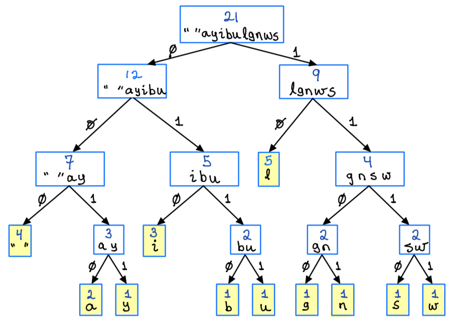

[//]: <> "                  GRAPH TREE                            "
[//]: <> "                                                        "
[//]: <> "                    ' 'ayibulgnws                       "
[//]: <> "               0/                    \1                 "
[//]: <> "            ' 'ayibu                 lgnws              "
[//]: <> "       0/            \1            0/      \1           "
[//]: <> "    ' 'ay           ibu            l        gnsw        "
[//]: <> "  0/      \1     0/      \1              0/      \1     "
[//]: <> " ' '       ay     i       bu             gn       sw    "
[//]: <> "         0/ \1           0/ \1         0/ \1    0/ \1   "
[//]: <> "       a     y          b     u        g    n  s     w  "


#### Creating the dictionary

**Step 4:**

Create bit patterns based on how you "walk" through the tree to your character.

Start at the top node, then as you 'walk' the tree, keep track of where you are going by using ```Left = 0```, ```Right = 1```

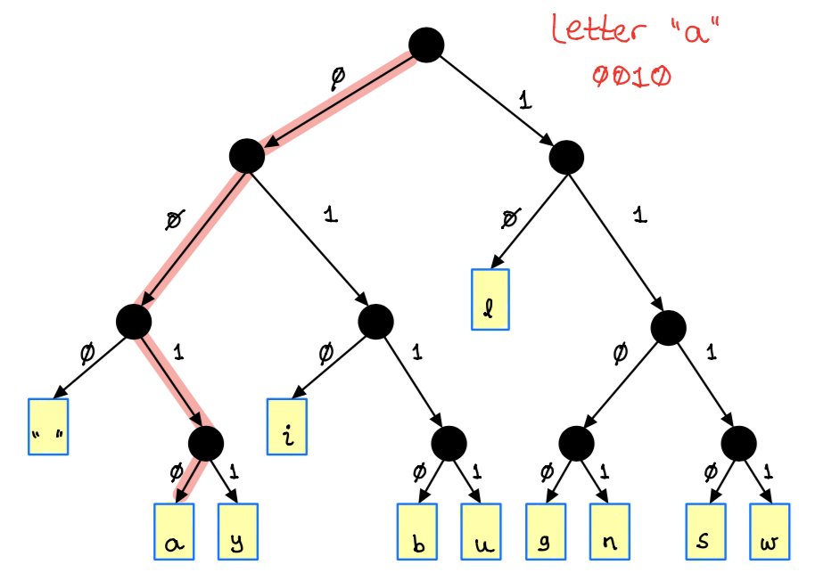

[//]: <> "                  GRAPH TREE                            "
[//]: <> "                                                        "
[//]: <> "                          /\                       "
[//]: <> "               0/                    \1                 "
[//]: <> "       /        \                    /\              "
[//]: <> "     0/          \1            0/      \1           "
[//]: <> "     /\          /\            l       /\        "
[//]: <> "  0/    \1     0/  \1              0/      \1     "
[//]: <> " ' '    /\     i   /\              /\      /\    "
[//]: <> "      0/  \1     0/  \1   0/ \1    0/ \1   "
[//]: <> "     a     y     b    u   g    n  s     w  "


```
" " (space) = left, left, left = 000
a = 0010
y = 0011
i = 010
b = 0110
u = 0111
l = 10
g = 1100
n = 1101
s = 1110
w = 1111
```

This is the new "dictionary" created with huffman codes and based on the frequencies of characters in the document.

High frequency characters are given low number of bits. Also notice that low frequency characters are given a lot of bits.

So the text:

> i will sing a lullaby

Becomes:

```
i   ' '    w    i   l  l   ' '   s    i    n    g
010 000   1111 010 10 10   000  1110 010  1101 1100 
```

And so forth...

#### Thoughts

So if you “compress” a piece of English Literature – the “space” would probably be given 3 or 4 bits, as would the “e”, “a” and other high frequency letters. Note that the “q” *could (and probably would) be longer than it’s original 8 bit ASCII.*  

This explains why certain things (like documents) compress really well – there are recurring pattern, and why some images do not compress well. Databases compress very well because there is a lot of blank spaces in them.


#### Sending the data

Notice also that when you send your bit string across, you MUST SEND YOUR DICTIONARY across as well!! If you lose your dictionary, your compressed data is UNDECODEABLE.  A virus or other malicious program simply has to target your “dictionary” and GB of data could be wiped out and undecipherable.

## Lab Exercise (optional)

Compress the text below using Hoffman encoding:

> laa dee daa dee daa
