# 04: Visual Studio

Many tools are required to create a program.  So many in fact, that the standard required tools are typically bundled together into one single program... the IDE.

## IDE - Integrated Development Environment

An **Integrated Development Environment** is a toolbox, it combines most of the tools a developer would in their workflow - text editor, compiler, debugger, project explorer, etc. 

IDE's are designed to improve **development experience (DX)** and tend to do things such as *remembering* which files were open, custom keyboard shortcuts, etc. You will notice that its editor is "smart". Think of the IDE as a workshop full of tools, where you create, edit, run, manage your program.

Examples of IDE's:

- [Visual Studio](https://visualstudio.microsoft.com/downloads/) is a professional-grade IDE developed and used by Microsoft.
- [Visual Studio Code](https://code.visualstudio.com/) open-source, super extensible, (not the same thing as Visual Studio),
- [IntelliJ](https://www.jetbrains.com/idea/)


## Visual Studio

**Microsoft Visual Studio** is an [integrated development environment](https://en.wikipedia.org/wiki/Integrated_development_environment) (IDE) from [Microsoft](https://en.wikipedia.org/wiki/Microsoft).

We'll use Visual Studio for C# programs. You can download Visual Studio [here](https://visualstudio.microsoft.com/downloads/). The 'community' edition is free and lighter (does not includes unnecessary advanced tools).

### Installation at home

When installing Visual Studio, it will what components you actually need. To save space on your computer, choose to only install what you need for this course (the rest can be installed later)

All you need for now is: `.NET desktop development`.

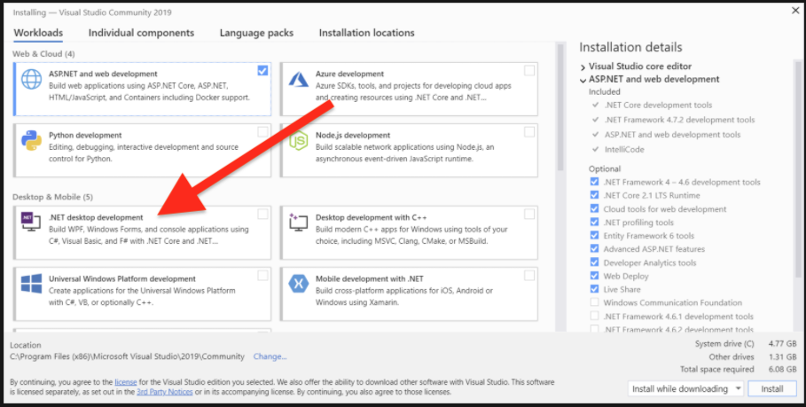

> For **detailed install instructions** follow official guides by Microsoft:
> 
> - [Install Visual Studio for **Windows**](https://docs.microsoft.com/en-us/visualstudio/install/install-visual-studio?view=vs-2022)
> - [Install Visual Studio for **Mac**](https://docs.microsoft.com/en-us/visualstudio/mac/installation?view=vsmac-2022)

If you installed Visual Studio but did not select the correct "workload" (see image above), see the official documentation for how to [Modify Visual Studio workloads, components, and language packs](https://docs.microsoft.com/en-us/visualstudio/install/modify-visual-studio?view=vs-2022).


### Starting Visual Studio

To run visual studio, just type Visual Studio into the Windows search bar (on MAC, command shift to get the search bar).

> Make sure you select 'Visual Studio', and NOT 'Visual Studio Code'

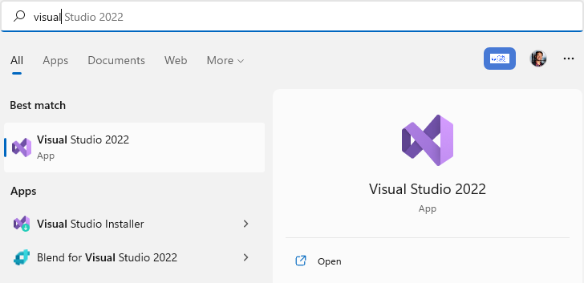


### Create a New Project

Once the Visual Studio has started (may take a bit of time), you will see the welcome screen.

To create a program: choose *Create a new project*.

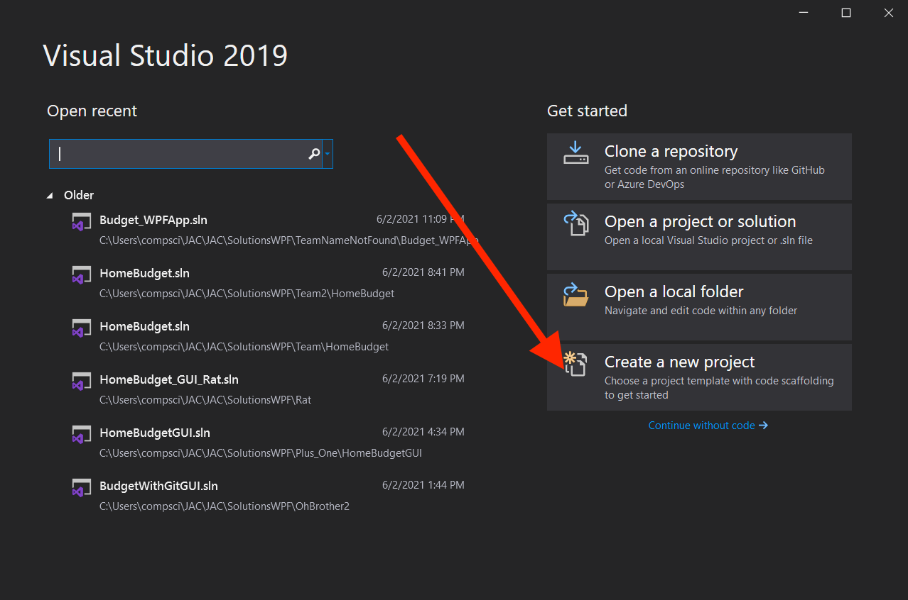

When asked 'what type of project', choose a `C#`, `Windows`, `Console App` project.

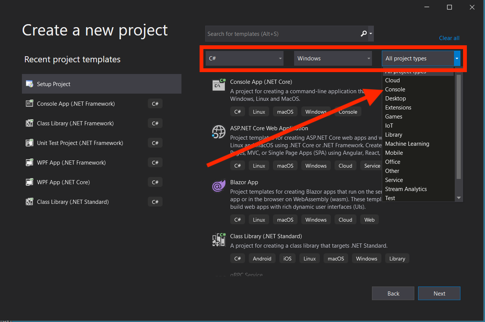

Lastly, you need to give your project a name, and a location where you want the project to saved on your hard drive.

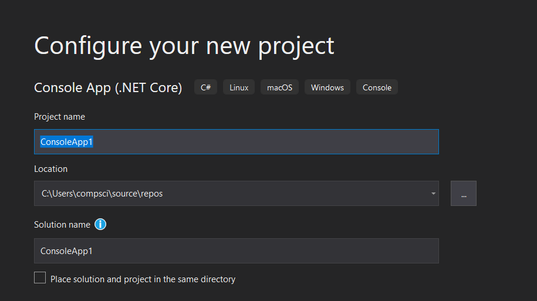


If asked for Additional information:
- Framework: .NET 6
- **Select** "Do not use top-level statements"

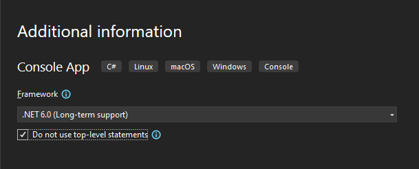


### Project Name Rules !

1.  Do NOT use spaces in the name of your project.
	1. Use the underscore character _ as spaces if you must.
2.  You cannot change the name of your project once it is created (Visual Studio is fussy).
3.  The name of your project should be **meaningful**.

> **Note**: Visual Studio uses the concept of **Solution** and **Project**.
>
> A **Solution** can contain multiple **projects**. However, in this course our solution will always contain only one project and they will have the same name.


## Our First Program

Depending on the exact configuration of Visual Studio, the default program created for your project will look exactly, or similar to, the following:

```csharp
using System;

namespace HelloWorld
{
    class Program
    {
        static void Main(string[] args)
        {
            Console.WriteLine("Hello World!");
        }
    }
}

```

#### Understanding 'Hello World' Code

##### using

```csharp
using System;	
```

The programs that we write must eventually _talk_ to the hardware, via keyboards and screens. To make the developer's life more simple, many common tools are bundled into libraries, where the developer can access this code as necessary.

`using System;` is a fancy way of instructing the compiler into including the code from the `System` library. This library includes many basic tools like the ability to write code to the terminal (command line).

For this course, we will _always_ be using the System library.

##### namespace

```csharp
namespace HelloWorld { ... }
```

At this point it is not necessary to understand what this statement does in detail, but suffice it to say that variable and functions are grouped together in _namespaces_. This allows a developer to re-use certain variable names, as long as they are in different namespaces.

Think of namespaces as a container in order to organize and isolate code.

In the above code, `HelloWorld` is the name of a new namespace that we are creating. The name can be changed if desired.

##### class

```csharp
class Program { ... }
```

C# is an object-orientated programming (OOP) language, which means everything must be in a `class`. Classes is another way of organizing your code into reusable "modules".

What object orientated programming is, and what a `class` is, will be discussed in Programming II. At this point, just consider this required code.

In the above code, `Program` is the class name, and may be changed if desired.

##### static void Main

```csharp
static void Main(string[] args) { ... }
```

This is the main function of our program (functions will be discussed very soon). When the program is first executed, the computer needs to know where to start. The computer _looks for_ the function `Main`, and starts execution at that point. Thus, this is the `entry point` of our program.

The code inside `Main` will be executed first, from top to bottom, line by line.

The `string[] args` says that the function will be called where the variable `args` will include any text that is written when the program is executed (this will be demonstrated in an example later in these notes)

##### Console.WriteLine

```csharp
Console.WriteLine("Hello World!");
```

This line will write to the console/terminal window whatever variable or string is enclosed between the parenthesis (in other words `Hello World!`).

## Submitting  work on LEA

1. Navigate to the folder where you created your project.
2. Be _very_ careful, there are two folders (one within the other) that have the name of your project. One folder is for the *Solution* and one folder is for the *Project*.

You need to look for the 'top level' folder.

The following diagram shows the contents of two folders, one left one being the contents of my `repos` folder, the other being the contents of `repos\ConsoleApp3` folder.

You MUST zip of the `repos\ConsoleApp3` folder, NOT `repos\ConsoleApp3\ConsoleApp3`. If you see a `solution file` in your folder, then you are in the wrong place, and must go up one level and zip and submit the parent folder.

 Inside `ConsoleApp3` => 


### Creating an executable

To create a file that will run our program (an executable), we need to `compile` and `link`. Most IDEs, including Visual Studio, will have a menu option called `build` that will do both tasks.

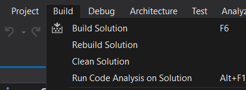

There is a difference between `Build Solution` and `Rebuild Solution`, but both will work equally well for now. **I suggest `Build Solution`.**

### Project file structure

What files have been created?

> The following examples assume that you have set your computer to show filename extensions. If you haven't, you can select "show file extensions" in your file explorer.

After creating your project, your directory structure should look similar to (but not necessarily exactly) the following:

```text
ConsoleApp3 (folder for solution)
   |---- .vs (folder)
   |
   |---- ConsoleApp3 (folder for project)
   |  |---- obj (folder containing object files)
   |  |
   |  |---- bin (folder containing binary files)
   |  |  |---- Debug (folder)
   |  |     |---- netcoreapp3.1 (folder - some people may not have this folder)
   |  |        |---- ConsoleApp3.deps.json (file)
   |  |        |---- ConsoleApp3.dll (file)
   |  |        |---- ConsoleApp3.exe (file - this is the EXECUTABLE)
   |  |        |---- ConsoleApp3.runtimeconfig.dev.json (file)
   |  |        |---- ConsoleApp3.runtimeconfig.json (file)
   |  |
   |  |---- ConsoleApp3.csproj (file)
   |  |---- Program.cs (the source code of your program)
   |
   |---- ConsoleApp3.sln (solution definition file)
```

>  ⚠ When submitting work to LEA, you must zip and submit the solution folder (the top level `ConsoleApp3` folder in the example above).

## Running your program

All you need to run your program is the executable file, found in the `bin\Debug` directory of your solution folder.

The executable is the file named `ProjectName.exe`, where *ProjectName* is the name you gave your project (`ConsoleApp3` in our example).

The executable can be copied and shared with friends. You do _not_ need to have Visual Studio installed to run your programs.

### Running the Program from Visual Studio

Running the program from the command line is a bit of a nuisance while developing your code. Thus, Visual Studio has implemented the ability to run the code from the IDE itself.

There are two simple ways to run your program (shown below):

1. Select `Debug` from the menu, and the select `Start Debugging`, or;
2. Select the button that is showing a little green arrow, followed by the name of your project.

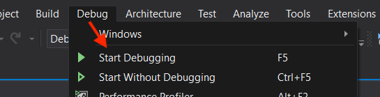

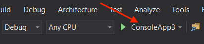


### Running the Program From the Command Line

Running the program from the command line is what actually happens behind the scenes when you click on the play button listed above.

The steps below will 

**Steps**

1.  Open a command window (or terminal, or console)
    
    1.  Example: In Windows search for `cmd` or `PowerShell` in the Windows search bar. For Mac and Linux, open the terminal app.
    
2.  Navigate to the directory where the executable file is
    
    1.  Simple way to do this is to navigate to the directory using file explorer, click in the top entry box that displays the location of the directory/folder, ctrl-c to copy

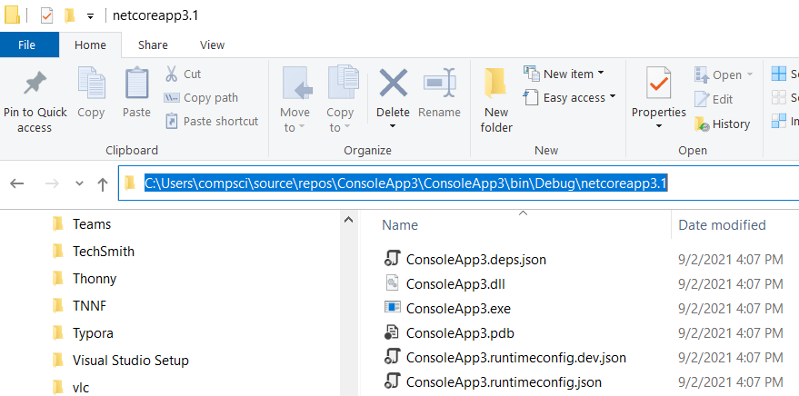

2.  Go to your terminal window, and type `cd`, a space , and then ctrl-v to paste your selection:
    
    ```dos
     cd c:\users\compsci\repos\ConsoleApp3\ConsoleApp3\bin\Debug\netcoreapp3.1
    ```
    
    1.  To confirm that you are in the correct location, type `dir` or `ls` in the terminal, and a list of files in the current directory will be shown.
    
3.  Type the name of the program executable (for Windows, it's the file ending in `.exe`) and hit return/enter.

Voila! You have just run your program.


## Program Output

When running your program from Visual Studio, the results should appear in a console window.

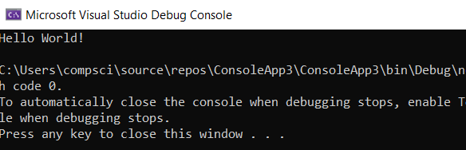

Sometimes the window closes before you can see what is happening. If that occurs, then add the following lines to the to the end of your `main` function

```csharp
Console.Write("\nPress any key to continue... ");
Console.ReadLine();
```

It will then look like...

```csharp
using System;
namespace HelloWorld
{
    class Program
    {
        static void Main(string[] args)
        {
            Console.WriteLine("Hello World!");
            
            // Only add if windows closes too quickly to see output
            Console.Write("\nPress any key to continue... ");
			Console.ReadLine();
        }
    }
}
```


## Solution Explorer

On the top-right of Visual Studio, you should see a panel called the **Solution Explorer**.


This panel will show you all the files included in your solution. From there you can:

- Rename your project
- Delete files
- Open different files in the project
- etc

>To open the Solution Explorer window (if not already not open):
>
	From the Visual Studio menu bar by using **View** > **Solution Explorer**, or by pressing **Ctrl**+**Alt**+**L**.

For more details on the Solution Explorer menu, see the official documentation on [Learn about Solution Explorer](https://docs.microsoft.com/en-us/visualstudio/ide/use-solution-explorer?view=vs-2022).


## Content Review

Would you like review and practice the content of this lesson?

Follow the tutorial below by Microsoft:

- [Write your first C# code](https://docs.microsoft.com/en-us/learn/modules/csharp-write-first/)


## Resources

- Video [Intro to Visual Studio in 5 minutes | Intro to Visual Studio](https://www.youtube.com/watch?v=5AOp8zFu4Vg&list=PLdo4fOcmZ0oWxvt87h9r3uq3uU6pUlCq8&index=1)
<iframe width="560" height="315" src="https://www.youtube.com/embed/5AOp8zFu4Vg" title="YouTube video player" frameborder="0" allow="accelerometer; autoplay; clipboard-write; encrypted-media; gyroscope; picture-in-picture" allowfullscreen></iframe>

- Video ["Hello World" Explained](https://docs.microsoft.com/en-us/shows/csharp-101/csharp-hello-world-explained) by Microsoft C# 101 series
<iframe width="560" height="315" src="https://www.youtube.com/embed/qmZ2RVZ4giY" title="YouTube video player" frameborder="0" allow="accelerometer; autoplay; clipboard-write; encrypted-media; gyroscope; picture-in-picture" allowfullscreen></iframe>
