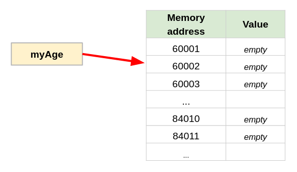
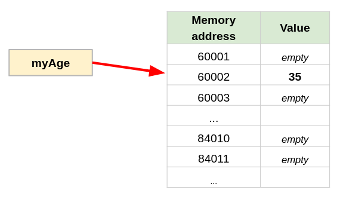
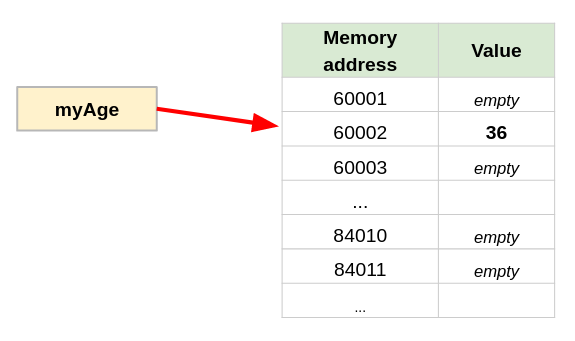

# 05: Variables

## Definition

A variable is a temporary holding place for a value. Think of it as a box that can store **a single** item.

The value inside a variable can be of different types, for example:

- a number, such as the user's hourly pay, or the number of students in a course;
- a word or sentence (aka. a "string"), such as the user's name;
- many other things that we'll visit later...

```csharp
// Number variables
int hourlyPay = 21;
int noStudents = 30;

// String variables
string userName = "Mauricio";
string greeting = "Hello there!";
```


## Variable Names

> 👉 Variable name should be **meaningful**!
>
> Anyone reading your code should be able to guess **what the variable represents** and **how it will be used** just based on the variable name.

Examples: 

* `highScore`
* `hourlyPay`
* `w`

What is `highScore` referring to?
	- It depends on the context but if we are looking at the source code for a game, we would have a good idea of what it holds and what's intended for.

What about `hourlyPay`?
	- Again, it's context dependent, but if we know we are looking at a budgeting app, we can guess it's meaning.

 `w`  is a terrible choice for a variable name.
	 - Only the original developer know what it means.

> 💣 Code submitted with poor variable names will have marks deducted.

There are rules and standards for naming variables.

#### Naming Rules

1. The variable name **cannot** start with a number
2. It may contain letters and numbers after the first character
3. It may contain an '\_' (underscore)
4. It **cannot** contain a ' ' (space), a '#' (hashtag), '!' (exclamation point), or '.' (period)
5. Variable names **cannot** be a ***reserved* word**. 
	- *Reserved* words are special words that the compiler expects to mean certain things internal to the language.
	- The list of reserved words is dependent on the computer language you are using. Example `print` is typically a reserved word for most languages.
	- For a list of reserved words in C#, see the official documentation [C# Keywords](https://docs.microsoft.com/en-us/dotnet/csharp/language-reference/keywords/).

#### Naming Standards

Naming standards are a set of recommended guidelines in naming your variables, functions and classes. In other words, it's a convention.

Naming conventions make it easier for other people to read your code. Remember, reading and modifying code is primary task of a developer (rather than designing).

Naming standards [vary with programming language](https://en.wikipedia.org/wiki/Naming_convention_(programming)) and sometimes within companies. 

##### Multi-word identifier formats

There are many different ways of using two or more words, flattened together into a single variable name. A few of them are shown below.

| Formatting | Name(s)                    |
| ---------- | -------------------------- |
| twoWords   | camelCase                  |
| TwoWords   | PascalCase (UpperCamelCase)|
| two_words  | snake case                 |
| TWOWORDS   | upper flat case (all Caps) |
| TWO_WORDS |  all Caps snake case |
| two-words | kebab-case | 


*Source: [Naming Convention Camel Case, Kebab Case & Snake Case](https://juniortoexpert.com/en/naming-convention/)*

For .NET languages (C# is a .NET language) the Microsoft guidelines recommend the exclusive use of only `PascalCase` and `camelCase`.

- `PascalCase` is used for class names and functions (covered in Programming II).
- `camelCase` is used for variable names and function parameters.
- `ALL_CAPS_SNAKE_CASE` is used for constants (a constant is a variable whose data *never ever* changes. More on this later in the course)

See [Microsoft's Naming Guidelines](https://docs.microsoft.com/en-us/dotnet/standard/design-guidelines/naming-guidelines) for details.

## Declaring Variables

A variable is created the moment it is "declared".

Think of it as a formal "announcement", and from that moment on wards, the variable exists. Another analogy would be the "birth" of a variable.

A variable:
- must be declared before it is used.
- can be declared but not assigned a value.
- must have a unique name (inside the same namespace).

```csharp
// Two variables being declared but not assigned (given) a value:

int noStudents;
string userName;
```


> Behind the scenes your program has a line of code that says "reserve a spot for me to store data please".
> The operating system hears this request and reserves a location in memory specifically for that variable. This location is an address in RAM. 

**Note**: you must assign something to the variable before you can expect to get anything from it.

```csharp
int sandyAge;
int newAge;

newAge = sandyAge + 1; // ERROR!!!, sandyAge has not yet been defined!
```

```csharp
int sandyAge;
int newAge;

sandyAge = 34;         // Assigning it a value
newAge = sandyAge + 1; // No problem! Now we can use it
```

## String and Integer Data Types

 To declare a variable, we must specify what **type of data** we want to store inside it.

For now, we'll focus on the following variable types:

**Integers**: A whole number, signed (positive) or unsigned (negative)
	- Examples: `-10`, `+10`, `10`

**Strings:** A series of characters surrounded by quotes (`"`). In source code, strings are typically wrapped in "double quotes".
	- Examples: `"mauricio"`, `"bob is your uncle"`, `"the number one (1) can often be confused as the letter ell (l)"`

To create a variable, you must specify it's type:

- For a integer, use the keyword `int`
- For a string, use the keyword `string`

> The words `int` and `string` are reserved in C#

The live-cycle of a variable in C# is:

1. Declare it (*only ever declare once, not allowed to be born twice*)
2. Assign it (or define it: give your variable some data)
3. Use it

```csharp
int myScore;                // declaration or birth 
myScore = 2;                // definition or assignment (giving it a value)
myScore = myScore + 10;     // Using the variable. myScore is now 12.
```

> Every time you run your program, the operating system will reserve a place in RAM memory for the variable.
> 
> This place is irrelevant to you since you refer to the variable in a high level language and call it `myScore`. If you run your program tomorrow, the operating system will reserve a different place in RAM, but again, it's irrelevant since you refer to it as `myScore`.


## String Concatenation

String concatenation means **adding strings together**.

> **Concatenate**:  the action of linking things together in a series

In C#, there are multiple ways of concatenating `strings`.

The simplest method is by using the plus (`+`) sign.

```csharp
"Hello" + "World";				// Output: "HelloWorld"
"Hello " + "World";				// Output: "Hello World"
"Hello" + " " + "World";	    // Output: "Hello World"

// Forgot the '+' between the two strings
"Hello" "World";					// ERROR - INVALID SYNTAX

// The plus is inside of the quotes, so is part of the string, so there
// is still no + sign between the two strings
"Hello + " "World";				// ERROR - INVALID SYNTAX

// You cannot have a trailing plus (+) sign.
"Hello " + "World " +	;		// ERROR - INVALID SYNTAX

// Add more than two strings together
"Goodbye"+"Cruel"+"World";      // Output: "GoodbyeCruelWorld"

// Spaces outside of the quotes have no affect on the final string
"Goodbye" + "Cruel" + "World";  // Output: "GoodbyeCruelWorld"

// Spaces inside the quotes become part of the string
"Goodbye    " + "Cruel   " + "World"; // Output: "Goodbye    Cruel   World"
  
```

### Using Variables

A string can be stores inside a variable.

Referring to the variable name will give you access to it's content, in other words, the string stored inside.

Do *not* enclose the variable name within quotes. Anything within quotes is considered a string.

```csharp
string name="Lovelace";

Console.WriteLine("Hello " + name);		// prints "Hello Lovelace"
Console.WriteLine("Hello"   + name);    // prints "HelloLovelace"
Console.WriteLine("Hello + name");		// prints	"Hello + name"
Console.WriteLine("Hello " + "name");	// prints "Hello name"
```

### Bad Way of Mixing `string` and `int` 

Although it is not considered best-practice to mix strings and numbers together, C# can do it with some catches.

```csharp
int age = 35;
string name = "Sandy";

Console.WriteLine("Hello " + name + ", your age is " + 35);
// Prints "Hello Sandy, your age is 35"
```


### Assignment Expressions & Hidden Data Type Conversions

Whenever you have a statement that looks like...

```csharp
variable = something_expression
```

... this is an `assignment` statement. 
 
In `assignment` statements, the right side of the equals sign (`RHS`) is **evaluated first**, and then the result (`value`) is placed inside the `variable`.
 
Here is how the evaluation of the `RHS` happens:

1. The evaluation of the `RHS`  happens from left -> to right.
2. **Inside the `RHS`, if the left element in a operation is a `string`, then both elements are converted to `string` and concatenated.**
3. Once the `RHS` is evaluated, it's value is **assigned to the `LHS`**.


**MAJOR WARNING**

The behaviour of mixing `strings` and `int` types in a statement which includes the `+` operator can be different depending of the construction of the expression (see section above).

```csharp
string output;     // from here on, output is always of type string.

output = "Hello " + (35 + 42);
Console.WriteLine(output);

output = "Hello " + 35 + 52;
Console.WriteLine(output);

output = 35 + 42 + " Hello";
Console.WriteLine(output);

//  OUTPUTS:
//	Hello 77
//	Hello 3552
//	77 Hello
```

### Best Way of Mixing `string` and `int` 

To avoid ambiguity in your code, and to improve the readability of code, use the `ToString()` function to convert any number into a string, **before** using  `+` operators.

```csharp
string output;

output = "Hello " + (35 + 42).ToString();
Console.WriteLine(output);

output = "Hello " + 35.ToString() + 52.ToString();
Console.WriteLine(output);

output = 35.ToString() + 42.ToString() + " Hello";
Console.WriteLine(output);

output = (35 + 42).ToString() + " Hello";
Console.WriteLine(output);

// OUTPUTS:
// Hello 77
// Hello 3552
// 3542 Hello
// 77 Hello
```


## String Interpolation

String interpolation is an efficient way of combining strings with variables.

It follows a specific syntax where everything is surrounded by  `$" "` (dollar sign and double quotes) and variable names are surrounded by `{ }` (curly braces).

The variables get replaced with their contents:

```csharp
string greeting = "Hello";
string firstName = "Mauricio";

Console.WriteLine( $"{greeting} {firstName}!" );  // Output: Hello Mauricio!
```

## Diving Deeper (optional)

### Variable Parsing

Parsing is the act of reading a block of text, breaking it down into smaller parts, and interpreting it.

Here is how variable parsing is interpreted by the compiler:

```csharp
	variable = something_expression
//    (LHS)           (RHS)
```

* Parsing an assignment statement is from **right to left** <--. 
* What is on the right of the equals sign - the right hand side (RHS) - is calculated first.
* The result of the above calculation is saved in the variable, overwriting anything that may have already been there.
* The left hand side (LHS) of an assignment statement must be a variable name. 
* Programs execute statements **one at a time**, from **top to bottom**, in sequence.


#### Analogy for Variable Parsing

The variable name simply becomes an *alias* for a memory location address.

Imagine that the memory (RAM) is just a bunch of boxes with a unique addresses, all lined up in a neat column. Each box can hold a single value and we'll call these boxes the **RAM box**.

When the programmer declares a variable with a name `myAge`, that variable points to a particular address in RAM.

```csharp
int myAge;
```

There is nothing in the box (at least not yet).



---

Want to put the number `35` in the box?  How to do that?  By using an *assignment statement*.

```csharp
myAge = 35;
```

What does the above instruction mean?  

* Firstly: read the instruction from **right to left**. The number `35` is the data.  The equals sign (`=`) doesn't *really* mean equal, it means **assign to**.  

* What is the assigned to?  
	* To the `myAge` box in RAM.  How do we find that box?  We don't care, because the CPU and OS will take care of finding the address of the RAM box that the variable  `myAge` is pointing to.

* Lastly, the number `35` is placed in the `myAge` RAM box.



---

Your birthday has come, and you want to change your age by one year.

Continuing with the analogy...

* Get the current age out of the `myAge` box.
* Whatever value it is, we add one to it.
* Then, put the result back into the `myAge` box.

```csharp
	myAge = myAge + 1;   // this is not a MATH formula! It's variable assignment
//  (LHS)	  (RHS)
```

The code is parsed right to left, starting with the RHS:

1. Parsing RHS:  `myAge + 1`

	- The program recognizes that  `myAge` is a variable, so it gets the number from the `myAge` RAM box, which currently happens to be the number `35`.
	*  `myAge` is thus replaced with the value `35`, the program now needs to parse `35 + 1`
	* The result is calculated to be `36`.

2. Variable assignment:
	- now we have `myAge = 36`.
	- Again, working from right to left, and knowing that the equals sign (`=`) actually means ***assign to***, the computer will place the number `36` into the `myAge` RAM address.




## Exercises

**Exercise 1:** What are the outputs?

```csharp
// Declare my variables first
int apples;
int grapes;
int oranges;

// Once my variables have been declared, give them values 
apples = 5;
grapes = 3;
oranges = 10;

// Do some math
apples = apples + grapes;
grapes = grapes + apples;
oranges = oranges + (apples * 2);

// print result onto the screen
Console.WriteLine(apples, oranges, grapes)
```

<br>
Exercise 2: What are the errors?

```csharp
highScore = highScore;
apples + 4 = oranges + 2;
apples + 5 = grapes;
oranges * 3 + 7;
grapes + 4 = apples * 4 - oranges + 7;
grapes;
14 = apples;
apples = 15;
```

Answers (*don't look before doing the exercise*)

```csharp
// forgot to declare the variables
int highScore;
// declaring multiple variables of the same type, not an error
int apples, oranges, grapes; 
```

```csharp
// forgot to give the variables values before you used them
highScore = 0;
apples = 0;
oranges = 0;
grapes = 0;
```

```csharp
// this code is valid, but it doesn't do much of anything
highScore = highScore
```

```csharp
// this code is invalid, because it does not have variable names on the 
// right-hand side of the equal sign
apples + 4 = oranges + 2;
apples + 5 = grapes;
oranges * 3 + 7;
grapes + 4 = apples * 4 - oranges + 7;
14 = apples;
```

```csharp
// This code is just confusing... You haven't told the computer what you 
// want to do with this variable.  Just shouting out a name is invalid :(
grapes;
```

```csharp
// This is valid code.  The number 15 will be placed into memory which
// is associated with the apples variable name
apples = 15;
```
<br>

**Exercise 3:** What is the output of the following bit of code?

```csharp
int a, b, c;
a = 4;
b = 3;
c = 2;
a = a + 4;
a = a + 4;
c = a + 5;
b = c - 2;
b = c - 2;
a = b + c + a;
a = b + c + 1;
c = c - 1;
b = b + 12;

Console.WriteLine("The values are ");
Console.WriteLine(a);
Console.WriteLine(b);
Console.WriteLine(c):

// Hint: create a table to track how they change (tracing)
// | a | b | c |
// -------------
// | 4 | 3 | 2 |
// | ? | ? | ? |
```


## Review & Resources

If you feel like you need a review, complete the following tutorial from Microsoft:

>Note: these tutorials cover a few extra things we haven't show in class yet (but it' good to know).

- [Hello World - Introduction to C# interactive C# tutorial](https://docs.microsoft.com/en-us/dotnet/csharp/tour-of-csharp/tutorials/hello-world) 

If you prefer videos:

<iframe width="560" height="315" src="https://www.youtube.com/embed/JSpC7Cz64h0" title="YouTube video player" frameborder="0" allow="accelerometer; autoplay; clipboard-write; encrypted-media; gyroscope; picture-in-picture" allowfullscreen></iframe>

<iframe width="560" height="315" src="https://www.youtube.com/embed/jEE0pWTq54U" title="YouTube video player" frameborder="0" allow="accelerometer; autoplay; clipboard-write; encrypted-media; gyroscope; picture-in-picture" allowfullscreen></iframe>