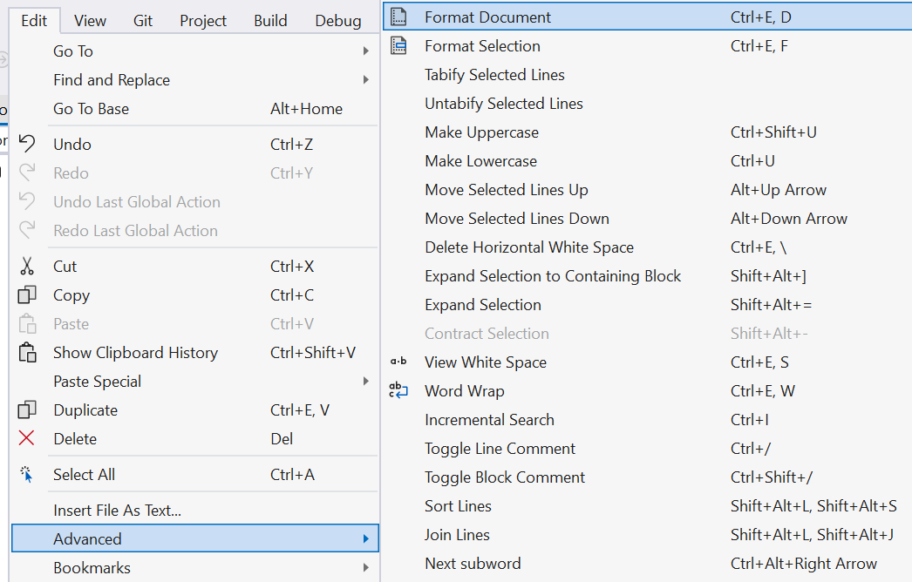

# If-Else: Good & Bad Practices

There are many ways in which `if-else` statements can go wrong.
Here are a few examples organized as:
- Best Practices
- Bad Coding Style;
- Good Coding Style;
- Common Syntax Errors;

> 🔥 **Hot Tip**: A lot of errors can be avoided by letting Visual Studio format your document for you:
>
> ⌨ Press <kbd>CTRL</kbd>+<kbd>E</kbd>, <kbd>D</kbd> (Windows) to format the entire file.
> 
> Alternatively, use the menu:
> *Edit* > *Advanced* > *Format Document*
> 


## Best Practices for `if-else` code

**Readability**:

Your questions should be as simple as possible - and as English like as possible so that you can read properly. 

```csharp

// keep this as English as possible
// Now do you see the importance of naming variables properly 
if  (lives == 0 )
{	 
	Console.WriteLine ("Game is over!");
} 
```

**Only true/false or yes/no questions**

A valid question would be *“Are you hungry?”* - because the answer is either yes or no. 

An invalid (illegal) question would be *“What would you like to eat?”* because the answer is too varied - it could a number of things.


## Bad Coding Style

Consider the following example:

```csharp
if (a < b ) 
  	Console.WriteLine( "yes" );
  	Console.WriteLine( "hello world" );
Console.WriteLine("All done!")
```

*Why is it bad coding style?*

* Because of the way we have indented the code, it appears as if the `if block`  are lines `2` and `3`.  BUT... because there are no squiggly braces, the actual `if block`  is just line 2.

If the code was properly formatted, it should look like:

```csharp
if (a < b ) 
  	Console.WriteLine( "yes" );
Console.WriteLine( "hello world" );
Console.WriteLine("All done!")
```

But this is still not good. *Why?*

* Although this is still syntactically correct, it is not unusual to add statements to the `if block`.  The programmer may not notice that there are no squiggly braces, and inadvertently create a bug

* after the programmer adds a new line, thinking that it will work as expected, but in fact will not.

```csharp
if (a < b ) 
  	Console.WriteLine( "yes" );
  	Console.WriteLine( "eh is less than bee" );   // NOT part of "if block"
Console.WriteLine( "hello world" );
Console.WriteLine("All done!")
```

## Good Coding Style

Even if there is only *one* line of code in your `true` block, **_always_** use braces.

```csharp
if (a < b ) 
{
  	Console.WriteLine( "yes" );
}
Console.WriteLine( "hello world" );
Console.WriteLine("All done!")
```

Now, when the programmer adds something to the `if` block, it will be correct.

```csharp 
if (a < b ) 
{
  	Console.WriteLine( "yes" );
  	Console.WriteLine( "eh is less than bee" ); // IS part of "if block"
}
Console.WriteLine( "hello world" );
Console.WriteLine("All done!")
```


## Different styles for if-else

There is a coding style where the opening curly braces are on the same line as the `if` statement. This is correct syntax.

However, C# styling prefers code blocks in a new line and Visual Studio will undo this format.

```csharp
if (a < b ) {   // Open brace on same line as if statement
  	Console.WriteLine( "yes" );
  	Console.WriteLine( "eh is less than bee" );
}
Console.WriteLine( "hello world" );
Console.WriteLine("All done!")
```


## Common Syntax Errors

```csharp
if (a < b ) 
		x = 3;  	//  Now the if block is this line
{   // Not the if block. Just a regular code block.
  	Console.WriteLine( "yes" );
  	Console.WriteLine( "eh is less than bee" );
}
Console.WriteLine( "hello world" );
Console.WriteLine("All done!")
```


```csharp
// VERY common error
if (a < b ) ;	// Added a semi-colon after the "if"
{
  	Console.WriteLine( "yes" );
  	Console.WriteLine( "eh is less than bee" );   
}
Console.WriteLine( "hello world" );
Console.WriteLine("All done!")
```

Why is the above code an error?

* The extra semicolon indicates the end of a line of code.
* Even though there is no code, it still indicates that there was a line of code.
* if there is a line of code immediately following an `if` condition, then it becomes the `if block`.
* So finally, we have an empty line of code that is part of the `if` block.  So even if the `if condition` is true, the empty line of code will be executed (in other words, nothing will happen).

```csharp
// VERY common error, but at least will not compile
if (a = b ) 	// NOT comparing a to b, but setting a equal to b,
              // and then testing if a (the final result) is true
{
  	Console.WriteLine( "yes" );
  	Console.WriteLine( "eh is less than bee" );   
}
Console.WriteLine( "hello world" );
Console.WriteLine("All done!")
```


### Common Syntax Error

```csharp
if (lives >0) 
{ 
		Console.WriteLine("you made it"); 
		Console.WriteLine("you are still alive"); 
} 
else 
		Console.WriteLine("you died"); 			// This is the "else" block
{ 
		Console.WriteLine("better luck next time"); // this is NOT the "else" block
} 

// The line below is independent of the if statement and will 
// ALWAYS be run 
Console.WriteLine ("Thank you for playing"); 
```


## Nesting if statements

Within a `code block`, any `code block`, we can add another `if` or `if - else` statement.

We won't go into details now, however, notice how **it's easier to see what's happening if you align your code correctly**.

```csharp
if (a < b)
{
  	// ... lines of code
  	if (lives < 0)
  	{
    		// ... lines of code
  	}
  	// ... lines of code, still part of the True block (a<b)
}
else
{
  	// ... lines of code
  	if (score < 10)
  	{
    		// ... lines of code
  	}
  	// ... lines of code, in the false block (a<b).
}
Console.WriteLine("You will always see this!!!")
```

