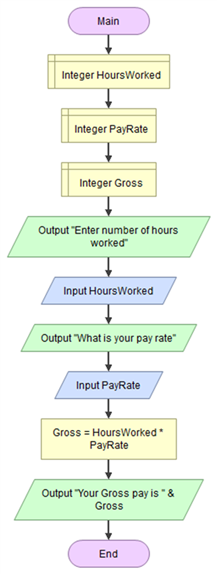
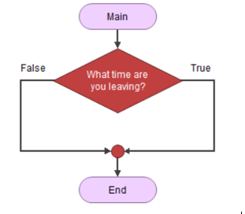
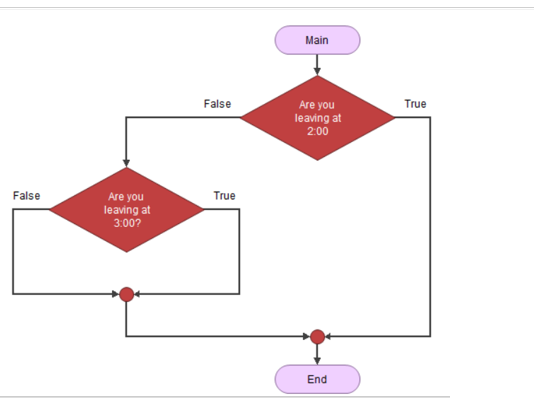
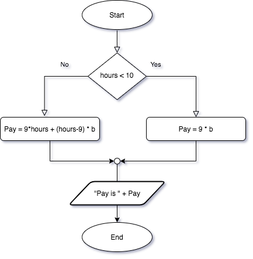

## Flowcharting

Flowcharting is another method of displaying or creating an algorithm or pseudo code.  It is a very visual tool, so is most helpful if there is a complex program flow (lots of loops and if conditions)

|Symbols| Used for... |
|--------|-----|
|Square with round corners |Start/Stop - called terminal symbols|
|Small circle | connectors (join lines together) |
|Home plate symbol| off page connector (flowchart continues on another page)|
|Parallelogram| input/output|
|Rectangle| processing code|
|Diamond| for if statement|
|Elongated hexagon| start of loops |
|Rectangle with extra lines on side| calling a function |
|lines| indicates the program flow, from top to bottom or left to right |
|arrows| Indicates program flow, indicated by arrow |

### General Rules about Flowcharts

NOTE: I am not talking about flowgorithm,  you can *execute* flowgorithm charts, but a *real* flowchart is just a diagram.

* Includes a `data dictionary`
  * A list of your variables (use short names if possible), and what they represent.  Also the data type if appropriate
* As much as possible, program flow should start at the top and go down, or to the right (not always possible).  Use arrows instead of lines *only* when the program flow is not down, or to the right.
* Lines indicating program flow should never cross each other (that makes it too confusing)
* A good flowchart should be able to fit on a single page... although *sometimes* it might be necessary to fit on two pages, but **never** three.

## Exercises

**Example IPO:** Calculate pay program   

| Input                                       | Processing                                                   | Output      |
| ------------------------------------------- | ------------------------------------------------------------ | ----------- |
| `Number of hours worked`  `Hourly pay rate` | Multiply the `Number of hours worked` by the `Hourly pay rate` and the result is the `Gross pay` | `Gross pay` |

The processing and the output happen automatically after the input is entered.  

Your job: Create a flowchart (using flowgorithm) or create a detailed algorithm using pseudo code for the above.

*Answer*: Pseudo code:

> START
>
> *// Variables*
>
> Integer/double? HoursWorked, PayRate, GrossPay
>
> Output: "Enter number of hours worked"
>
> Input: HoursWorked
>
> Output: "Enter you pay rate"
>
> Input PayRate
>
> *// Calculate gross pay*
>
> Gross = HoursWorked * PayRate
>
> Output: "Your Gross Pay is " Gross
>
> END

**Question:** Should you use integers, or doubles?  

**Question** 

This is an error, why? 

The above is an error because an "if" or decision cannot ask a question. 

 

**Question** 

Is this an error, and if so, why? 

 

The above is better and more logical 

But still the person could be leaving at 5:00 or 6:00. 

It might be better to ask “Are you leaving after 2:59pm”? 

**Question**

Consider this flowchart excerpt (BTW... this is a `nested if`)

 

Note that the above only does things if the person leaves exactly at 2:00 or 3:00. If they leave at 2:01 nothing might be done as you'll pass on the false ends of the decisions. 

 **Tips**

In General testing for equality may not be the best. We usually test `<`, `<=`, `>`, `>=` these cover a bigger range.  

How would you do things if someone was to leave between 2:00 and 3:00? 

**Style**

It is good to pull things that are in common out of "decision branches.  Looking at the flowchart below, we have two output blocks, both which are doing the *exact* same thing.

Look at the following flowchart... we have moved the output block out of both the true and false branch, and relocated *one* copy of the output until the *end* of the `if/else` construct.

