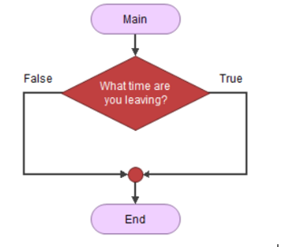
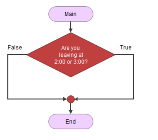
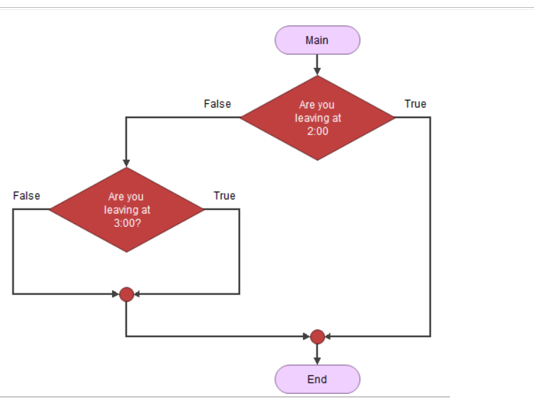
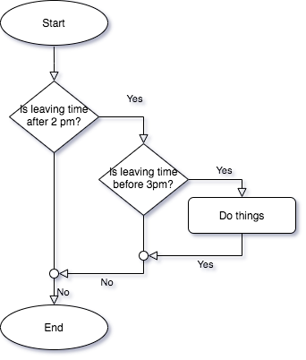

# Pseudo Code

Pseudo Code is a syntax free language of instructions in English. Basically you write out what you want to do in English in the correct order. Once your logic is established, it should be straightforward to convert your pseudo-code into C# or any other high level language. 

**Example**: 

> Input user's birthday 
> Age = today - user's birthday (yes you can do math on dates) 
> Display Age 

 

**Example**

pseudo-code to put on shoes in the morning.  

>1. sit up from bed 
> 2. put socks on 
> 3. put shoe on 
> 4. tie shoelaces 

 Note: *numbering is optional - but you must logically see the order of things!!!! This is very important.*

 

 **Example**

Note: *You cannot say this unless x has been previously declared (born, created) and x has been defined (given a value)* 

> Increase the value of x by 4 


## The **DDU"** approach `declare`, `define`, `use` 

```csharp
int myscore;  // declares or births the variable myscore 
myscore = 10;   // define it, you give it a value 
myscore = myscore + 30;   // you use myscore on the right hand side 
```

Computer Science is very strict about this: You cannot use a variable until it is born and has a value.  You cannot even "speak of" a variable unless it exists. 


## Algorithm 

*a process or set of rules to be followed in calculations or other problem-solving operations, especially by a computer.* 

In other words what technique did you use to accomplish something. This usually involves a series of steps in logical order, with part of the process possibly repeating.  

We create an algorithm:-- 

1. Pour desired amount of water into pot 
2. Put pot on stove burner 
3. Turn on burner 
4. Watch water until you see bubbles rising, when this is done turn off burner 
5. Water is boiled. 

  We can also do this using pseudo code - which is code without syntax and/or rules. It is very English like. It’s also very similar to the algorithm above 

Difference between pseudo code and algorithm? Well pseudo code is the English like you're using. It is syntax free.  An algorithm is the logical order of things. It how you arrange your pseudo code to perform a certain task. 

## Flowcharting

Flowcharting is another method of displaying or creating an algorithm or pseudo code.  It is a very visual tool, so is most helpful if there is a complex program flow (lots of loops and if conditions)

|Symbols| Used for... |
|--------|-----|
|Square with round corners |Start/Stop - called terminal symbols|
|Small circle | connectors (join lines together) |
|Home plate symbol| off page connector (flowchart continues on another page)|
|Parallelogram| input/output|
|Rectangle| processing code|
|Diamond| for if statement|
|Elongated hexagon| start of loops |
|Rectangle with extra lines on side| calling a function |
|lines| indicates the program flow, from top to bottom or left to right |
|arrows| Indicates program flow, indicated by arrow |


### General Rules about Flowcharts

NOTE: I am not talking about flowgorithm,  you can *execute* flowgorithm charts, but a *real* flowchart is just a diagram.

* Includes a `data dictionary`
  * A list of your variables (use short names if possible), and what they represent.  Also the data type if appropriate
* As much as possible, program flow should start at the top and go down, or to the right (not always possible).  Use arrows instead of lines *only* when the program flow is not down, or to the right.
* Lines indicating program flow should never cross each other (that makes it too confusing)
* A good flowchart should be able to fit on a single page... although *sometimes* it might be necessary to fit on two pages, but **never** three.

# Comments 

In code we can/should include comments. These are not compiled, can be in any language - ex. French. They describe what is going on in the code. They should explain things. 

### What should my comments say?

**Comments should explain _what_ you want to accomplish, not the _how_**

**Example**

```csharp
// Example of bad comment:

// increase age by 1
age = age + 1
```

```csharp
// Example of better comment

// In Korea, people define their age by 1 years old at birth,
// so we need to convert European age to Korean age because this program
// is being used in Korea exclusively
age = age + 1
```


### Syntax

In `C#` we use slash slash `//` to denote comments. Anything between the `//` and the end of the line will be a comment. 

```csharp
// this is a line comment
a = a + 3; // this is an end of line comment
b = b*55 // ACK! // + 35;  <=== this is an error because the "+35;" is part of the comment
  
```

**Style**

This is my personal preference (Sandy), but I will not impose it upon you...

* I find it difficult to find sections of my code (my code can be quite long), so I like to break up my code using the equivalent of headers, which make it easier to find the section *'Calculate the user's CI'* for example.

* Also, I want my comments to look like an algorithm, or pseudo code

  ```csharp
  // =======================================================
  // this is a major section (most likely a function)
  // =======================================================
  
  // --------------------------------------------------------
  // sub-section ... almost like a paragraph title
  // --------------------------------------------------------
  
  // just a description of what I am doing
  // get user input
  
  ```

  

* I only use end of line comments if what I am doing 

  * is very sophisticated and needs explanation, 
  * or describing a list of variable declarations

  ```csharp 
  // =============================
  // Very important code 
  // =============================
  
  double sigma; // The `uncertainity` of the answer to a least squares fit
  
  ```

  

#### Block comments

Lets assume that you want to write a very detailed description of your `EULA` (End User's License Agreement) in your code, and you don't want to have to keep messing with slashes (`//`).

You can use what is called `block comments`, which are inherited directly from the `C` language.

It starts with a `/* ` and the with a bunch of comments, multilined or not, and then ends with `*/` 

**Example**

```csharp
/*
	This code has been written by a very important person, and before you
	use this program, you must agree to the following.
	
	1. You must name your first child Sandy 
	   1.1 Alexander or Alexandra is permitted, but additional requirements will be added
	2. You never disparage the taste of licorice again.
	3. You acknowledge that 'red licorice is not a licorice'!
	.... and so on
*/
using System;
namespace Candy
{	class Licorice
    {	static void Main(string[] args)
        {
            Console.Write("Licorice is good! ");
        }
    }
}

```

**Style**

The following is valid commenting, but is considered bad style

```csharp
z = z + 2;  /* increase z by 2 */ 
```

Instead, for an end of line comment, use `//`

```csharp 
z = z + 2;  // increase z by 2 
```

**_BLOCK COMMENTS CANNOT EMBED OTHER BLOCK COMMENTS_**

```csharp
// Before
a = b * c; 
a = a/100;  /* block comment on one line */
y = 3;
```

```csharp
// After
/* 
a = b * c; 
a = a/100;  /* block comment on one line */
y = 3;												/// THIS LINE IS NOT COMMENTED OUT
*/														/// LEAVING THIS LINE AS AN ERROR
```


##### Block Comments and Debugging

Commenting can be a very very powerful debugging technique. We can use commenting to comment out huge sections of code and try to zero in on problem areas. Also - if someone wants to swap out a section of code, we can use comments. 

In `Visual Studio`, you can select a bunch of code lines that you want to comment, and press `ctrl` `/` (on MAC, press `command` `/`) to toggle comments `on`/`off` in your code.  Most editors have some form of shortcut to achieve this.

But, if you don't want to do that, you can block out code using the `/*` `*/` commenting style: 

**Example** - something is wrong with the code for baby sitter being drunk.  Lets check rest of code first to make sure it works, before testing that bit of code.

```csharp
// ================================================================
// Mom and Dad going out :)
// ===============================================================

// ---------------------------------------------------------------
// can we get a babysitter? if so, lets go out
// ---------------------------------------------------------------
babySitter = CallBabysitterService();
if (PickUp( babySitter)) {

  // mom and dad are going on a date!
  GoOutOnDate(Mom, Dad);
  
  // but must check to make sure babysitter is ok
	babySitterStatus = CallHomeAndCheck();
  
  // -------------------------------------------------------------
  // babysitter is not ok
  // -------------------------------------------------------------

  /*  START OF BLOCK COMMENT
  // drunk
	if (babySitterStatus == drunk) {
  	CallPolice();
    GoHome();
    End()
	}
	END OF BLOCK COMMENT */  
  
  //  baby sitter is up too late
  if (babySitterStatus == late) {
    GoHome();
    End();
  }
  
  // -------------------------------------------------------------
  // Everything is good, carry on
  // -------------------------------------------------------------
  DanceLikeNoOneIsWatching (Mom, Dad);
}
```


There are two methods, use the shortcut keys in Visual Studio... select the code you want to comment, and press `ctrl` `/` (on MAC, press `command` `/`) to toggle comments `on`/`off` in your code.


# Coding

## Step1 - Design

Understand the task to be performed, determine steps to be taken.

### IPO - Input, Process, Output

Start by creating a chart, detailing what inputs are needed, what you are going to do with those inputs (i.e. process), and what outputs are needed by the user.  

 * What variables are needed, what concept or information is related to the variable, what datatype (`int`, `string`, `double`, `bool`) should they be.

**Example IPO:** Calculate pay program   

| Input                                       | Processing                                                   | Output      |
| ------------------------------------------- | ------------------------------------------------------------ | ----------- |
| `Number of hours worked`  `Hourly pay rate` | Multiply the `Number of hours worked` by the `Hourly pay rate` and the result is the `Gross pay` | `Gross pay` |

The processing and the output happen automatically after the input is entered.  

Your job: Create a flowchart (using flowgorithm) or create a detailed algorithm using pseudo code for the above.

*Answer*: Pseudo code:

> START
>
> *// Variables*
>
> Integer/double? HoursWorked, PayRate, GrossPay
>
> Output: "Enter number of hours worked"
>
> Input: HoursWorked
>
> Output: "Enter you pay rate"
>
> Input PayRate
>
> *// Calculate gross pay*
>
> Gross = HoursWorked * PayRate
>
> Output: "Your Gross Pay is " Gross
>
> END


**Question:** Should you use integers, or doubles?  

  

**Example**: **Calculating Cell Phone Charges**

Suppose your cell phone charges you 35 cents for each minute. 

Manual Algorithm (Using pencil and paper, or calculator) 

1. You get the number of minutes that you have used. 
2. You multiply the number of minutes by 0.35. 
3. The result of the calculation is your current charge. 

  

Ask yourself the following questions about this algorithm: 

| *Question:* | What input do I need to perform this algorithm?              |
| ----------- | ------------------------------------------------------------ |
| *Answer:*   | I need the number of minutes.                                |
| *Question:* | What must I do with the input?                               |
| *Answer:*   | I must multiply the input (the number of minutes) by 0.35. The result of that calculation is the charge |
| *Question:* | What output must I produce?                                  |
| *Answer:*   | The monthly charge                                           |

  

You can do this in flowgorithm or pseudo code: 

> Output How many minutes did you use? 
> Input number of minutes 
> Calculate charge = number of minutes * .35 
> Display the charge 
> End of pseudo code 


**Optional Homework Examples to try (nothing to hand in):** 

You should be able to do these to set yourself up for the test. 

 

**Calculating Your weekly work** 

- You make $15 per hour 
- Every hour you work over 40 hours is time and a half 
  - This means the first 40 hours you work you get $15 per hour (so 600$ for the first 40 hours). Then your 41st hour and onwards you get 1.5 * 15 or $22.50 an hour. 
- Design a flowchart to input the number of hours and display the weekly pay 
  - Sometimes the user will work below 40 hours and so that's easy, just multiply their hours times $15 and display the pay. 
  - Sometimes they will work more than 40 hours - you have to determine how much "more" than 40 hours they worked (hint hint cough cough use "subtraction" to figure this out). Multiply pay rates accordingly and display the weekly pay 
- What are the inputs? The outputs? 

  **Calculating Cost and shipping on a web page** 

- Shipping cost is a flat fee of \$10 for totals under \$35 
- Free shipping for anything over $35 
- Inputs? Outputs? 
- Something to think about … what if the cost of my items is $34….. Is this a good business model? 


**Calculating Cell phone charges** 

- Flat rate of $30 a month for usage under 300 minutes 
- $0.35 cents per minute for every minute over 300 minutes 

>  For the above exercises I suggest a pseudo code and/or flowgorithm

  

### Clues and Hints: 

Remember: Variables Must be: 

- Well named 

- Unique 

- Not a reserved word of the language - also called keyword. Ex “if” 

- **NO SPACES** No funny characters, no periods, spaces, etc. 

- Declared (born, created) of the proper type: 

  - int 
  - double
  - Single char 
  - string 
  - bool

    

**Question** 

This is an error, why? 



The above is an error because an "if" or decision cannot ask a question. 

 

**Question** 

Is this an error, and if so, why? 

 

The above is better and more logical 

But still the person could be leaving at 5:00 or 6:00. 

It might be better to ask “Are you leaving after 2:59pm”? 


**Question**

Consider this flowchart excerpt (BTW... this is a `nested if`)

 

Note that the above only does things if the person leaves exactly at 2:00 or 3:00. If they leave at 2:01 nothing might be done as you'll pass on the false ends of the decisions. 

 **Tips**

In General testing for equality may not be the best. We usually test `<`, `<=`, `>`, `>=` these cover a bigger range.  

How would you do things if someone was to leave between 2:00 and 3:00? 





**Style**

It is good to pull things that are in common out of "decision branches.  Looking at the flowchart below, we have two output blocks, both which are doing the *exact* same thing.


Look at the following flowchart... we have moved the output block out of both the true and false branch, and relocated *one* copy of the output until the *end* of the `if/else` construct.


