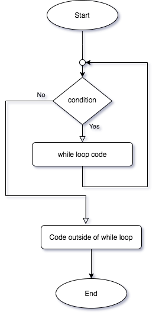

# While Loops

Just a *very* brief description of while loops, so that we can understand some of the design patterns discussed in the rest of the document.

Consider the following flow-chart:



The beginning of a while loop starts with a `condition` (something returns `true` or `false`).  After the while loop statement, a `code block` (code enclosed in squiggly brackets (`{...}`) is required.  

* If the `while` condition is `true`, the `while code block` is executed, and the program returns to the initial `while` condition to check *again* if this `condition` is true.  This repeats *ad-infinitum* until the `while condition` returns false
* Once, or if, the `while condition` is false, then the program skips over the `while block code` and continues with the code that follows the `code block`.

# Design Patterns

What are design patterns?

Basically a template, or algorithm for specific requirements that are common to almost all programs.  Design patterns are language agnostic, meaning that the methods for acheiving a certain goal remains the same, whether you are using `python`, `ruby`, `C#`,`java`, etc.

> In software engineering, a **software design pattern** is a general, reusable solution to a commonly occurring problem within a given context in software design. It is not a finished design that can be transformed directly into source or machine code. Rather, it is a description or template for how to solve a problem that can be used in many different situations. Design patterns are formalized best practices that the programmer can use to solve common problems when designing an application or system. 
>
> ([wikipedia](https://en.wikipedia.org/wiki/Software_design_pattern))

## Counters 

A `counter` is not a special variable, it’s how you USE the variable that makes it a `counter`. Counters *typically* begin at zero and count by one. 

> **NOTE**: Unlike most humans, programmers **count starting at 0 (zero)**, *not 1 (one)*.

`Counters` can be used to keep track of how many times you repeat a process. 

 **Example**

Consider this pseudo-code: 

>  int x, a;   // the word int means ‘create’ or make a variable (the declare part) 
> `x` = 0;    // initialize the counter (define - you're giving it a value) 
> `a` = 0; 
> ….this part below may be in a repeating loop process 
> 		`x` = `x` + 1; // count by one 
> 		`a` = `a` + 3; // this is a counter, by threes! 
> ….. this is the end of the repeating loop 
> print “You were in the loop “  `x`  “ times!” 

So as long as your variable is increasing by a constant amount, you can consider it a form of a `counter`. In reality, almost all `counters` count by 1. 

You use counters every day - perhaps without even realizing it. You repeat processes and count how many times you do it.  

**Example:**
your gym teacher tells you to run around the track 5 times, or an Indianapolis 500 race car driver will count how many laps they’ve driven around the track. 

 ### Counters as iterators 

**Iteration** : Iteration is a fancy word you should know - it means "a cycle". In other words - repeating something

The idea is one iteration is one loop. You should know the word iteration. 

Most counters are used to control iteration - *but you must have a criteria for stopping this repeating process.* 

**Example:** …. jump up and down - continuously - <u>until you get tired</u>.  

**Example:** …. run around the block <u>10 times</u>. 

**Example:** Consider the following pseudo code: 

> int mycount; 
> mycount =0; 
>
> while mycount < 5   
> {                                          <== WHILE CODE BLOCK 
> 	Make the screen flash 
> 	Print the high score 
> 	mycount = mycount + 1
> 
> }                                          <== END OF WHILE CODE BLOCK

*Something has to happen in the loop to get you kicked out of this loop. Otherwise you'll be in there forever! In this case, the counter variable called mycount is used as a counter, and the condition (being tested on ever iteration) will test this counter and see if it goes into the loop, or not.* 

**Questions: **

1. What is the criteria for stopping the screen flashing?
2. How many times does the screen flash?

**Example:** 

> int control; 
> control = 6; 
> while ( control > 4) 
> { 
>       Print "hello";  // this is pseudo code 
>       control = control –1; 
>} 

**Question**

1. How many times does the above print hello? 

## Accumulators

An `Accumulator` is also not a special type of variable. It is how you USE the variable that makes it an `accumulator`. Typically `accumulators` are real (or floating point) numbers used to keep track of amounts. Like `counters`, `accumulators` should be initialized to zero - *unless* there are special circumstances. 

> ... pattern of iterating the updating of a variable is commonly referred to as the **accumulator pattern**. We refer to the variable as the **accumulator**. This pattern will come up over and over again. Remember that the key to making it work successfully is to be sure to initialize the variable before you start the iteration. Once inside the iteration, it is required that you update the accumulator.
>
> ([source](https://runestone.academy/runestone/books/published/thinkcspy/Functions/TheAccumulatorPattern.html))

Accumulators tend to look like this: 

```csharp
myTotal = myTotal + inputAmount;
```

*This might look like a `counter`, but it is increasing my a **non-constant** amount, so it `accumulates`*.

Accumulators are typically used to keep track of total, and aggregate sums.  

**Example:** 

Consider this pseudo-code: 

> 		totalcollected = 0.0;         // initialize the accumulator as a real number
> 		donation = 0.0;           	 // initialize the user input as a real number
> 		numdonations = 0;          // start counter at zero 
> 			
> 		….this part below may be in a repeating loop process or a loop of some sort 
> 			
> 		{ 
> 			print “Please enter your donation” 
> 				input donation // get user’s donation hopefully it is a large amount 
> 			
> 				// numdonations is a counter 
> 				// count by one - you got a donation. I hope today 100 people donate 
> 				// this counts the actual number of people who have made a (any) donation. 
> 			numdonations = numdonations + 1; 
> 			
> 				// let's accumulate the amount donated (stored in variable donation) to the grand 
> 				// total of money (stored in variable totalcollected) 
> 				totalcollected = totalcollected + donation; // important!!!! 
> 				// note that the above is your accumulator! you keep a grand total of 
> 				// your collected donations. You sum everything into the 
> 				// variable totalcollected, and to it you add whatever the 
> 				// next person donates. 
> 			
> 		} 
> 		… this is the end of the repeating loop 
> 			
> 		// notice how we print out the totals ONCE outside the loop, 
> 		//	once the loop iterations are 
> 		// complete and the charity event is over. 
> 			
> 		// aha! Xx people donated money! 
> 		print “You collected “ & numdonations & “ donations!” 
> 			
> 		// this is the total cash we raised 
> 		print “The total you collected is “ & totalcollected  
