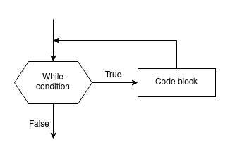
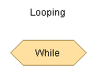
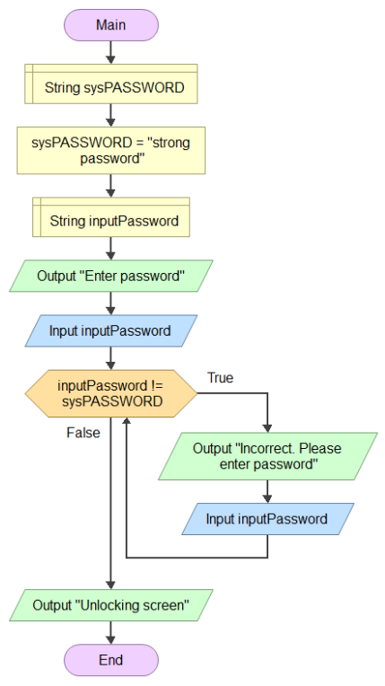

# While Loop & Accumulators

## While Loop

In computer programming, the **while loop** is a structure that repeats a set of instructions as long as a condition is true.




```csharp
while ( boolean_condition )
{
	// code block 
}
```

### How while-loops work

1. If the `boolean_condition` is `true`, the `code block` is **executed**, and the program returns to the initial  `boolean_condition`  to check **again** if it is `true`. 
2. This **repeats in a loop** indefinitely **until** the `boolean_condition` returns `false`.
3. If, the `boolean_condition` is `false`, the program skips over the `block code` and continues with the code that follows the `code block`.


Source: [giphy.com](https://giphy.com/gifs/perfect-loops-1iqiuAeqvBZlN2wsvD)


### While loops in Flowgarithm

In Flowgarithm, the symbol for the `while loop` is the following:




### Example 1: Unlock Screen

Rewrite the *Unlock Screen* program from Lab 2 but this time **using a while loop**.

The user enters the password to unlock their phone. **While the password is incorrect**, the program continues to ask for the correct password. **Otherwise**, the screen is unlocked.

*Pseudo-code* 

> - Ask the user for the password.
> - Compare the entered password with the password on the system.
> - If the passwords are equal:
> 	- Unlock the screen.
> - else:
> 	- Ask the user to enter the password again.

*Flowgarithm*



*C#*

```csharp
const string SYS_PASSWORD = "strong password";
string inputPassword;

Console.WriteLine("Enter password to unlock.");
inputPassword = Console.ReadLine();

while (inputPassword != SYS_PASSWORD)
{
	Console.WriteLine("Incorrect. Please enter password");
	inputPassword = Console.ReadLine();
}

Console.WriteLine("Unlocking screen");
```


### Example 2: System Update

This program prompts the user to install system updates. The user can reply "Y" for yes, "N" for no. Invalid input is detected with an appropriate message and the user is asked to re-enter their selection.


```csharp
string selection;

Console.WriteLine("Install system updates? [Y/N]");
selection = Console.ReadLine();

while (selection != "Y" && selection != "N")
{
    Console.WriteLine("Invalid selection. Type 'Y' for Yes or 'N' for No");
    selection = Console.ReadLine();
}

if (selection == "Y")
{
    Console.WriteLine("Starting updates. Don't turn off your machine.");
}
else
{
    Console.WriteLine("System is out of date!");
}
```

**Notes:**

- The `string` variable `selection` is constantly overwritten inside the `while loop`.
- By the time the `if` statement is reached, we are guaranteed to have a valid entry (either Y or N).


## Counters 

A `counter` is a regular `int`  variable, that can be used to keep track of how many times a process is repeated.

Every time something of interest happens, the counter will be increased (incremented) or decreased (decremented).

> **Note**: Unlike most humans, programmers **count starting at 0 (zero)**, *not 1 (one)*.


### Counters as iterators 

**Iteration** means "a cycle". In other words, repeating something. One iteration is one loop.

Counters can be used to **control iteration**. However, **there must be a criteria for stopping this repeating process**.

Most iterators are incremented or decremented by 1 but the increment/decrement number will depend on your code logic.

### Example 3: Beeping

```csharp
int myCount = 0;

while (myCount < 5)
{
    Console.Beep();
	myCount = myCount + 1;
}
```

Something has to happen inside the loop to get out of it. Otherwise **the code can loop forever!**

In the example above, the counter `myCount` is incremented by 1 and the condition (being tested on every iteration) is being less than 5.

*How many times does console beep?*

<details>
<summary>Answer (Click to expand)</summary>

- 5 times. Remember to count from 0.

</details>


### Example 4: Bart's Blackboard (looping prints)

This program will repeatedly print a message as many times as the used specify.


*[Source](https://fiverr-res.cloudinary.com/t_main1,q_auto,f_auto/gigs/2978346/original/BARTpromo.jpg)*

*Pseudo Code*
> - Ask user for the message.
> - Ask user for how many times to repeat it.
> - Setup a counter variable and set to 0.
> - Loop printing the message until counter reaches the number set by user.

```csharp
string message;
int NO_MESSAGES;
int counter = 0;   // Declare and initialize counter to zero.

Console.WriteLine("Enter message to be repeated");
message = Console.ReadLine();

Console.WriteLine("How many times should the message be repeated?");
// Assume user enters a valid integer
NO_MESSAGES = int.Parse( Console.ReadLine() );

while ( counter < NO_MESSAGES )
{
    Console.WriteLine(message);
    counter = counter + 1;      // Increase counter

    Thread.Sleep(1000); // Program will sleep for 1 second (1000 milliseconds)
}

```


## Accumulators

An `Accumulator` is a regular numerical variable (`int` or `double`)  used to keep track of amounts. 
 
Like `counters`, `accumulators` are typically initialized to zero (but not necessarily).

Accumulators tend to look like this:

```csharp
myTotal = myTotal + inputAmount;
// or
myTotal += inputAmount;
```

This might *look like* a `counter`, but it is increasing my a **non-constant** amount, so it `accumulates`.

Accumulators are typically used to keep track of total, and aggregate sums.

### Example 5: Average Calculator

The program *Average Calculator* asks the user to enter a number or the word "stop".
The user can enter as many numbers as they would like. Once "stop" is entered, the average of all numbers is calculated.

*Remember:* the average is equal to the sum of all numbers divided by how many numbers were summed.

*Pseudo Code*
> - Declare an 'int' counter and a 'double' accumulator and set both to zero.
> - Prompt the user for a number or the word "stop".
> - Collect user input.
> - While the input is not "stop" (we know a number was entered):
> 	- Increase the counter by one.
> 	- Add the number to the total.
> 	- Ask the user for another number or the word "stop"
> - When "stop" is entered, calculate the average by dividing the total by the counter.
> - Display average to user.

*C#*
```csharp
string input, message;
int counter = 0;
double total = 0.0;
double average;

message = "Enter a number or 'stop' to output the average";
Console.WriteLine(message);
input = Console.ReadLine();

while (input != "stop")
{
    counter++;
    total = total + double.Parse(input);
    // total += doucle.Parse(input)  is same but shorter.

    Console.WriteLine(message);
    input = Console.ReadLine();
}

average = total / Convert.ToDouble(counter);
Console.WriteLine($"The average of all numbers is {average}");
```

Notes:
- The pseudo-code has all the logical steps required to make the program work, including variable declaration and their types.
- The C# code includes some details that are not essential and therefore don't need to be included in the pseudo-code. For example:
	- Declaring `input` and message `strings`
	- Converting  `counter` from `int` to `double`


## Exercises

### Exercise 1: Unlock Screen with Counter

In example 1: Unlock Screen, the program constantly asks the user to enter the unlock password until the correct password is entered.

This is a major security flaw because a password cracker software like [Hydra](https://github.com/vanhauser-thc/thc-hydra) or [John the Ripper](https://www.openwall.com/john/) could easy find the password by using a [brute force Diattack](https://us.norton.com/blog/emerging-threats/brute-force-attack).

Improve the program so that:
- It allows a **maximum of 3 trials** before terminating the program. 
- The program halts for 3 seconds if the wrong password is entered.

*Pseudo code*

> Use the same code as example 1, with the following modifications:
> 
> - Declare a new `int` variable to count the number of trials and set it to 0.
> - Declare the system password as a `string` and set it to the correct value (ex. "strong password").
> - Loop as long as the password is wrong and the counter is 3 or less.
> - Every time the user makes a password attempt, increase the counter by one.
> - When the wrong password is entered, pause the program for 3 seconds.
> - If the counter limit is reached, display error message and end the program.
> - Else, if the correct password is entered, unlock the screen.


### Exercise 2: 21 Dice roll 🎲

In the exercise section of [lesson 10 - *If Else-If Statement*](10_if_else-if_random.md), you created a dice roll game with 4 simple rules:

- The player rolls 2 dice at a time.
- If the two dice have the same number, it's an instant win.
- If the sum of the dice is 7, it's an instant loss.
- The sum of the dice is the user's score for that roll.

Add two new rules:

- After each roll, the user can choose to roll again.
- If the user rolls again, the points for the new roll are added to the previous roll.
- If the total points for the round go above 21, it's an instant loss.

Once the user chooses to stop rolling, the total score and the total number or rolls is shown to the user.
