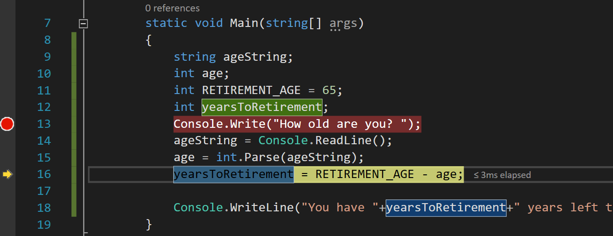

# Debugging Code

> Troubleshooting can seem like a mysterious “art” only practised by experienced, professional mechanics, when you don't know how certain systems in your car work.
>
> If you work by **process of elimination**, starting with **the most likely cause** and working through **to more complex issues**, you can easily diagnose the problem yourself.
>  
> Figuring out the problem and solution is simply the result of having the right knowledge combined with **an intelligent, systematic approach**.
>
> Haynes Car Mechanics: [Troubleshooting: Common Clutch Issues and Causes](https://haynes.com/en-us/tips-tutorials/troubleshooting-common-clutch-issues-and-causes)

It is normal that programs do not do what we want them to do.

Learning how to debug is a **fundamental programming skill** that will be required for the rest of your programming career. From beginner to senior developer.

## Types of Errors

The the two most types of errors are **Syntax errors** and **Logic errors**.

### Syntax Error

A syntax error occurs when the compiler cannot figure out what it is that you want it to do.  

This can be because you misspelled an instruction, used a variable that has not yet been defined, lost a quote (`"`), missing a squiggly brace (`}`), or a number of other errors.

When you try to compile your code, the compiler will notify you if you have any syntax errors.

### Logic Error

This is when you want your algorithm to accomplish a task, but if you follow the directions of the algorithm, it doesn't do what you want it to do.

> *Mom*: Brush your teeth
>
> *Kid*: OK
>
> *Mom*: Why can't I smell toothpaste on your breath?
>
> *Kid*: You didn't tell me that I needed to use toothpaste.


## Debugging Techniques

### Staring at Your Code Method

One method of `debugging` the code is to stare at it for a very long time, and hope that you see your error.  This is not a very effective but may occasionally work.

### Rubber Ducky Method

Explain, exactly, what your code is doing to a rubber ducky (if you don't have a rubber ducky, any inanimate object will do).
While explaining your code to the rubber ducky, you might see the error of your ways.

This method can be surprisingly effective.

### The 'print' Method

Another method of `debugging` is to print the current value of your variables to the console window, so that you can verify that what you think is supposed to happen, actually happens.

**Example**
The code below should calculate a person's hourly salary from their yearly salary.

However, the code does not give the expected answer. Regardless of the input, It always says the hourly salary is $0.

```csharp
const int WORK_HOURS_PER_WEEK = 40;
const int WEEKS_PER_YEAR = 52;
int salaryPerYear;
int salaryPerHour;
    
Console.Write("What is your Yearly salary ");
salaryPerYear = int.Parse ( Console.ReadLine() );
    
int weeklySalary = salaryPerYear * (1 / WEEKS_PER_YEAR);
salaryPerHour = weeklySalary / WORK_HOURS_PER_WEEK;
Console.WriteLine("Salary per hour is: $" + salaryPerHour);
```

Let's add an  additional print statement to identify **roughly where the error is introduced**.

```csharp
int WORK_HOURS_PER_WEEK = 40;
int WEEKS_PER_YEAR = 52;
int salaryPerYear;
int salaryPerHour;

Console.Write("What is your Yearly salary ");
salaryPerYear = int.Parse ( Console.ReadLine() );

int weeklySalary = salaryPerYear * (1 / WEEKS_PER_YEAR);

// ******** DEBUG CODE
// verify that the weekly Salary is calculated properly
Console.WriteLine("weeklySalary is " + weeklySalary);
// ********* END DEBUG CODE

salaryPerHour = weeklySalary / WORK_HOURS_PER_WEEK;
Console.WriteLine("Salary per hour is: " + salaryPerHour);
```

Running the above code gives me the following output

```text
What is your Yearly salary 45000
weeklySalary is 0
Salary per hour is: 0
```

We may not know exactly what is causing the error, however, we can tell the problem starts around the calculation of  `weeklySalary`.


### Block Comments and Debugging

Commenting can be a powerful debugging technique. We can use commenting to comment out large sections of code and try to zero in on problem areas.

Commenting is also useful when swapping out a section of code without immediately deleting the old code (just in case the new code does not work).

In Visual Studio there are keyboard shortcuts to help you comment code:

**Comment out the selected lines** button on the Text Editor toolbar. If you prefer to use the keyboard, select **Ctrl**+**K**, **Ctrl**+**C**.


**Uncomment the selected lines** button on the Text Editor toolbar. If you prefer to use the keyboard, select **Ctrl**+**K**, **Ctrl**+**U**.


*Source: [Learn to use the code editor](https://docs.microsoft.com/en-us/visualstudio/get-started/tutorial-editor?view=vs-2022#comment-out-code) by Microsoft.


### Using the IDE Debugger Method (Best)

Visual Studio comes with a visual debugger.

The steps required are:

1. Create a breakpoint in your program where you want the execution of your program to stop. Preferably before the location where you think the error is coming from.  The breakpoint will be indicated by a big red circle.

   1. To create a breakpoint in Visual Studio, either 
      1. double click on the left-most column right next to the line where you want the code to stop execution, or
      2. right click a line of code, and select `set breakpoint`
      
      

2. Start running the program as usual (ex: menu: `Debug` ->`Start Debugging`).  

3. The program will stop at your breakpoint.

	> NOTE: It is important to know that the line of code that has been highlighted has NOT yet been executed

4. To see the content of each variable has you step through the code, you can either

   1. Mouse-over a particular variable, and its current value will be shown, or

      

   2. Right-click on a variable, and select `Add Watch`.  

   

   A new window in the IDE will open, showing any variables that you are currently watching, plus the values of those variables.

5. Step through the code, i.e., execute one line of code at a time, by clicking the `step into` button  in the top menu (or press `F11`).  

   

   1. As the variables are being modified by executing a line of code, changes will be noted in the `watch` window.

      

### Breakable Lines

What line(s) of code can have breakpoints?

> - You can set a breakpoint on any line of executable code.
> 	- Example, you could set a breakpoint on a variable assignment (`int testInt = 1`), a `for` loop, or any code inside a `for` loop.
> 	- You can't set a breakpoint on method signatures, declarations for a namespace or class, or variable declarations if there's no assignment and no getter/setter (more on this later in the course).

[source](https://docs.microsoft.com/en-us/visualstudio/debugger/using-breakpoints?view=vs-2019)

## Resources

- Video: [Debugging (C#101 Series)](https://www.youtube.com/watch?v=pm_pv0Eb7Fw&list=PLdo4fOcmZ0oVxKLQCHpiUWun7vlJJvUiN&index=15)

## Class Exercise

The program below asks the user for a number N. It should then display the first N even numbers.

However, it is not working. Find out why.

```csharp
/* Example user types in 5 
* program should display the first 5 even number: 2 4 6 8 10 
*/ 
int userInput, xvalue;
int i = 0;    // i is a conventional name for an iterator (counter)
Console.Write("enter a number: "); 
userinput = Convert.ToInt32(Console.ReadLine()); 

while (i <= userInput)
{ 
	++i;
	xvalue = i * 2; 
 	Console.Write(xvalue + ' '); 
}
```

Hint: This program has two bugs.
The answer to this question will be told orally.