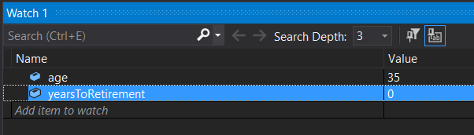

# Debugging Code

It is normal that programs do not do what we want them to do.

The the two most types of errors are **Syntax errors** and **Logic errors**.

#### Syntax Error

A syntax error occurs when the compiler cannot figure out what it is that you want it to do.  

This can be because you misspelled an instruction, used a variable that has not yet been defined, lost a quote (`"`), missing a squiggly brace (`}`), or a number of other errors.

When you try to compile your code, the compiler will notify you if you have any syntax errors.

#### Logic Error

This is when you want your algorithm to accomplish a task, but if you follow the directions of the algorithm, it doesn't do what you want it to do.

> *Mom*: Brush your teeth
>
> *Kid*: OK
>
> *Mom*: Why can't I smell toothpaste on your breath?
>
> *Kid*: You didn't tell me that I needed to use toothpaste.


### Staring at Your Code Method

One method of `debugging` the code is to stare at it for a very long time, and hope that you see your error.  This is not a very effective way of working.

### Rubber Ducky Method

Explain, exactly, what your code is doing to a rubby ducky (if you don't have a rubber ducky, any inanimate object will do).  While explaining your code to the rubber ducky, you might see the error of your ways.

This method can be suprisingly effective.

### The 'print' Method

Another method of `debugging` is to print the current value of your variables to the console window, so that you can verify that what you think is supposed to happen, actually happens.

**Example** ... the following code does not give the answer that I expect. No matter what I do, It always says my hourly salary is $0.

```csharp
		public static void Main(string[] args)
        {
            int WORK_HOURS_PER_WEEK = 40;
            int WEEKS_PER_YEAR = 52;
            int salaryPerYear;
            int salaryPerHour;
    
            Console.Write("What is your Yearly salary ");
            salaryPerYear = int.Parse ( Console.ReadLine() );
    
            int weeklySalary = salaryPerYear * (1 / WEEKS_PER_YEAR);
            salaryPerHour = weeklySalary / WORK_HOURS_PER_WEEK;
            Console.WriteLine("Salary per hour is: $" + salaryPerHour);
        }
```
If I add some additional code in an effort to find the error, 

```csharp
       public static void Main(string[] args)
        {
            int WORK_HOURS_PER_WEEK = 40;
            int WEEKS_PER_YEAR = 52;
            int salaryPerYear;
            int salaryPerHour;

            Console.Write("What is your Yearly salary ");
            salaryPerYear = int.Parse ( Console.ReadLine() );

            int weeklySalary = salaryPerYear * (1 / WEEKS_PER_YEAR);

            // ******** DEBUG CODE
            // verify that the weekly Salary is calculated properly
            Console.WriteLine("weeklySalary is " + weeklySalary);
            // ********* END DEBUG CODE

            salaryPerHour = weeklySalary / WORK_HOURS_PER_WEEK;
            Console.WriteLine("Salary per hour is: " + salaryPerHour);

        }
```

Running the above code gives me the following output

```text
What is your Yearly salary 45000
weeklySalary is 0
Salary per hour is: 0
```

I may not be able to figure this out yet, but at least I know that it is not calculating the `weeklySalary` correctly.


### Block Comments and Debugging

Commenting can be a very very powerful debugging technique. We can use commenting to comment out huge sections of code and try to zero in on problem areas. Also - if someone wants to swap out a section of code, we can use comments. 

In `Visual Studio`, you can select a bunch of code lines that you want to comment, and press `ctrl` `/` (on MAC, press `command` `/`) to toggle comments `on`/`off` in your code.  Most editors have some form of shortcut to achieve this.

But, if you don't want to do that, you can block out code using the `/*` `*/` commenting style: 

**Example** - something is wrong with the code for baby sitter being drunk.  Lets check rest of code first to make sure it works, before testing that bit of code.

```csharp
// ================================================================
// Mom and Dad going out :)
// ===============================================================

// ---------------------------------------------------------------
// can we get a babysitter? if so, lets go out
// ---------------------------------------------------------------
babySitter = CallBabysitterService();
if (PickUp( babySitter)) {

  // mom and dad are going on a date!
  GoOutOnDate(Mom, Dad);
  
  // but must check to make sure babysitter is ok
	babySitterStatus = CallHomeAndCheck();
  
  // -------------------------------------------------------------
  // babysitter is not ok
  // -------------------------------------------------------------

  /*  START OF BLOCK COMMENT
  // drunk
	if (babySitterStatus == drunk) {
  	CallPolice();
    GoHome();
    End()
	}
	END OF BLOCK COMMENT */  
  
  //  baby sitter is up too late
  if (babySitterStatus == late) {
    GoHome();
    End();
  }
  
  // -------------------------------------------------------------
  // Everything is good, carry on
  // -------------------------------------------------------------
  DanceLikeNoOneIsWatching (Mom, Dad);
}
```


There are two methods, use the shortcut keys in Visual Studio... select the code you want to comment, and press `ctrl` `/` (on MAC, press `command` `/`) to toggle comments `on`/`off` in your code.


### Using the IDE Debugger Method

Visual Studio comes with a visual debugger.

The steps required are:

1. Create a breakpoint in your program where you want the execution of your program to stop.  Preferably before the error might happen.  The breakpoint will be indicated by a big red circle.

   1. To create a breakpoint in Visual Studio, either 
      1. double click on the left-most column right next to the line where you want the code to stop execution, or
      2. right click a line of code, and select `set breakpoint`
      
      

2. Start running the program as usual (ex: menu: `Debug` ->`Start Debugging`).  

3. The program will stop at your breakpoint.

	> NOTE: It is important to know that the line of code that has been highlighted has NOT yet been executed

4. To see the content of each variable has you step through the code, you can either

   1. Mouse-over a particular variable, and its current value will be shown, or

      

   2. Right-click on a variable, and select `Add Watch`.  

   

   A new window in the IDE will open, showing any variables that you are currently watching, plus the values of those variables.

5. Step through the code, i.e., execute one line of code at a time, by clicking the `step into` button  in the top menu (or press `F11`).  

   

   1. As the variables are being modified by executing a line of code, changes will be noted in the `watch` window.

      

# Program Examples

```csharp
// ==================================================
// PURPOSE:
//      Calculate how many years left to retire
// AUTHOR:
//      Sandy Bultena, (c) 2021
// ==================================================
using System;

namespace Examples
{
    class MainClass
    {
        public static void Main(string[] args)
        {
            // This number does not change, so I am using all
            // capitals to indicate it is a constant
            int RETIREMENT_AGE = 65;

            // I need to know the user's age
            // create variable so that I can save that information
            int usersAge;

            // I also need to know the number of years until retirement,
            // so I create a new variable for that purpose
            int yearsUntilRetirement;

            // Prompt the user
            Console.Write("Please enter your age: ");

            // Get the user's age.
            // NOTE: I need a number, not a string, so I have to convert
            // the string that the user types in, into an integer.
            // I do that by 'parsing' the string.
            usersAge = int.Parse ( Console.ReadLine() );

            // Calculate the number of years to retirement
            yearsUntilRetirement = RETIREMENT_AGE - usersAge;

            // Print information to the terminal
            Console.WriteLine("You have " + yearsUntilRetirement + " years until you retire");
        }
    }
}
```

```csharp
// ==================================================
// PURPOSE:
//      How much does it cost for your movie tickets
// AUTHOR:
//      Sandy Bultena, (c) 2021
// NOTES:
//      In this example, I am using `double` as a
//      variable type.  'double' variables are used
//      if you want to have numbers that include fractions.
//      i.e. 12.25 is 12 plus 1 quarter.
// ==================================================
using System;

namespace Examples
{
    class MainClass
    {
        public static void Main(string[] args)
        {
            // This number does not change, so I am using all
            // capitals to indicate it is a constant
            double PRICE_OF_MOVIE_TICKET = 17.37;

            // I need to know how many tickets to purchase
            // create variable so that I can save that information
            int numberOfTickets;

            // I also need to know the final price,
            // so I create a new variable for that purpose
            // It may include a fraction of a dollar, so I need to
            // use a variable of type 'double'
            double finalPrice;

            // Prompt the user
            Console.Write("How many tickets do you want to buy? ");

            // Get the number of tickets.
            // NOTE: I need a number, not a string, so I have to convert
            // the string that the user types in, into an integer.
            // I do that by 'parsing' the string.
            numberOfTickets = int.Parse ( Console.ReadLine() );

            // Calculate the total price
            finalPrice = PRICE_OF_MOVIE_TICKET * numberOfTickets;

            // Print information to the terminal
            Console.WriteLine("You must pay $"+finalPrice);
        }
    }
}
```
