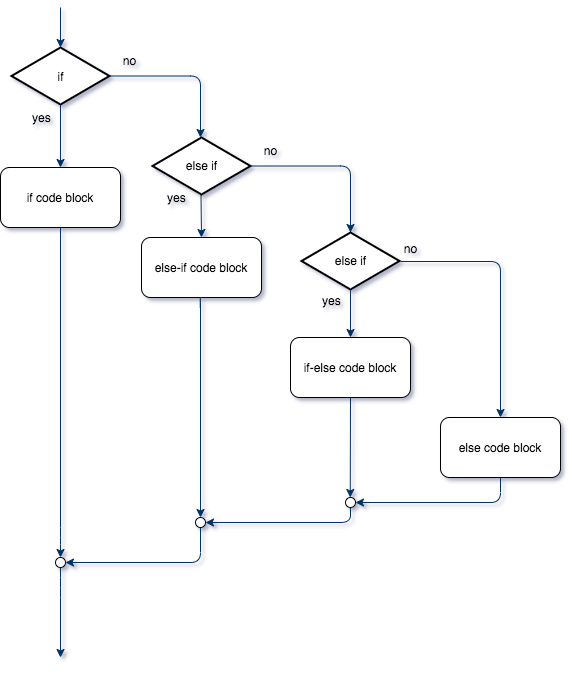
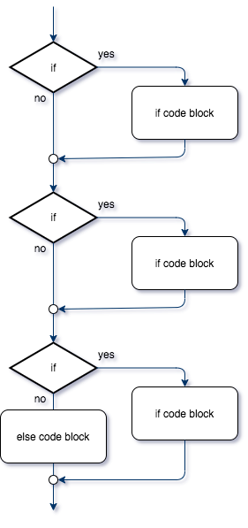
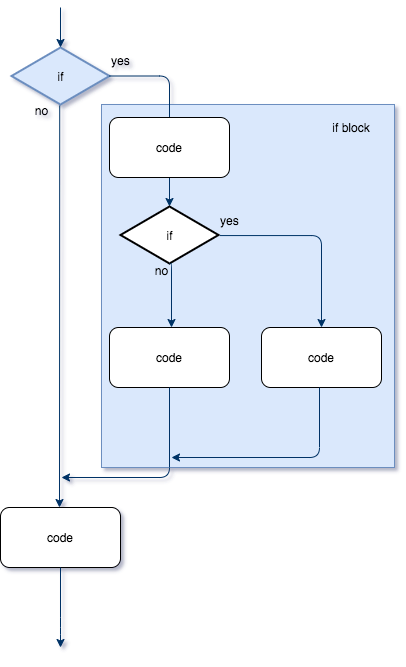

# Review Answers to Test 1

... no notes

# Gotcha's

A 'gotcha' is any *common* mistake that confuses the programmer. 

## `if` - `if` versus `if` - `else`

Not necessarily an error, but definitely *not* `best practice`.

Consider the following code snippet

```csharp
if (a > 10) { some code }
if (a <= 10 ) { other code }
```

Imagine that `a` is greater than 10.  The `some code` would be executed.  Would the `other code` ever be executed? No.  Why? Because either `a` is `greater than` 10, or it is NOT.  Either/or.

The following is marginally better, but still not good.

```csharp
if (a > 10) { some code }
else if (a <= 10 ) { other code }
```

If we have either/or conditions, we should be using `if-else`. 

```csharp
if (a > 10) { some code }
else { other code }
```

Why?  What difference does it make?
* In the first code snippet, *both* conditionals must be calculated *every time*!
* In the second code snippet, you have to calculate the comparison again (`a <=10`) if the first condition (`a>10`) is false, even though it is *not* necessary.  

These extra comparisons slows down your program, and makes the user's experience less enjoyable.

> With the programs that you will write in first year, this *slowing down* of the execution will not be noticable, but once you start 'real' programming, it can make a significant difference.
> Better to learn *now* how to code correctly

## Choice of Conditionals

Many, many times, programmers will make a mistake between `less than` and `less than or equal`. Likewise for `greater than` and `greater than or equals`.

Consider the following code snippet

```csharp
{ beginning code }
if (a > 10) { some code }
else if (a < 10 ) { other code }
{ final code }
```

What's wrong with the above code (at least what do we assume is missing?)

* What about when a = 10 ?

Unless you want something different for the `a=10` case, you should use `if-else` like described above, or, if you do have special instructions for `a=10` then...

```csharp
if (a > 10) { some code }
else if (a < 10 ) { other code }
else { different code }
```

## Improper closing of an `if` block

If you do not use curly braces, of if you accidentally add a semi-colon after your if statement, things will not work as planned.

**Example**

```csharp
int a = 90;
if (a < 60); {
  Console.WriteLine("You need to work harder! ");
}
Console.WriteLine("The end");
```

**Output**

```text 
You need to work harder! 
The end
```

Why?

**Example**

```csharp
int a = 90;
if (a < 60) 
  Console.WriteLine("You need to work harder! ");
  Console.WriteLine("Or else you are going to fail");

Console.WriteLine("The end");
```

**Output**

```text 
Or else you are going to fail
The end
```
Why?

# If, else if, else if, else

It is possible to string a bunch of `if` statements together, in such a way that only **one** of the code blocks will be executed.

The flowchart looks like this (if, else-if, else-if, else)



What is so special about this construct?

**As soon as one condition is true, the associated code block will be executed, and no further conditionals will be evaluated**

> Very similar to a `switch` statement, to be discussed later.

**Example**

Determining a letter grade based on your percentage:

```csharp
int grade_percent = 80;
if (grade_percent > 90) {Console.WriteLine("You got an 'A'");}
else if (grade_percent > 75) {Console.WriteLine("You got a 'B'");}
else if (grade_percent > 60) {Console.WriteLine("You got a 'C'");}
else {Console.WriteLine("You failed :(");}
```

*Result*

```text 
You got a 'B'
```

Notice line 3... even though grade_percent (80) is greater than 75, the code block is *not* executed.  Why?  Because a `true` condition was met line 2, thus all other `else if` and `else` blocks will be ignored!

*Be **very** careful how you choose your conditionals, and in what order they are evaluated.*

**Example**

Determining a letter grade based on your percentage:

```csharp
int grade_percent = 80;
if (grade_percent > 60) {Console.WriteLine("You got an 'C'");}
else if (grade_percent > 75) {Console.WriteLine("You got a 'B'");}
else if (grade_percent > 90) {Console.WriteLine("You got a 'A'");}
else {Console.WriteLine("You failed :(");}
```

*Result*

```text 
You got an 'C'
```
This time I only got a 'C', even though my grade hadn't changed.  Why?

### Comparing to if-if-if-else

Compare the `if, else-if, else-if, else` flowchart to the following flowchart `if, if, if, else`

~

If we only use `if` as opposed to `if else`, then *every* condition will be evaluated.

**Example**

Compare the grading example (above) which used `if else` blocks with the following (only using `if` blocks)

```csharp
int grade_percent = 80;
if (grade_percent > 90) {Console.WriteLine("You got an 'A'");}
if (grade_percent > 75) {Console.WriteLine("You got a 'B'");}
if (grade_percent > 60) {Console.WriteLine("You got a 'C'");}
else {Console.WriteLine("You failed :(");}
```

*Result*

```text
You got a 'B'
You got a 'C'
```

Why did we get two grades?  Because the condition in line 3 is true, so the `if block` is executed, and then proceeds to evaluate line 3 (because it is not an `else if`).  The conditon in line 4 is also true, so the `if block` in line 3 is also executed.

# Nested `if`s

Remember that a code block is just a bunch of code, surrounded by curly braces.  Within a code block, we can have other loops, and/or if statements.  If we have an `if` inside of an `if block` or `else block`, it is referred to as a `nested if`.

See flowchart below:



**Example**

```csharp
// ... other code asking user what they want

// If they ordered a Trio, then what do they want for a side?
if (order == "Trio") {
  
  	//  Do you want a cookie or a bag of chips (default: cookie)
  	Console.Write("Do you want a bag of chips or cookies? [chips/cookie] ");
  	string answer = Console.ReadLine();
  
  	// *** nested if, still inside 1st if block
  	if (answer == "chips") {
      	order = "Trio with chips";
    }
  	else {
      	order = "Trio with cookies";
    }
}

// process order:
Console.WriteLine("You have ordered: " + order);
```

*Result (assuming `order == Trio` is `true`)*

```text
Do you want a bag of chips or cookies? [chips/cookie] chips
You have ordered: Trio with chips
```

