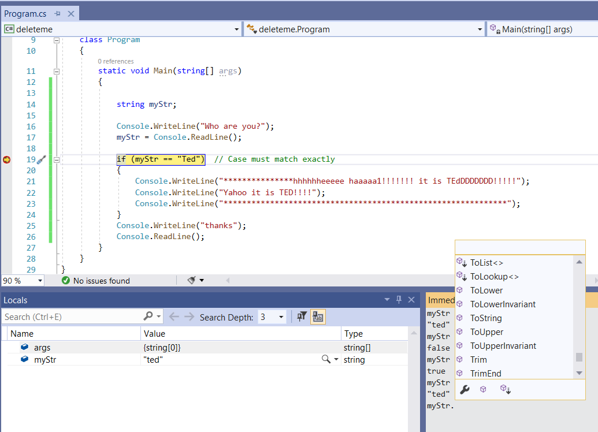

# Modulo, Typecasting & String Methods

The table below has all the mathematical operators used in this course:

| symbol | explanation                                                     |     |
| ------ | --------------------------------------------------------------- | --- |
| `*`    | multiplication                                                  |     |
| `/`    | division                                                  |     |
| `++`   | increment by one (unary operator)  `a++` is same as `a = a + 1` |     |
| `--`   | decrement by one (unary operator) `a--` is same as `a = a - 1`  |     |
| `+=`   | `a += 3` is equivalent to: `a = a + 3`                          |     |
| `-=`   | `a -= 3` is equivalent to `a = a - 3`                           |     |
| `/=`   | `a /= 5` is equivalent to `a = a/5`                             |     |
| `*=`   | `a *= 4` is equivalent to `a = a*5`                             |     |
| `%`    | modulo (the remainder after the integer division)               |     |

The only operator not covered yet is the **modulo operator**:

## Modulo Operator

The modulo operator gives the remainder after a division (not the result).

```text
10 % 3 = 1
```

Ask yourself the question:

> Once I divide the first number by the second number, how much of it cannot be fully divided by the second number?

### Division Remainder

For terminology, every division has a dividend and a divisor:

$\dfrac{dividend}{divisor}$

In a regular division operation, some divisions are exact:

$\dfrac{8}{4}=2$

This means that 4 **"fits"** inside 8 exactly 2 times.

However, if we divided 9 by 4:

$\dfrac{9}{4}=2.25$

An alternative way to calculate this operation:

$\dfrac{9}{4}=\dfrac{8+1}{4}=2+\dfrac{1}{4}$

4 can only **"fit"** inside 9 two times, anda remainder of 1 is left to be divided by 4.

> The remainder of a division, which cannot be fully divided by the divider is the result of modulo.

Using modulo for for the same operation:

```text
9 % 4 = 1
This is said as "nine modulo four"
```


### Modulo in Code

Below is an example of how modulo can be used with C#:

```csharp
int a, b, c;

a = 10; 
b = 3; 
c = a % b;  // c will be 1 
```


Modulo is commonly used in programming to determine if something is even or odd:

```csharp
// Assume variables are declared and defined.

if ( (number % 2) == 0 ) 
{ 
		Console.WriteLine(" number is even!") 
} 
else 
{ 
		Console.WriteLine("number is odd!") 
} 
```


> - If a number divides by two perfectly, the remainder is be zero and this number is even.
> - Otherwise, the number is odd.  


## Additional C# Data Types

So far we've mostly used `int`, `double`, `string`, and `bool` in our programs. 

> You are not required to memorize the data types, however, it's important to be aware that these data types exist.


| Reserved Word | .NET Type | Type                                                         | Size (bits) | Range (values)                                          |
| ------------- | --------- | ------------------------------------------------------------ | ----------- | ------------------------------------------------------- |
| byte          | Byte      | Unsigned integer                                             | 8           | 0 to 255                                                |
| sbyte         | SByte     | Signed integer                                               | 8           | -128 to 127                                             |
| short         | Int16     | Signed integer                                               | 16          | -32,768 to 32,767                                       |
| ushort        | UInt16    | Unsigned integer                                             | 16          | 0 to 65,535                                             |
| int           | Int32     | Signed integer                                               | 32          | -2,147,483,648 to 2,147,483,647                         |
| uint          | UInt32    | Unsigned integer                                             | 32          | 0 to 4294967295                                         |
| long          | Int64     | Signed integer                                               | 64          | -9,223,372,036,854,775,808 to 9,223,372,036,854,775,807 |
| ulong         | UInt64    | Unsigned integer                                             | 64          | 0 to 18,446,744,073,709,551,615                         |
| float         | Single    | Single-precision floating point type                         | 32          | -3.402823e38 to 3.402823e38                             |
| double        | Double    | Double-precision floating point type                         | 64          | -1.79769313486232e308 to 1.79769313486232e308           |
| decimal       | Decimal   | Precise fractional or integral type that can represent decimal numbers with 29 significant digits | 128         | (+ or -)1.0 x 10e-28 to 7.9 x 10e28                     |
| char          | Char      | A single Unicode character                                   | 16          | Unicode symbols used in text                            |
| bool          | Boolean   | Logical Boolean type                                         | 8           | True or False                                           |
| object        | Object    | Base type of all other types                                 |             |                                                         |
| string        | String    | A sequence of characters                                     |             |                                                         |
| DateTime      | DateTime  | Represents date and time                                     |             | 0:00:00am 1/1/01 to 11:59:59pm 12/31/9999               |


Notice how .NET types begin with capital letters.

>When C# is run with .NET, the upper case and lower case data types mean the exactly same thing.

.NET is a runtime (the engine that runs the compiled code) which is used to run C#.
.NET can also be used to run [other languages such as C++](https://learn.microsoft.com/en-us/cpp/dotnet/dotnet-programming-with-cpp-cli-visual-cpp?view=msvc-170).

> For now only use:
>  
>  - `string` or `String`,
>  - `double` or `Double`
>  - `int` or `Int32`
>  - `bool` or `Boolean`.
>  
>  Everything else should be avoided unless you have a special reason not to.


## Typecasting & Mixing Types

Sometimes you need to temporarily convert a number into another type so that is matches. 

**Example**:

```csharp
int visits = 25; 
double price = 3.35; 
 
double total = visits * price; // will this work? We are mixing types...
```

As mentioned before, the C# compiler will implicitly convert some data types into another in order to make the operation work. It is not good practice to reply on implicit conversion.

> When data is transformed from one type to another, this is called **typecasting** or just **casting**.

We've learned how to explicitly convert one data type to another. 

```csharp
int myInt = 10;
double myDouble = 5.25;

Convert.ToString(myInt);    // convert int to string
Convert.ToDouble(myInt);    // convert int to double
Convert.ToInt32(myDouble);  // convert double to int
```

However, there is a "quick and dirty" way to convert, called **explicit casting**.

### Explicit Casting

> - **General Rule** -avoid relying on the system to "maybe" convert data types for you.
> - **Typecast** your variables whenever data types don't match. 

**Rules**

* Everything on the right hand side of the assignment should match the type of the variable on the left hand side.
* To change type, enclose the type name in parenthesis before your variable. 
  * *Example*: ` (int) var1 `
    * this means, convert `var` to an `int` for **this calculation only**.

**Example**: 

 ```csharp
 int a = 2; 
 double d = 6.8; 
 
 a = a * (int) d; 
 
 // similarly 
 d = d * (double) a; 
 ```


**Remember**
- Typecast is only temporary for that line of code.
- Typecast does not change the type of the declared variable.
- If you typecast a `double` to an `int`, it will be **truncated** (the decimal portion of the real number will be chopped off) !

### What is the difference between explicit type casting and converting?

Converting a real number to integer uses *rounding* instead of *truncation*.  See example below:

```csharp
double a = 45.7;
int b = (int)a;
int c = Convert.ToInt32(a);

Console.WriteLine("original number: " + a);
Console.WriteLine("integer cast: " + b);
Console.WriteLine("convert to Int32: " + c);
```

*Output*
```text
original number: 45.7  
integer cast: 45  
convert to Int32: 46
```

### Type Conversion Tables

To see a list of valid conversion from one data type to another, see the official documentation:
- [Type Conversion Tables in .NET](https://learn.microsoft.com/en-us/dotnet/standard/base-types/conversion-tables)


## String Input and Compare

We'll look at different ways to compare strings.

The code below tries to detect a specific name:

```csharp
string myStr;

Console.WriteLine("Who are you?"); 
myStr = Console.ReadLine(); 

if (myStr == "Ted")  // Case must match exactly 
{ 
	Console.WriteLine ("Yahoo it is TED!!!!"); 
} 
Console.WriteLine("Hello there "+myStr); 
```

> - What will happen if the user types `ted`, `TED`, or `teD`?

Let's test it in the debugger:

#### Testing Casing with the debugger



Open the `immediate window` via Debug->Windows. The immediate window allows you to inspect variables, and expressions

* To see the value of a variable, you simply type the variable name, or expression

Type the following

```code
myStr
myStr == "Ted"
myStr = "Ted"
myStr == "ted"
myStr.ToUpper()
myStr.ToLower()
```

*Expected results shown in `Immediate Window`*

```dos
myStr
"ted"
myStr == "Ted"
false
myStr = "Ted"
"Ted"
myStr == "Ted"
true
myStr.ToUpper()
"TED"
myStr.ToLower()
```

You now know that `ted` is not the same as `Ted`.


## How to properly compare strings

In order to avoid having to deal with upper and lower case entries for strings, we have the following options:

- Convert the user input to lower case and compare it to `ted`
OR
- Convert the user input to upper case and compare it to `TED`.

> To convert a string from upper case to lower case and vice-versa use the functions:
> - `myString.ToUpper()`
> - `myString.ToLower()`


There are about 100 built-in string methods (aka. funcitons). 
See the official documentation on the [String Class for a description and examples.](https://learn.microsoft.com/en-us/dotnet/api/system.string?view=net-7.0#methods).

The original code show at the beginning of this section should be re-written as:

```csharp
if (myStr.ToUpper() == "TED") // Now it works with any case
```

Alternatively:

```csharp
if (myStr.ToLower() == "ted")
```

Note that the example below is an error.

```csharp
if (myStr.ToLower == "tEd")   // Error! Will never be true
```

It is converting the user input to lower case and comparing it to something with an upper case "E" in it. This can never be true. 


## Exercises

1. Modulo. Evaluate the following math expressions:  

```text
 5 % 2 
14 % 5 
20 % 6 
 4 % 8 
25 % 17 
 2 % 9 
```

2. Adjust the data types of the operations below by using explicit casting:

```csharp
int visits;
const double PRICE = 12.99;

double total = visits * PRICE;
```

```csharp
int flatRate = 4;
double firstRate = 8.50;
int weight = 8;

double cost = flatRate + firstRate * weight;
```

3. Write a program for a menu selection where the user is asked to select a letter. Assuming the user has provided a valid letter, letter casing should not matter.

	Example menu:
```text
Please select a game:

A. Dice game
B. Snake game
C. Minesweeper
D. Solitaire
```

4. Complete all the [String exercises from W3Schools](https://www.w3schools.com/cs/exercise.php?filename=exercise_strings1).

5. Write a program that prompts the user for a word and checks if that word is contained in the sentence below.

```csharp
const string sentence = "The quick brown fox jumps over the lazy dog";
```

*Hint: Use a built-in string method*

6. Complete the tutorial: [Modify the content of strings using built-in string data type methods in C#](https://learn.microsoft.com/en-us/training/modules/csharp-modify-content/)
	- Make sure you can complete the last challenge!
