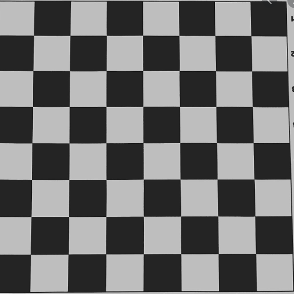

# Nested Loops

At a basic level, a nested loop is a loop within a loop.

Below is one example of a nested loop:

```csharp
int iLIMIT = 5;
int jLIMIT = 4;

for (int i = 0; i < iLIMIT; i++)
{
	for (int j = 0; j < jLIMIT; j++)
	{
		// Code block
	}
} 
```

>**Note** - Make sure the following information is well understood before you write the loop:
>
> - Iteration limits (how many iterations are required),
> - How the iterator variables are increasing or decreasing,
> - How the loop ends.

## Printing Patterns with RC


*Gameplay from the original Space Invadors game. Source: https://mrjoseph-hello.blogspot.com*

Consider the patterns below (imagine that an `X` is an alien):

```text
X X X X
X X X X
```

We have 2 rows and 4 columns: a "2 by 4" grid (also called a matrix). 

Using nested loops, we can print this grid using the **RC pattern**.

> **RC** stands for **Row, then Column**.
> 
> **This is the order in which the nested loops will print your grid patters**

If you need a reminder for the direction of rows and columns, think about spreadsheets:


### Pseudo code

To print the aliens pattern above we would use the following pseudo code (minor details are left out): 

```text
for row = 1 to 2 
{ 
	for col = 1 to 4 
	{ 
		print alien;  // do not break the line
	} 
	print a line break; // happens after the row is completed
} 
```

The following variable names are typically used as iterator variables:

- `row` and `col` 
- `r` and `c` 
- `i` and `j`

> **Remember**
> - Make sure to change your iterator variables (don't use the same for row vs columns).
> - Variables created inside a `for-loop` **exist only inside that scope**. 

## Exercises

### 1- Checker board  

Create a chess/checker board of size 8 x 8.
Use `X` for black squares, `O` for white and start with a white square.



 *Output* 
```text
OXOXOXOX 
XOXOXOXO 
OXOXOXOX 
XOXOXOXO 
OXOXOXOX 
XOXOXOXO 
OXOXOXOX 
XOXOXOXO 
```

**Hint 1:** if (col+row) is an even number, then print a white square, else print a black square.

**Hint 2: Pseudo code below**
Use modulo to check if the sum of row and column is even, then print a white square:

```text
for row = 1 to 8   // here eight is a magic number, use constants! 
	for col = 1 to 8 
		If (col+row) % 2 == 0 then print white square, else print black square
		
	print blank line, moving to next row 
```

### 2- Custom Squares

Prompt the user to input a size of the board, then print it out. 
The pattern must **always be a square**. 

### 3- Input Validation

Refactor exercise 2 in order to validate user inputs with `TryParse`.

The following inputs **should not crash** the program:

- a negative number
- 0 (zero)
- 1  (one)
- 100,000,000: what happens when it goes off screen? Crash? Should there be a max size?
- A word is entered
- A decimal number is entered (e.g. 4.3)

> **Remember**
> - The user should **never crash** your program and it should always **display an error message**.

### 4- Tutorial Challenge
Complete the exercise challenge from Microsoft's tutorial [Combine branches and loops](https://learn.microsoft.com/en-us/dotnet/csharp/tour-of-csharp/tutorials/branches-and-loops?tutorial-step=6)

*Don't look at the solution until you've completed it!*
