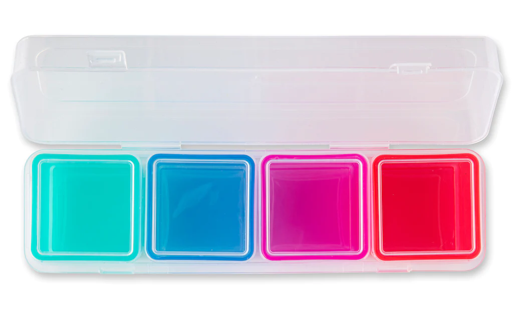

# Arrays

## Terminology

An **array** is a contiguous area of memory where a set of **elements** are stored. Each element in the array is accessible by an **index** position.

- An **array element** is value stored within the array, which can accessed using its index position within the array. The value must be of predefined data type (`int`, `bool`, `double`, `string`, etc).

- The **index position** (referred simply as **index**) is an integer used to specify the position of an element. The first element is at index **zero**, and the last element would be ***(size of array - 1)***.

Example: declaring an **array of strings with four elements**. The 3rd element is being printed:

```csharp
string[] cars = {"Honda", "BMW", "Ford", "Ferrari"};
// Accessing the 3rd element at index 2 (start counting from index 0).
Console.Write( card[2] )  // Ford
```

Example: declaring an **array of integers with three elements**. The 1st element is being printed:


```csharp
int[] students = {"123456", "234567", "345678"};
// Accessing the 1st element at index 0
Console.Write( students[0] )  // 123456
```


### Fixed Size Rule

Arrays must follow the following rules:

> 1. The size of the array must be specified when the array is created.
> 2. Arrays are of fixed size and cannot grow in size. New elements cannot be added.


### Array Analogies

We'll use two analogies to describe an array:

1. An array is similar to a Canada Post community mailbox:


*Source: [raisethehammer.org](https://raisethehammer.org/article/3029/canada_post_corporations_manufactured_crisis)*

For this analogy, consider the following:

* Community mailboxes are unique, and have a unique identifier (e.i. box #2 on 275 Rue Lakeshore).
* The mailbox has different slots (elements), identified by their number (index).
* It's impossible to add or remove a slot (element) without rebuilding the entire mailbox (array).

2. An array is similar to a **box containing smaller boxes**.


*Source: [canada.michaels.com](https://canada.michaels.com/en/5-in-1-multi-use-organizer-by-simply-tidy/10622044.html)*

For this analogy, consider the following:

* The outer plastic box has multiple boxes inside, each with a position number.
* The outer box cannot grow or shrink in size, even if the small boxes are empty.


### Arrays versus Lists

You might be asking yourself: "I can't believe arrays must have a fixed size. There's gotta be a way to have a container that can change sizes on the fly?"

The answer is yes: Lists.

However, **we will not cover lists for now**. Although their size can change as you go, they also have disadvantages. Below is a comparison:

| Arrays                                                  | Lists                                               |
| ------------------------------------------------------- | --------------------------------------------------- |
| Elements are stored in contiguous memory location       | Elements are stored all over the memory             |
| Accessing elements is very fast                         | Accessing elements is very slow                     |
| Size of the array must be defined when declared         | Size of the list does not need to be defined        |
| Cannot add or delete elements once the array is defined | Can append, insert, and delete elements as required |
| Access elements by using square brackets `a[i]`         | Access elements by using square brackets `a[i]`     |


## Array Syntax

### Declaration

An array can be declared without initializing any values (similar to a variable):

*`type_of_array`*`[] `*`array_name`*

> Declaring an array will simply "reserve" it's name.
> - It will not create the "container" to hold other values.

Examples:

```csharp
double[] doubleArray;
string[] myStringArray;
int[] studentNumbers;
```


### Creating an array

To create an array use the `new` keyword

*`variable_name`*` = `**`new`** _`type_of_array`_`[`*`size_of_array`*`]`

>  **NOTE: Declaring an array is not the same thing as creating an array**
>  - Creating an array initializes it to the correct size with its "inner boxes".

Examples:

```csharp
intArray = new int[10];	// create an empty array of integers of size 10
doubleArray = new double[20];
stringArray = new string[5];
```

It's possible to do the declaration and the creation on the same line:

```csharp
int[] intArray = new int[10];	// create an array of integers of size 10
double[] doubleArray = new double[20];
string[] stringArray = new string[5];
```


### Assigning Values to an Array

*Copied from*:  [tutorials point C# arrays](https://www.tutorialspoint.com/csharp/csharp_arrays.htm)

You can assign values to individual array elements, by using the index number:

```csharp
double[] balance = new double[10];
// Assign the value 4500.0 to the first position (using index 0)
balance[0] = 4500.0;
```

You can assign values to the array at the time of declaration. This form avoids the `new` keyword:

```csharp
double[] balance = { 2340.0, 4523.69, 3421.0};  // no 'new' keyword
```

Similar but longer form:

```csharp
int [] marks = new int[5]  { 99,  98, 92, 97, 95};
```

You may also omit the size of the array (implicit from declared elements):

```csharp
int [] marks = new int[]  { 99,  98, 92, 97, 95};
```


#### Array Default Values

When an array is created, the C# compiler **implicitly initializes each array element to the default value for that data type**.

For example:
- For an `int` and `double` arrays, all elements are initialized to 0.
- For a `bool` array, all elements are initialized to `false`.

To see the default values of C# types see official documentation:
- [Default values of C# types](https://learn.microsoft.com/en-us/dotnet/csharp/language-reference/builtin-types/default-values) by Microsoft.


### Copying Arrays

It's possible to copy an array variable into another array variable.

> However, both the target and source arrays will point to the same memory location.
> - This has important repercussions what will be discussed later.

```csharp
int [] marks = new int[]  { 99,  98, 92, 97, 95};
int[] score = marks;
```


### Accessing Array Elements

To reading or write to a particular element in array, use the element's index position: 

*`array_name`*`[`*` index `*`]`

> Remember: the **first element is at index 0**.

Examples:

```csharp
int[] intArray = new int[10];	// create an array of integers of size 10
intArray[3] = 21;  // assign position 3 to value 21
Console.WriteLine( intArray[0] );  // Prints '0', the default value
intArray[2] = 2 * intArray[3];     // intArray[2] = 42
```


### Array Length

To know the exact size of an array, use the notation `arrayName.Length`. This will return an `int` representing the size of the array:

```csharp
int[] numbers = { 1, 2, 3, 4 };
Console.Write( numbers.Length )  // 4
```


## Looping Over Arrays

### For-loop

We can combine the iterator of the `for-loop`, with the array index and the array length to iterate over all the elements of an array:

```csharp
int [] myArray = new int[10];

for (int i = 0 ; i < a.Length; i++) 
{
	myArray[i] = i * 2;
	Console.WriteLine( myArray[i] );
}
```

*Output*
```text
0
2
4
6
8
10
12
14
16
18
```


### foreach loop

The `foreach` loop offers a more concise syntax to iterate through an array.

*Syntax*:

```csharp
foreach (type temporary_variable in array_name )
{
	// use temp_variable in code block
}
```

When using a `foreach` loop, the value of each array element is automatically assigned to the `temporary_variable` as the loop iterates through each element.

- You cannot assign any value to the temporary variable.
- The `temporary_variable` can be called anything. Typically, if the array name is in the plural (e.i. `students` or `cars`), then the `temporary_variable` name will be in the singular (e.i. `student` or `car`).

*Examples*:

```csharp
string[] colors = {"red", "green", "blue", "purple", "pink"};

foreach (string color in colors)
{
  Console.WriteLine("I love the color: " + color);
  // color = "orange"; // Error! Not allowed to assign to color
}
```

*Output*
```text
I love the color: red
I love the color: green
I love the color: blue
I love the color: purple
I love the color: pink
```

The equivalent `for-loop` to the `foreach` above:

``` csharp
string[] colors = { "red", "green", "blue", "purple", "pink" };

for (int i = 0; i < colors.Length; i++)
{
	Console.WriteLine("I love the color: " + colors[i] );
	// colors[i] = "orange";  // No problem.
}
```


## References

- [C# Arrays](https://www.w3schools.com/cs/cs_arrays.php) by W3Schools.
- [Arrays (C# Programming Guide)](https://learn.microsoft.com/en-us/dotnet/csharp/programming-guide/arrays/) by Microsoft


## Diving Deeper 🤿

> This content is optional and will not be tested

To learn more about Array Methods, complete the lesson:

-  [Perform operations on arrays using helper methods in C#](https://learn.microsoft.com/en-us/training/modules/csharp-arrays-operations/) by Microsoft.

The Array Method `Array.Resize` gives the impression of changing the array size. However, this method allocates a new array with the specified size, copies elements from the old array to the new one, and then replaces the reference of the old array with the new one.

- See section [Remarks](allocates a new array with the specified size, copies elements from the old array to the new one, and then replaces the old array with the new one.) of the `Array.Resize` documentation.
- See section [Passing an argument by reference: An example](https://learn.microsoft.com/en-us/dotnet/csharp/language-reference/keywords/ref#passing-an-argument-by-reference-an-example) of the `ref` keyword documentation.


## Exercises

1. Complete [Exercises 1 to 4 on C# Arrays](https://www.w3schools.com/cs/exercise.php?filename=exercise_arrays1) by W3Schools.

2. The array below contains a list of party guests. Write a program that will ask a user for their name and output whether or not the user is in the guest list. Make sure the program is case-insensitive.

