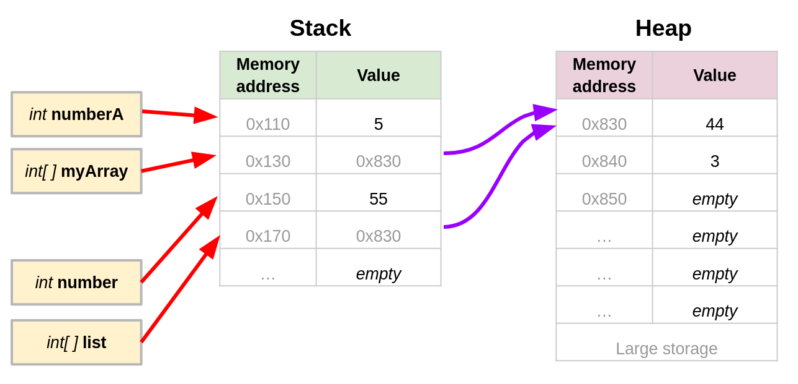

# Passing Arrays, Heap & Stack

## Passing Arrays to Functions

It's possible to pass an array to a function in a similar way we would pass a regular variable (ex. `int`, `bool`, `string`):

```csharp
// Print all the numbers inside an int array
static void PrintArrayNumbers( int[] numbers )
{
	for(int index=0; numbers.Length; index++)
	{
		Console.WriteLine(numbers[index]);
	}
}
```

Note how the single function parameter is declared to be an array of integers, `int[] numbers` . 

> Although this looks very similar to passing a regular data type (ex. `int`, `bool`, `string`) to a function, there is a fundamental difference:
>
> - Modifications done to the array inside the function will affect the values of the array outside the function. 


The code below illustrates this fundamental difference between arrays vs passing regular data types:

```csharp
static void Main(string[] args)
{
    int numberA = 5;
	int[] myArray = { 2, 3 };
    ChangeNumbers(numberA, myArray);

    Console.WriteLine($"First array value: {myArray[0]}. numberA: {numberA}");
}
static void ChangeNumbers(int number, int[] list)
{
    number = 55;
    list[0] = 44; 
}
```

*Output*
```text
First array value: 44. numberA: 5
```

As you can see, the variable `myNumber` was unaffected by the function `ChangeNumbers`.
- **A completely new variable is created** inside `ChangeNumbers` and its value is set to be the same as the second argument passed to the function (`myNumber`).

However, the same is not true for `numberList`. The first element of the array (value of `1`) was modified from within the function `ChangeNumbers` when the line `list[0]` was executed.
- This happens because when an array is passed to the function, the function receives a reference to the original array, **not a copy of the data inside the array**.
- Using this reference, the function has access to the original array and can modify it's data. 

This process will be illustrated in more detail below.


## Reference Types vs Value Types

In C#, there are two categories of data types:

- **Value Types** such as `int`, `double`, `bool`, and `char`.
	- Think of these as "basic" data types.

- **Reference Types**, such as `array` and `Object`.
	- They can grow quite large in size.


When a **value type** variable is initialized (ex. `int numberA = 5` ), the variable name points to (red arrow) the memory location that holds the variable's value.

When a **reference type** variable is initialized (ex. `int[] myArray = {2, 3} `), the variable name points to (red arrow) a memory location holds the **reference address** of (purple arrow) a second memory location. The actual values of the array are contained in the second memory location.


### Passing Value Types and Reference Types to Functions

We will use the previous code snip to illustrate how *value types* and *reference types* are passed to a function.

```csharp
static void Main(string[] args)
{
    int numberA = 5;
	int[] myArray = { 2, 3 };
    ChangeNumbers(numberA, myArray);
}
static void ChangeNumbers(int number, int[] list)
{
    number = 55;
    list[0] = 44; 
}
```

<br>

When a value type (ex. `numberA`) is passed to a function, the following takes place:
1. A new local variable is created inside the function (`int number`). This local variable has a unique memory address.
2. The **value** of the argument being passed (`numberA = 5`) is copied into the newly created variable (`number = 5`);

When a reference type (ex. `myArray`) is passed to a function:
1. A new local variable is created inside the function (`int[] list`) . This local variable has a unique memory address.
2. The **reference memory address** of the argument being passed (`myArray`) is copied into the newly created variable (`int[] list`).
	1. Therefore, the array inside the function has direct access to data of the original array and can modify its values.


The diagram below shows the moment when the function `ChangeNumbers` is being called (lines of code highlighted in yellow):


Once all of the function's local variables have been setup, the function code is executed. In the case of `ChangeNumbers`, there are two variable assignments - one for the integer and one for the array:

1. The local integer variable is modified (`number = 55`) and its value changes from `5` to `55`.
2. The local array at index `0` is modified (`list[0] = 44`), however, since `list` holds a reference to the same memory address as the original array - `myArray` - the value is modified for both arrays, even thought `myArray` is outside of the function.

The diagram below show the moment when both local variables are modified (lines of code highlighted in yellow):


## Stack & Heap

The previous diagrams showed the data for *value types* and the data for *reference types* being stored in different "memory tables" (green vs purple table headers).

When a program is executing there are two types of memory locations available to store data: the **stage and the heap**.


*Source: [What and where are the stack and heap?](https://stackoverflow.com/questions/79923/what-and-where-are-the-stack-and-heap) in StackOveflow. Illustration by [Alireza](https://stackoverflow.com/users/5423108/alireza)*

### The Stack

When a program starts, it reserves memory for local variables in a special area in memory called the `stack`.

It is called the stack, because it is similar to a stack of plates:

* When a new local variable is required it is added to the top of the existing stack;
	* E.g: putting a plate on top of a stack of plates.
* When the local variables are no longer required, it is removed from the stack (leaving the memory available for something else).
	  E.g: removing a plate or plates from the top of the stack of plates.
- Variables can only be added or removed from the top of the stack. This order is called FILO: First In, Last Out.

Typically, the number of local variables is limited in size, so the amount of memory reserved for the stack is also limited. If too much memory is used, it will result in a **stack overflow** and the program crashes.


### The Heap

When the program starts, it also reserves memory for variables that could be quite large.  The amount of memory reserved for the `heap` is quite large, and is able to grow in size as required.

> Since *reference type* variables can also be quite large (e.g. arrays, lists, objects), they may not fit into the stack and are placed into the Heap 
> 
> * These *reference type variables* hold the starting address to the memory that is reserved in the *heap* (a pointer).


The diagram below shows the previous code example after execution is completed with the data separated between the stack and the heap:




## Illustrated Shopping Analogy

### Creating Arrays: Heap and Stack

Below is an illustrated analogy by teacher Sandy Bultena which shows how arrays are created, and what is *really* stored in the declared array variable.

In this analogy an user would like to store large amounts of data as an array (of soil) on their stack (shopping cart). Since the data would not fit, the computer's memory management uses the heap to store the data and provides the user with a reference to where the data is stored in the heap.

*A detailed explanation is provided below the illustration*


**Imagine the following:**

* Off you go to the hardware store to pick up supplies. 
* As you peruse the shelves, you pick up things that you need and put them in your shopping cart, which we will call the *stack*. 
* The shopping cart holds your *local variable data*.
* You come across a stack of bags of soil that you need.  They do not fit in your shopping cart.
* You yell "HEY! Memory Manager, I need you to reserve 20 bags of dirt for me"
* The memory manager then goes to the back of store in an area where there are numbered stalls which can be used to store stuff.  This is called the *heap*.  
	* the memory manager finds a slot that is big enough to hold your valuables.  In this cartoon, the available memory slots are from 103-112 
	* if the data (bags of soil) exist, the memory manager saves this in the appropritately addressed slot.
* The memory manager now brings you back a slip of paper, saying that the stuff in the appropriate slot belongs to you!
* You take this information, and save it in a special kind of variable (a pointer, or more accurately, a reference).  This information contains the number of the slot where your valuables are, and what kind of valuables are stored there.
* Now, you give this piece of paper a name (the variable name), and stuff it into your shopping cart.  
* You are already to carry on.

**C# example code for the story above**:

```csharp
soil[] bags_of_soil = new soil [20];
```


### Passing Arrays to functions

The shopping cart analogy is continued for arrays being passed to functions.

In this case, the user is passing their data (shopping supplies) to a function (landscape contractor) so that the function can accomplish a task. The data being passed to the function includes an array. During the function call, a copy of the array reference is created which makes the array contents available inside the function.

*A detailed explanation is provided below the illustration*


Continuing our story...

* You, whose sole function is to get supplies (shall we call you `GetSupplies` ?) need to give the bags of soil to the landscaper whose sole function is to fix your lawn (called `FixLawn`?)
* You cannot give the bags of soil to the landscaper, because you don't have them!
* ... but... you do have a slip of paper (called `bagsOfSoil` in the comic) that has the information of where the bags of soil are.
* You instruct the landscaper to make a copy of this paper, so that they now have the information required.
* Your job is done.
* The landscaper on the other hand, needs to get the soil out of the bags.  Being ornery, they decide to ask specifically for bag #3.
* The landscaper yells out to the memory manager, "Hey, get bag # 3.  Here is the information as to where it is stored"
* So, the poor overworked memory manager does just that.

The end.

**VERY IMPORTANT**

Because `GetSupplies` and `FixLawn` are only copying the location of the bags of dirt, when either actually manipulates this dirt (array), they are *both* accessing the same pile of bags of soil.

**C# example code for the story above**:

```csharp
static void GetSupplies() {
  soil[] bagsOfSoil = new soil[20] {"dirt", "dirt", "dirt", // ... etc}
  int greenBox = 3;
    
  FixLawn(bagsOfSoil);  
}

// Notice that we have to specify that 'dirt' is a `soil array'?
static void FixLawn( soil[] dirt ) 
{
  soil three = dirt[3];
  // and more code
}
```


## Diving Deeper 

- [The C# type system](https://learn.microsoft.com/en-us/dotnet/csharp/fundamentals/types/#built-in-types) documentation by Microsoft.
- 


## References

<iframe width="560" height="315" src="https://www.youtube.com/embed/mvieNUe9Urs" title="YouTube video player" frameborder="0" allow="accelerometer; autoplay; clipboard-write; encrypted-media; gyroscope; picture-in-picture" allowfullscreen></iframe>

