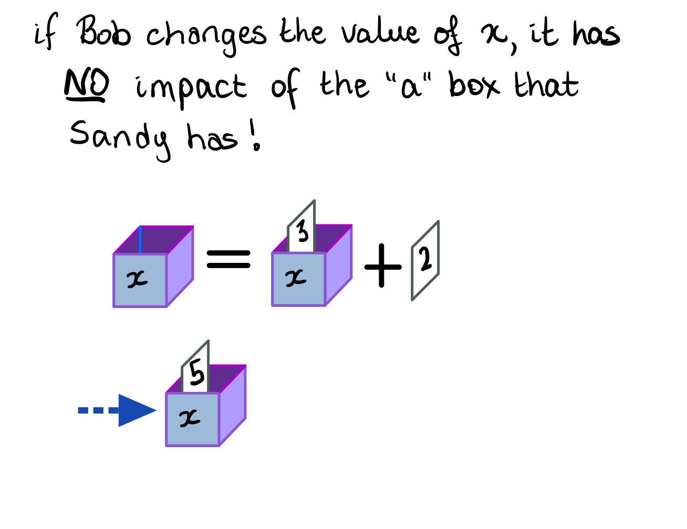
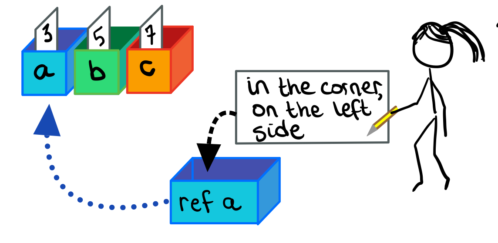
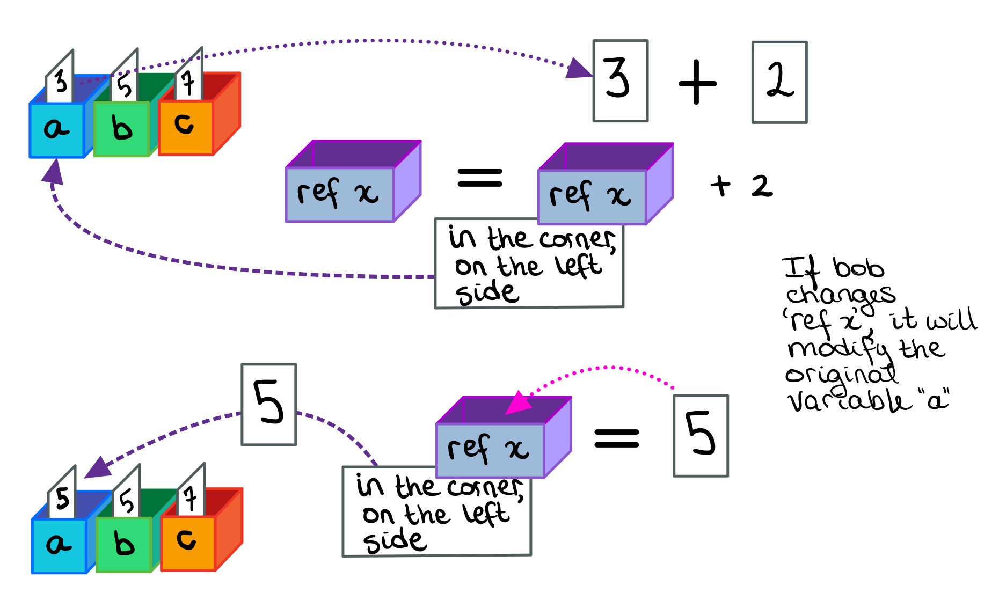

# Pass By Value & Pass By Reference

## Pass By Value: The Default

In C#, when a function A calls another function B, arguments are passed to function B as ***pass by value*** **by default**.

We'll review the default behaviour of passing arguments to a function (aka. **pass by value**) with the example below:

```csharp
public static void Sandy()
{
	int a = 3;
	int b = 5;
	int c = 7;
	Bob(a, b, c);
}
static void Bob( int x, int y, int z )
{
	x = x + 2;
	Console.WriteLine($"Result is {x + y + z}");
}
```


Let's inspect each stage of the function call:

1. Function `Sandy` calls function `Bob` and wants to pass 3 arguments.

2. The arguments passed by `Sandy` are stored in variables `a`, `b`, and `c`. 
  * In other words, the values for these variables are stored in RAM memory where each memory location has been given a name, `a`, `b`, and `c`, respectively.

```csharp
	int a = 3;
	int b = 5;
	int c = 7;
	Bob(a, b, c);
```

3. When `Sandy` calls `Bob`, `Bob` must have three variables of his own (`x`, `y`, and `z` in this example), in RAM, that are *not* in the same locations as the ones that `Sandy` is using.
	- In the drawing below, the RAM locations are going show with the coloured boxes.

```csharp
static string Bob( int x, int y, int z )
{	
	// ... function code
}
```


4. The content in variable `a` is read, and the *value* **is copied** into the memory address `x`. Likewise, the content of variable `b` is read, and **copied** into variable `y`, and finally the value of `c` is **copied** into the variable `z`.

```csharp
static void Bob( int x, int y, int z )
{
	// Equivalent to having parameters x, y and z initialized at the begining of the function:
	// int x = 3;
	// int y = 5;
	// int z = 7;
	
	// ... rest of function
}
```

Remember:

> The variables inside function `Bob` are **local copies** of the values passed to it and are **completely independent** from any variables inside function `Sandy`.

**Notes:**

* The names of the variables in `Sandy` and `Bob` are irrelevant
* The variables in `Sandy` and `Bob` are stored in *separate* locations!
* The *values* stored in the variables are copied from `Sandy` to `Bob`.


###  Independent Copies

If `Bob` makes any changes to variable `x`, it will have no consequence to `Sandy`'s variable `a`, because it is **not** in the same memory location.

```csharp
static void Bob( int x, int y, int z )
{
	x = x + 2;  // Does no modifies any variables inside function Sandy
	Console.WriteLine($"Result is {x + y + z}"); 
}
```





## Pass by Reference: Sending the Address

It is possible to pass a variable to a function in such a way that the function would have direct access to the original variable's memory address.

This is done by using the keyword `ref` to **pass a reference variable - which points to the original variable** - to a function.

> **Pass by Reference** works similarly as passing arrays to functions (see previous lesson).

In the example below, function `Sandy` is passing the variable `a` by reference using `Bob(ref a)`.

Notice how function `Bob` must be declared as receiving a reference with `static void Bob( ref int x)`.

```csharp
public static void Sandy()
{
	int a = 3;  // regular variable declaration
	int b = 5;
	int c = 7;
	Bob(ref a);  // passing 'a' by reference

	Console.WriteLine("a is: " + a);  // 5, 'a' was modified inside Bob
}
static void Bob(ref int x)
{
	x = x + 2;
	Console.WriteLine($"Result is {x}");   // 5 as expected
}
```


> To use a `ref` parameter, **both** the function definition and the calling function must explicitly use the `ref` keyword.

### Sandy & Bob with `ref`

We'll use our previous example (from Pass by Value) to illustrate how Pass by Reference works.

#### Step 1: Create a reference to the variable

Assuming that the variable which will be passed already exists (`a` in the example above), the first step involves creating a ***reference variable*** with the `ref` keyword (`ref a`), which will be passed to a function.

* Imagine that the RAM is a series of boxes with labels. The 'value' of each variable is kept inside the labelled box.

* Assume a variable `a`, which contains the number `3`.

* This box is kept to the left of all other boxes, in the corner of the classroom. This will be its location or "address".

* Create a new box, labelled `ref a`, which contains a slip of paper that says "*in the corner on the left side*". **This is a reference to variable `a`, not the variable itself.**



#### Step 2: Pass the variable by reference

Pass the `ref a` variable to function  `Bob`, which must also have a *reference variable* setup in order to receive it.  The data inside of `ref a` will be copied to the variable `ref x`.

* `Bob` has a box called `ref x`.

* The content of the `ref a` box (*in the corner, on the left side*) will be copied into the box `ref x`.

- At this point, both `Sandy` and `Bob` contain a reference to the original variable `a`.


### Access to the Same Reference

If `Bob` makes a change to his variable `ref x` (which can be referred simply as  `x` inside the function), the program will do the following:

1. Read the  contents of the variable `ref x` will be read to determine what's inside of it.
	* It will find the reference: *"in the corner on the left side"*.

2. It will follow the reference and find the actual box that is is pointing to. box *in the corner on the left side*
	* In this example, that is the box labelled '`a`'.

3. The content of the box in the corner on the left side will be read. In this example, that number is `3`.


When assignment values into `ref x`, the process is repeated. The program will:

1. Read the contents of the variable `ref x` and determine what is inside of it.
	- Reference: *in the corner on the left side*. 

2. Follow reference to find the box *"in the corner on the left side"* (box `a`)

3. Assign the new value into the original box `a`.

> Note that this process **modifies the original variable**!





### Using Memory Tables

The same concept can be explained using a memory table to track how the reference of variable `a` is being passed to function `Bob`.

1. Variable `int a = 3` is initialized inside function `Sandy`.
	- Variable `a` is given a memory address which stores its value `3`.


2. Once `ref a` is passed to function `Bob`, it is not the value of `a` which is passed (the default behaviour), but rather the memory address of variable `a`
	- Address `0x110` in the table example.

```csharp
public static void Sandy()
{
	int a = 3; 
	Bob(ref a);  // passing address of 'a' to function
	
	// rest of function... 
}
```


3. Inside function `Bob`, a new reference variable is declared,  `ref x`, which will hold the reference address passed to this function.
	- Address `0x110`

```csharp
static void Bob(ref int x) // ref x is setup to hold reference addresses
{
	// rest of function... 
}
```


4. When variable `x` is modified inside function `Bob`, the modification happens at the reference (destination address)

```csharp
static void Bob(ref int x)
{
	x = x + 2;  // value at reference is 3, so 3 + 2 = 5
	Console.WriteLine($"Result is {x}");   // 5 as expected
}
```


## The `out` keyword

The `out` keyword works very similar to using the `ref` keyword, but with a few new rules

* The receiving function (`ConvertInt` in the example below) *must* assign a number to `number`!

```csharp
static void Main(){
	bool lightStatus = true;  // light starts as on
	ToggleLight(out lightStatus);
}
static void ToggleLight(out bool light)
{
	light = (!light);  // if it's on, turn if off and vice-versa
}
```


## Exercises

### Ex.1: Re-implementing the `int.TryParse` Function 

Using **pass by reference**, create your own implementation of the `int.TryParse` function using `int.Parse`.

Review of `TryParse` :

* Receives the `string` to be parsed.
* Returns a `bool`, which is `true` if parsing succeeded, `false` otherwise.
* Sets a variable to the parsed number.  Note: because the function is already returning `true/false`, it cannot also return a number.

#### Hint: Try-Catch

The function `int.Parse` will crash the program if parsing fails.

The  `try-catch` statement is mean to allow a program to recover when a crash has happened.

```csharp
try
{
	// Code that will be attemped (eg. int.Parse)
}
catch
{
	// Code that will run if the 'try' block crashes (eg. string is not parseable)
}
```


