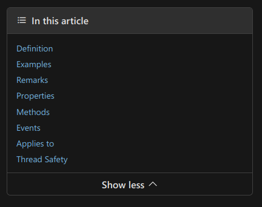
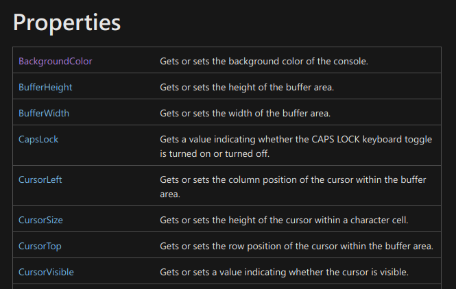

# Console Manipulation

All of the programs that we've written so far exist inside the Console window. However, the Console window itself is programmable and can be controlled via code.

This is a brief introduction to reading and setting properties of the Console as well as using its build-in methods.


## Self-Guided Learning

> **Note on Self-Guided Learning**
> 
> Self-guided learning is arguably the **most important skill a developer must acquire**.

Self-guided learning includes:

- Reading documentation, which is typically "the ultimate source" of information.
- "Googling" for information with the right keywords and an appropriate level of generalization or specificity;
- Sorting and filtering unrelated information. 

> Students will be expected to research deeper into the topics introduced in the notes and learn from linked documentation and resources.


##  The Console Class 

The console is a programming class.

In Object Oriented Programming (OOP), classes typically composed of **properties and methods**.

> See the official documentation to see the properties and methods available to the `Console` class.
> 
> **[Console Class](https://learn.microsoft.com/en-us/dotnet/api/system.console?view=net-7.0)** Reference by Microsoft


### Documentation Tips

When looking at the official documentation, use the table of contents on the right-hand side of the page.



## Properties

Properties are attributes that describe the a class. Properties can be '***read only***' or '***read and write***'.

Below are a few properties described in the docs (documentation):




### Read/Write Properties

When a property is of type 'read/write', it means that:

1. The property value can be accessed (read).
	- In programming terms, we can ***get** the property.

2. The property value can be modified (written).
	- In programming terms, we can ***set*** the property.

To know if a property is 'read/write', look at its definition:
- If both keywords ***get*** and ***set*** are listed, then this property is read/write.

#### Read/Write Example

Property `BackgroundColor`: *Gets or sets the background color of the console.*

When reading the documentation for this property, we find:

```csharp
// First 4 lines are not relevant
// [System.Runtime.Versioning.UnsupportedOSPlatform("browser")]
// [System.Runtime.Versioning.UnsupportedOSPlatform("android")]
// [System.Runtime.Versioning.UnsupportedOSPlatform("ios")]
// [System.Runtime.Versioning.UnsupportedOSPlatform("tvos")]

public static ConsoleColor BackgroundColor { get; set; }
 ```

**Note:** property `BackgroundColor` is of type `ConsoleColor` (see section Property Value below).

*Example of using a read/write property*

```csharp
Console.BackgroundColor = ConsoleColor.DarkBlue;   // setting the property
ConsoleColor currentBc = Console.BackgroundColor;  // getting the property
```

### Read Only

If a property is only listed with the keyword `get` (but not `set`), then it is 'read-only'.

#### Read-only Example

Property `CapsLock`: *Gets a value indicating whether the CAPS LOCK keyboard toggle is turned on or turned off.*

When reading the documentation for this property, we find:
```csharp
// [System.Runtime.Versioning.SupportedOSPlatform("windows")]
public static bool CapsLock { get; }
```

*Example of using a read-only property*

```csharp
if (Console.CapsLock) {
	Console.WriteLine("Caps lock is on!");
}
```


### Property Values

* The property value describes what this propery is.  It also defines what `type` the value must be (`int`, `bool`, *etc*)
* If the property value is not a simply type (numbers, arrays, strings, etc), there should be a link to a web page that describes that type.

Example:

> [ConsoleColor](https://docs.microsoft.com/en-us/dotnet/api/system.consolecolor?view=net-6.0)
> - Relevant to `Console` color properties `BackgroundColor` and `ForegroundColor`.


## Documentation Examples

* Examples included in the Microsoft documentation can be very helpful.  **However**, sometimes they are too complex or confusing to understand.
* At this point, if you know what you want to learn, but do not understand the documentation, google is your friend.
* Beware of the site, [Stack Overflow](https://stackoverflow.com/), it can contain great information, but answers can be wrong and out of date. It is largely based on opinion (via its voting system), and answers can be very specific to the question asked.


### Interesting Console Properties

 `BackgroundColor`, `ForegroundColor` : Changes the colors used to write text to the screen

 `CursorLeft`, `CursorTop`: defines the location of the cursor row, column)

 `CursorVisible`: Is the cursor visible?

 `KeyAvailable`: will be described next class

 `WindowHeight`, `WindowWidth`: the size of your terminal window in rows and columns


## Methods

- Methods are functions that are 'build into' the class.
- In other words, methods are functions that belong to the class and can be called by the class.

*Method Example*

```csharp
// [System.Runtime.Versioning.SupportedOSPlatform("windows")]
public static void SetWindowSize (int width, int height);
```

*Example in use*

```csharp
// Step 1: Get the current window dimensions (properties)
int origWidth  = Console.WindowWidth;
int origHeight = Console.WindowHeight;

// Step 2: Cut the window to 1/4 its original size.
int width  = origWidth/2;
int height = origHeight/2;
Console.SetWindowSize(width, height);
```


### Interesting Console Methods

`Beep` - doesn't work on Mac

`Clear` - clear the terminal of all text, reposition the cursor at row 0, and column 0

`GetCursorPosition` - where is the cursor?

`ReadKey` - reads a single keystroke (useful with property `KeyAvailable` - see next notes)


## Exercises

### 1. Middle Position

Create a program that does the following:
1. Prints the character "X" in yellow color exactly in the middle of the Console.
2. Then prints "Hello Word" in the top left of the Console without erasing the previous "X".

