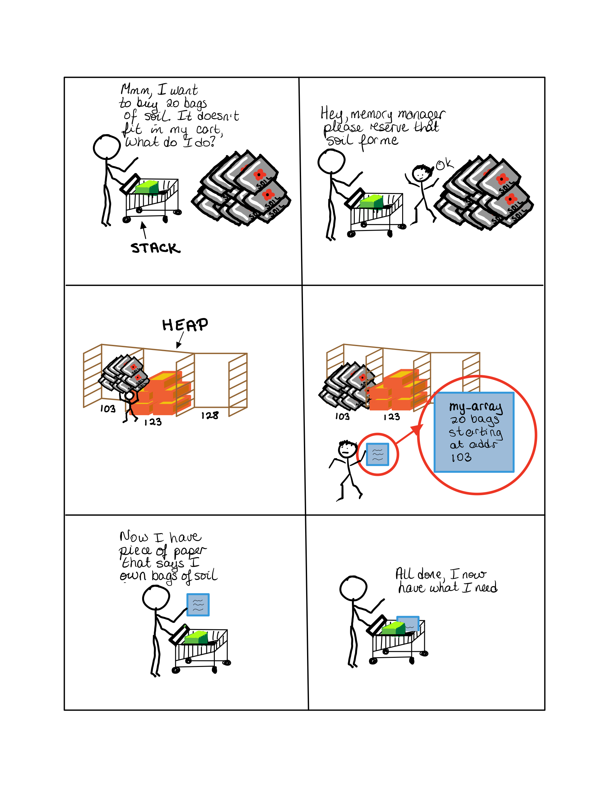
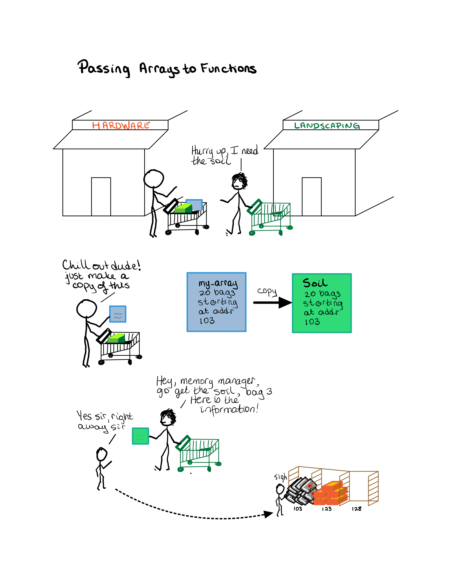

# Data Storage of Local Variables and Arrays

When a program is executing, it needs to manage the memory.

> NOTE: Maybe a better explanation in lecture 31?

## Local Variables

Local variables are only accessible when they are executing the code block they are defined in.  Which means that the memory address (the actual location of in RAM) is assigned to this variable only during the duration of that code block.  Confused?

```csharp
static void foo() { // Code block 1
  int Sandy = 35;
  int Bob = 29;
  
  // ... some code ...
 
  for (int i = 1; i<10; i++) { // Code block 2
    int Sally = 902;
    int Bill = 98;
    // ... some code...
  }
}
```

Currently the executing code block is the `for` loop.  It needs access to `Sandy`, `Bob`, `Sally`, `Bill`, and `i`. The executing code saves the data for these variables in RAM (and keeps track of where each one is)

Imagine the following table is a section of RAM.  

| Address | Variable Name    | Value |
| ------- | ---------------- | ----- |
| 351     | Sandy            | 35    |
| 352     |                  | 67    |
| 353     | Bob              | 29    |
| 354     | Sally            | 902   |
| 355     | i                | 1     |
| 356     | Bill             | 98    |
| 377     | *- unassigned -* | 101   |

When the `while` loop finishes, the variables `Sally`, `Bill`, and `i` are no longer required, and are no longer associated with these addresses.  These addresses can. now be used for other things.

| Address | Variable Name    | Value |
| ------- | ---------------- | ----- |
| 351     | Sandy            | 35    |
| 352     |                  | 67    |
| 353     | Bob              | 29    |
| 354     | *- unassigned -* | 902   |
| 355     | *- unassigned -* | 10    |
| 356     | *- unassigned -* | 98    |
| 377     | *- unassigned -* | 101   |


### Stack

When the program starts, it reserves memory for local variables (plus a few other things) in a special area in memory called the `stack`.

It is called the stack, because it is similar to a stack of plates,... i.e.

* when a new local variable is required it is added to the existing stack 
  * put a plate on top of a stack of plates
* when the local variables are no longer required, it is removed from the stack (leaving the memory available for something else) 
  * remove a plate or plates from the top of the stack of plates

Typically, the number of local variables is limited in size, so the amount of memory reserved for the stack is also limited.  If you need too much memory, you have a **stack overflow** and your program crashes.

### Heap

When the program starts, it also reserves memory for things that could be quite large.  The amount of memory reserved for the `heap` is quite large, and is able to grow in size as required.

What is stored on the heap?

* Objects, arrays, lists, dictionaries, etc. (this will be explained a little bit later)

## Storing Array Data

Arrays can be quite large, although they can be small.  However, the compiler (which organizes the code and memory) will treat all arrays the same way, regardless of size.

So, given that arrays can be large, they may not fit into the *stack*.  

Therefore, 

* The required amount of memory will be reserved in the *heap* to store the array's data

* a variable will be created that holds the starting address to the memory that is reserved in the *heap* (a pointer)

# Consequences of Arrays Being Stored in the Heap

Consider the following code:

```csharp
int [] a = new int[5] {1,2,3,4,5};
int [] b;

Console.WriteLine(a[0]+" "+a[1]+" "+a[2]+" "+a[3]+" "+a[4]);
b = a;
b[2] = b[2] + 200;
Console.WriteLine(a[0]+" "+a[1]+" "+a[2]+" "+a[3]+" "+a[4]);
```

*Result*

```text
1 2 3 4 5
1 2 203 4 5
```

*Analysis*

* (Line 1) declare *and* create a new array
  * Memory in the heap is reserved for the array (assume that it starts at the address 103)
  * the address of the heap data is stored in a local variable (`a`). (So `a` is a *pointer* with a value of `103`)
* (Line 2) declare but do NOT create a new array
  * `b` is a pointer to an array, but is currently undefined
* (Line 4) print out the content of `a`
  * Note: `a[2]` means... take the address of `a` (which is hypothetically `103`), and add `2` to it to get `105`. Now access the data that is stored in the heap at address `105`.  This would be the value of `a[2]` which is  `3`

* (Line 5)   `b` (a pointer) is given the contents of `a`, also a pointer, which means now that `b` is equal to `103`
* (Line 6)  `b[2]` means... take the address of `a` (which is hypothetically `103`), and add `2` to it to get `105`. Now access the data that is stored in the heap at address `105`.  
  * The data at address `105` is currently `3`.
  * Add `200` to get`203` and save it at the same address (`b[2]`) of `105`
  * NOTE!!! we just changed data in the heap.  This is the same data that `a` is referring to when it wants info about the array!!!
* (Line 7) print out the content of `a`
  * Note: `a[2]` means... take the address of `a` (which is hypothetically `103`), and add `2` to it to get `105`. Now access the data that is stored in the heap at address `105`.  This would be the value of `a[2]` which is now  `203`

*Trace*

| Line# | `ptr val of a` | `ptr val of b` | `addr:103` | `addr:104` | `addr:105` | `addr:106` | `addr:107` |
| ----- | -------------- | -------------- | ---------- | ---------- | ---------- | ---------- | ---------- |
| 1     | 103            |                | 1          | 2          | 3          | 4          | 5          |
| 2     |                | `Null`         |            |            |            |            |            |
| 5     |                | 103            |            |            |            |            |            |
| 6     |                |                |            |            | 203        |            |            |


# Arrays, Pointers  - revisited

How arrays are created, and what is *really* stored in the declared array variable.

Imagine the following:

* Off you go to the hardware store to pick up supplies. 
* As you peruse the shelves, you pick up things that you need and put them in your shopping cart, which we will call the *stack*. 
* The shopping cart holds your *local variable data*.
* You come across a stack of bags of soil that you need.  They do not fit in your shpping cart.
* You yell "HEY! Memory Manager, I need you to reserve 20 bags of dirt for me"
* The memory manager the goes to the back of store in an area where there are numbered stalls which can be used to store stuff.  This is called the *heap*.  
	* the memory manager finds a slot that is big enough to hold your valuables.  In this cartoon, the available memory slots are from 103-112 
	* if the data (bags of soil) exist, the memory manager saves this in the appropritately addressed slot.
* The memory manager now brings you back a slip of paper, saying that the stuff in the appropriate slot belongs to you!
* You take this information, and save it in a special kind of variable (a pointer, or more accurately, a reference).  This information contains the number of the slot where your valuables are, and what kind of valuables are stored there.
* Now, you give this piece of paper a name (the variable name), and stuff it into your shopping cart.  
* You are already to carry on.

## c# example

```csharp
soil[] bags_of_soil = new soil [20];
```


# Passing Arrays to functions

Continuing our story...

* You, whose sole function is to get supplies (shall we call you `get_supplies` ?) need to give the bags of soil to the landscaper whose sole function is to fix your lawn (called `fix_lawn`?)
* You cannot give the bags of soil to the landscaper, because you don't have them!
* ... but... you do have a slip of paper (called my_array in the comic) that has the information of where the bags of soil are
* You instruct the landscaper to make a copy of this paper, so that they now have the information required.
* Your job is done.
* The landscaper on the other hand, needs to get the soil out of the bags.  Being ornery, they decide to ask specifically for bag #3.
* The landscaper yells out to the memory manager, "Hey, get bag # 3.  Here is the information as to where it is stored"
* So, the poor overworked memory manager does just that.

The end, sleep tight

## C# example

```csharp
static void get_supplies() {
  soil[] bags_of_soil = new soil[20] {"dirt", "dirt", "dirt", // ... etc}
  int green_box = 3;
    
  fix_lawn(bags_of_soil);  
}

// Notice that we have to specify that 'dirt' is a `soil array'?
static void fix_lawn( soil[] dirt ) 
{
  soil three = dirt[3];
  // and more code
}
```

## VERY IMPORTANT

Because `get_supplies` and `fix_lawn` are only copying the location of the bags of dirt, when either actually manipulates this dirt (array), they are *both* accessing the same pile of bags of soil.

