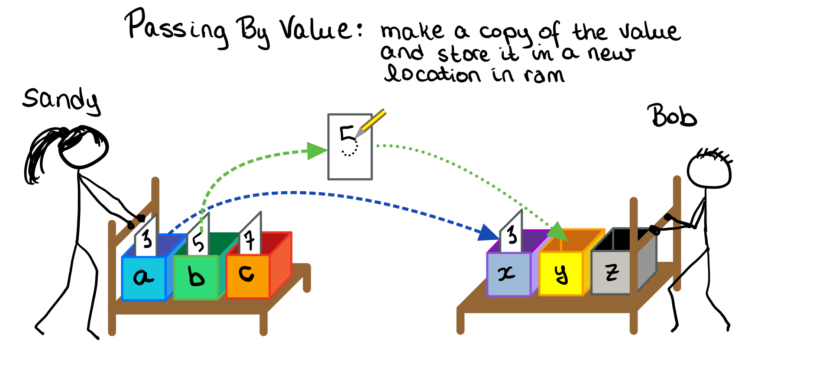
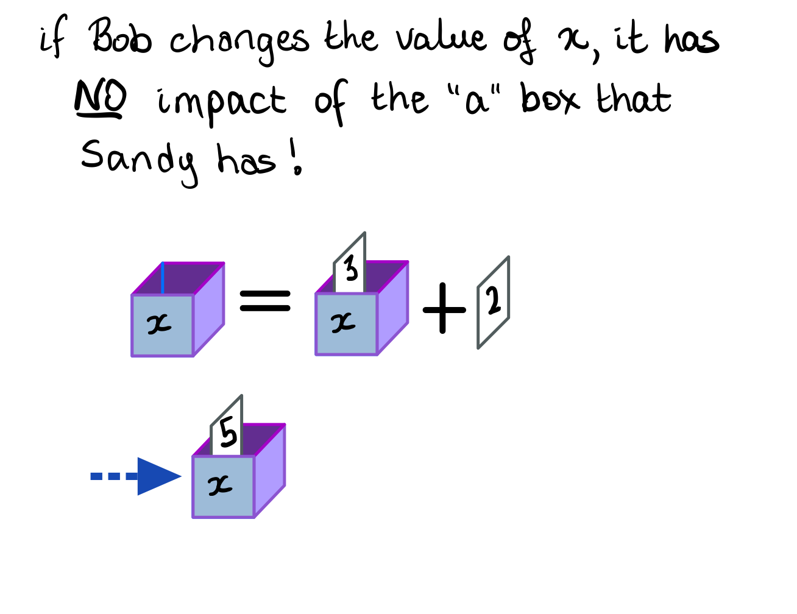
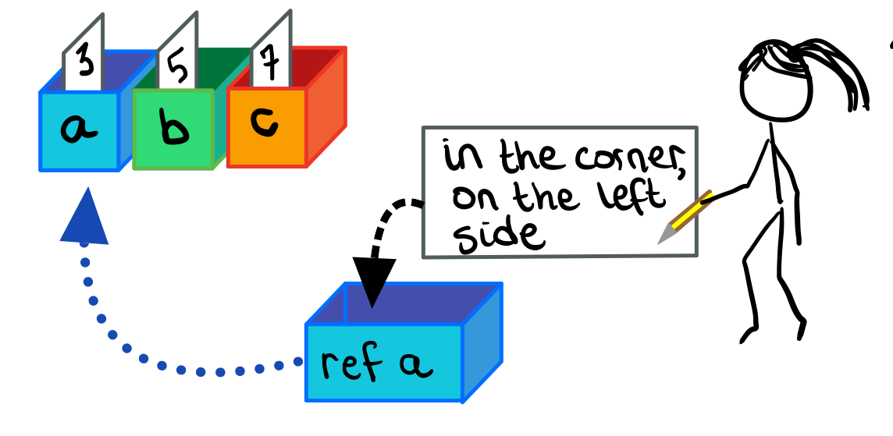
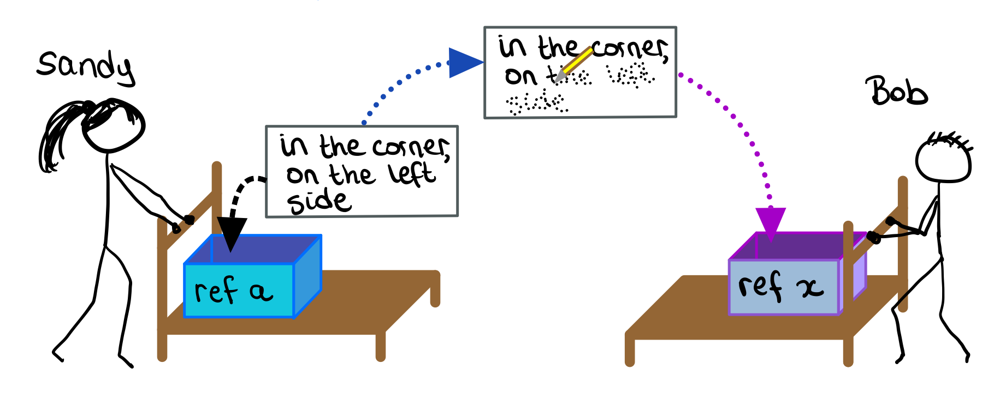
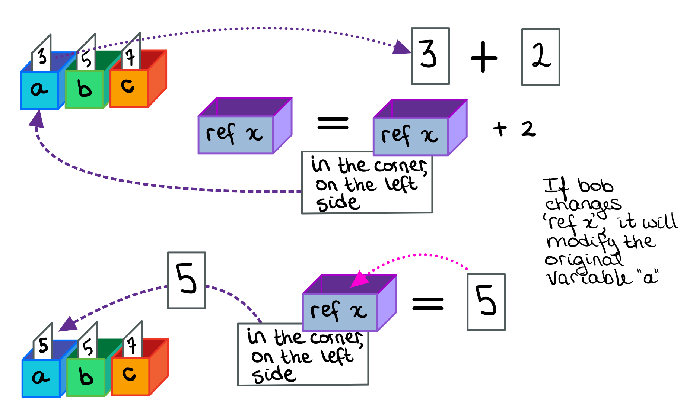

# Pass By Value

When a C# calls another function, and passes arguments to that function, it is typically done as *pass by value*.

So what does this mean?



Lets assume that 

* function `sandy` is calling function `bob`.  
* `sandy` wants to pass three arguments to `bob`
* the arguments are stored in variables `a`, `b`, and `c`. 
  * In other words, the values for these variables are stored in RAM (memory) where each memory location has been given a name, `a`, `b`, and `c`, respectively.
* when `sandy` calls `bob`, `bob` must have three variables of his own (`x`, `y`, and `z` in this example), in RAM, that are *not* in the same locations as the ones that `sandy` is using.
* The content in in variable `a` is read, and the *value* is copied into the memory address `x`. Likewise, the content of variable `b` is read, and **copied** into variable `y`, and finally the value of `c` is copied into the variable `z`.

NOTE:

*  The names of the variables in `sandy` and `bob` are irrelevant
* The variables in `sandy` and `bob` are stored in *separate* locations!
* The *values* stored in the variables are copied from `sandy` to `bob`.

The above describes **pass by value**

## Consequences of Pass by Value

If `bob` makes any changes to variable `x`, it will have no consequence to `sandy`'s variable `a`, because it is NOT in the same memory location.



### Code

```csharp
static void sandy() {
  int a = 3;			// stored in blue box in RAM
  int b = 5;			// stored in green box in RAM
  int c = 7;			// stored in orange box in RAM
  
  bob(a,b,c);			// copy the numbers 3,5,7 into bob storage area
	Console.WriteLine(a);
}

static void bob(int x, int y, int z) { // copy 3,5,7 into purple,yellow,gray boxes, respectively)
  x = x + 2;  // change the content of the purple box only.  Does not modify the blue box at all!
 	// ... more code ...  
}
```


# Pass by Reference

As was seen in the previous session, any changes that `bob` makes to the variable `x` has no impact on `a`.  But what if we wanted it to?

Step 1. Create a reference/pointer to your variable.  

* Imagine that your RAM is a series of boxes, with labels on them.  You keep the 'value' of your variable inside the labelled box.

* Now assume we have a variable `a`, which contains the number `3`. 

* This box is kept in the left hand corner of your classroom.

* You then create a new box, labeled `ref a`, which contains a slip of paper that says "*in the corner on the left side*"



Step 2. Pass the `ref a` variable to `bob`, who must also have a reference variable to receive it.  The data inside of `ref a` will be copied to the variable `ref x`.

* Bob has a box called `ref x`.

* The content of the `ref a` box (*in the corner on the left side*) will be copied into the box `ref x`.



## Consequences of Passing by Reference

If `bob` makes a change to his variable `ref x` (which might just be called `x` by the way), the program will

* read the contents of the variable `ref x` and determine what is inside of it
  * *in the corner on the left side*  
* find the box *in the corner on the left side*

  * in this example, that is the box labelled '`a`'
* The content of the box in the corner on the left side will be read.  in this example, that number is `3`.

When saving content into `ref x`, the process is repeated...
* read the contents of the variable `ref x` and determine what is inside of it
  * *in the corner on the left side*  
* find the box *in the corner on the left side*

  * in this example, that is the box labelled '`a`'
* Whatever needs to be saved, will be saved in the box in the corner on the left side

THIS MODIFIES THE ORIGINAL VARIABLE `a`!!




### Code

```csharp
static void sandy() {
  int a = 3;			// stored in blue box in RAM
  int b = 5;			// stored in green box in RAM
  int c = 7;			// stored in orange box in RAM
  
  bob(ref a);			// create a new box that says (use blue box in corner)
	Console.WriteLine(a);
}

// bob reserves a box that holds information about another box that holds an integer
static void bob(ref int x) { // copy 'use blue box in corner' into 'x'
	
  // LHS: x + 2... x says read blue box in corner
  //      blue box in corner has value 3,
  //      therefore x + 2 = 5
  // RHS: x = 5
  //      x says get blue box in corner
  //      put 5 into that box.
  x = x + 2;  // Modifying the variable 'a' in the function 'sandy'
 	// ... more code ...  
}
```

# Rewriting the `TryParse` Function 

## using `pass by reference`

The question always comes up, why would we just not use a `return` statement if we wanted to modify something?

RULE: You can only return ONE thing from a function.  Just ONE.

So, what if you want to return more than one thing?  Like TryParse?

`TryParse` 

* returns a `bool` which lets us know if we could successfully convert a string to a number,  
* sets a variable to the appropriate number.  Note, because we are already returning `true/false`, we cannot also return a number.

### Psuedo Code

**Inputs**

* a string that hopefully contains a number
* a reference to a variable, where we will store the results of the parsing

**Returns**

* a boolean, true if the string contained a number, false otherwise

### Code

```csharp
static void sandy() {
  int age = -1;
  string stringAge;
  Console.Write("Please enter your age: ");
  stringAge = Console.ReadLine();

  if (ConvertInt(stringAge, ref age)) {
    Console.WriteLine("Yay!");
  }
  else {
    Console.WriteLine("Boo!");    
  }
}

static bool ConvertInt(string input, ref int number) {
  bool success;
  try {
    number = int.Parse(input);   // number is a reference, so is actually changing 'age' in 'sandy'
    success = true;
  }
  catch { // code goes here if the program cannot parse the string
    number = 0;
    success = false
  }
  return success;
}
```

# The `out` keyword

The `out` keyword works very similar to using the `ref` keyword, but with a few new rules

* The receiving function (`ConvertInt` in the example below) *must* assign a number to `number`!

  

```csharp
static void sandy() {
  int age = -1;
  string stringAge;
  Console.Write("Please enter your age: ");
  stringAge = Console.ReadLine();

  if (ConvertInt(stringAge, out age)) {
    Console.WriteLine("Yay!");
  }
  else {
    Console.WriteLine("Boo!");    
  }
}

static bool ConvertInt(string input, out int number) {
  bool success;
  try {
    number = int.Parse(input);   // number is a reference, so is actually changing 'age' in 'sandy'
    success = true;
  }
  catch { // code goes here if the program cannot parse the string
    number = 0;
    success = false
  }
  return success;
}
```

# Hints for Assignment 4

## Question 1 - Rainfall

RULES: 

* DO NOT UNDER ANY CIRCUMSTANCES CREATE A FUNCTION WITHIN A FUNCTION!  WEIRD STUFF HAPPENS!!!
* DO NOT USE GLOBAL VARIABLES.
* YOU DO NOT HAVE TO FOLLOW THE ORGANIZATION SHOWN BELOW IF YOU HAVE CODE THAT IS ALREADY WELL ORGANIZED.

THOUGHTS:

* You need to keep the amount of rain per month in an array.  Then you need to pass this array to the other functions.

POSSIBLE ORGANIZATION:

* Top level function for rainfall statistics
  * Calls all the functions below.  saves data in rainfall array (it is returned by the first function call)

* one function to accept user input and store this into an array
  * create the `rainfall` array and store rain amounts per month in this array
  * returns rainfall array

* one function to calculate/display total rainfall for the year
  * inputs (rainfall array)

* one function to compute/return average of monthly rainfall
  * inputs(rainfall array)

* one function to display the month with the highest rainfall
  * inputs(rainfall array)

* one function to display the month with the lowest rainfall
  * inputs(rainfall array)


OTHER FUNCTIONS, TO BE USED BY THE ONES ABOVE

* a function that can read in a number, validate it (using TryParse), and validate that the number is not negative, (use examples given in previous lecture notes to create this function)
  * Inputs: message text... the question to ask the user
  * Returns: a valid number
* a function that can read in a number from zero to eleven, and return the appropriate month in string format
  * inputs: an integer describing which month
  * returns: a string (example 'January')

