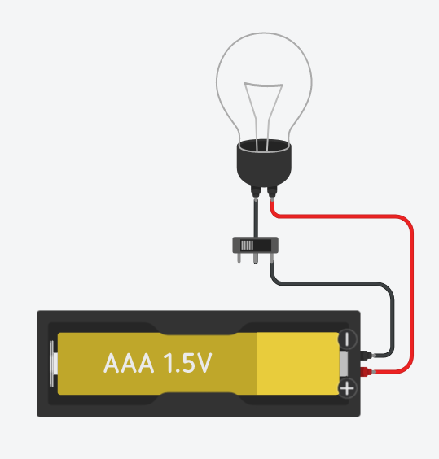

# Day 2 - Computer Concepts

Wednesday - August 25, 2022

## Software vs Hardware

> **Hardware** refers to the **physical structure** and **physical devices** that make up a computer.
> 
>Ei.: the stuff you can touch.

Examples:
- Hard drive (primary storage device)
- CPU (central processing unit)
- Wireless card
- USB ports
- Main memory (RAM)

It can also refer to the peripherals such as:
- Mouse
- Keyboard
- Microphone
- Webcam

> **Software** is any **set of instructions** that tells the hardware how to carry out a specific task.
> 
> Ei.: the stuff you cannot touch.

Examples:
- Operating system
- Games
- Programs that do inventory or manage things

> **Firmware** is a special type of software. Instead of being stored in text form, the instructions are written into the hardware itself (by changing the nature of the transistors within the chip)

Examples:
- The BIOS in your computer's motherboard
- The software managing your microwave or fridge.

## Human to Computer Language

Everything begins at the power power source.

- In computers we send pulses of electricity along a wire. These pulses are either zero or five volts.

There are two states along the wire. Nothing else. In other words, **this is a binary system**.

Similarly to a light bulb, when the voltage is high, the light is ON. If there is no voltage, the light is OFF.

### Characters

Each letter of the English alphabet is mapped to a series of 7 UNIQUE pulses of electricity that form a pattern.  This mapping is called ASCII - American Standard Code for Information interchange. With addition of more pulses, all language symbols can be represented on a computer.  This encoding is called 'unicode'.

In a textbook it would be very hard to write that the letter 

>  A = zero volts, five volts, zero volts, zero volts, zero volts, zero volts, zero volts, five volts 

This is tedious….. Wouldn't it be nice if we used the number "1" to represent 5 volts, and the number "0" to represent zero volts. 

So now I can say 

> A = 01000001  and this the unique sequence for the letter A. 

This use of "0" and "1" to represent voltage is what is used in computers. It is a **BINARY** system.
Note that even though ASCII  uses only 7 pulses to represent a character, most characters use 8 pulses (with a zero at the beginning).

For example, see A = 01000001  and D = 01000100 at the ASCII CHART table below:

| Decimal | Octal | Hex | Binary | Character | HTML | Description |
| ---- | ---- | ---- | -------- | ---- | ----- | ----------- |
| 65   | 101  | 41   | 01000001 | A    | &#65; | Uppercase A |
| 66   | 102  | 42   | 01000010 | B    | &#66; | Uppercase B |
| 67   | 103  | 43   | 01000011 | C    | &#67; | Uppercase C |
| 68   | 104  | 44   | 01000100 | D    | &#68; | Uppercase D |
| 69   | 105  | 45   | 01000101 | E    | &#69; | Uppercase E |

From <https://www.ascii-code.com/> 

### Terminology

In Computer Science we call a "1" or a "0" a **BIT**. 8 Bits together makes up a letter of the English language from the ASCII chart. 

We have "words" to denote quantities as well: 

8 bits is a **byte**, In French we call this "un octet" 

> A byte is the minimum amount of bits you need to represent a character or letter of the alphabet 

4 bits is a **nibble** (half a *byte*)

1024 bytes is a **K** or **KB** **Kilobyte** 

1024 **KB** is a **Megabyte MB** 

1024 MB is a **Gigabyte** or a "**Gig**" 

1024 GB is a **Terabyte** **TB** - etc etc look it up after this…. 

people blur this line and sometimes say 1000 GB is a TB….reality is it is 1024... 

### Numbers

Another thing to think about is we have to use these BITS to represent numbers as well….. Think about this….. We use 0, 1 to represent voltages and we agreed that 8 pulses together could form a letter of the English language….  

But…. What if I need to put in a real number???? How would I represent the number 8 on a computer? Or any number for that mattter? 

The answer is we use the Binary number system 

| Real English Number | Binary Pattern |
| ------------------- | -------------- |
| 0                   | 0 (Zero Volts) |
| 1                   | 1 (5 volts)    |
| 2                   | 10             |
| 3                   | 11             |
| 4                   | 100            |
| 5                   | 101            |
| 6                   | 110            |
| ….and so on         | And so on…     |

 

This is our binary number system and it is often called BASE 2 number system. 

Bit patterns don't always represent letters! Sometimes we need them to represent numeric quantities as well. For example the numeric quantity one hundred and fifty seven. How would I represent this in binary? 

*Answer*: 

10011101 = 157 here we interpret the bit pattern as a number and it equals one hundred and fifty seven. 

  

7   6   5  4  3  2 1  0   bit – notice how you begin by ZERO position   

1   0   0  1  1  1 0  1 = 157 - but how??? Why? 

  

Well let’s think about “regular” numbers or our own decimal system. Think back to what you were taught about regular "decimal numbers" - You were taught that 

  

4352 = The 2 is in the ones column, the 5 is in the tens column, and the 3 is in the hundreds column and 4 is in the thousands column. So it’s 2x1 +  5x10  + 3 x100  + 4 x 1000 which equals 4352! 

In reality you could look at it like this: 

| Digit | Base or Number System | Digit Position  – which becomes exponent | Math expression      | Value |
| ----- | --------------------- | --------------------------------------- | -------------------- | ----- |
| 2     | 10 (decimal)          | 0                                       | = 2 x 100 |   2 |
| 5     | 10 (decimal)          | 1                                       | = 5 x 101 | 50 |
| 3     | 10 (decimal)          | 2                                       | = 3 x 102 | 300   |
| 4     | 10 (decimal)          | 3                                       | = 4 x 103 | 4000  |
|       |                       |                                         | Total sum:           | 4352  |

So now let’s get back to the “how is binary 10011101 = 157 decimal??” issue 

| Digit | Base or Number System | Digit Position  – which becomes exponent | Math expression | Value |
| ----- | --------------------- | --------------------------------------- | --------------- | ----- |
| 1     | 2 (binary)            | 0                                       | = 1 x 20        | 1     |
| 0     | 2 (binary)            | 1                                       | = 0 x 21        | 0     |
| 1     | 2 (binary)            | 2                                       | = 1 x 22        | 4     |
| 1     | 2 (binary)            | 3                                       | = 1 x 23        | 8     |
| 1     | 2 (binary)            | 4                                       | = 1 x 24        | 16    |
| 0     | 2 (binary)            | 5                                       | = 0 x 25        | 0     |
| 0     | 2 (binary)            | 6                                       | = 0 x 26        | 0     |
| 1     | 2 (binary)            | 7                                       | = 1 x 27        | 128   |
|       |                       |                                         | Total sum:      | 157   |

  

Don’t panic if you don’t fully understand binary to decimal and decimal to binary conversion. This will be covered in more detail in your other courses. You should observe that fourth column of the table above is 2 to the power of zero, one, two, three, four, five, and so on. This is why we have “funny” numbers in computer science like 0, 2, 4, 8, 16, 32, 64, 128, 256, 512, 1024, etc…. 

1024 Bits is a “**K**” and often people think a “**K**” means a thousand (like “kilo”). But in Computer Science a “K” is 1024. It has to do with the binary base 2 being raised to the power of 10 

