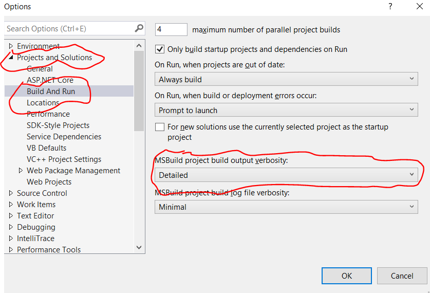

# C# Command Line

This document will describe the steps needed to setup your computer environment so that you can

* Use any editor to create your code (this document assumes Notepad++, but can be adapted for any editor)
* Launch your favourite editor from the command line
* Compile your code from the command line
* Run your executable from the command line

## Assumptions

* Visual Studio is installed
* Notepad++ is installed
* The reader knows how to open a `cmd` window, and type instructions :)

## Life raft

We are going to be changing the `PATH` environment variable.  If we do this wrong, we could mess things up totally, so we need to protect ourselves by saving the current content of the `PATH` environment variable.

### Saving the current *local* `PATH`

1. Open `cmd` window

2. Check out the current content of your local `PATH` (*as opposed to the system `PATH`*)

  > NOTE: the results shown here will probably be different than what you see on your computer)

  ```dos
  SET Key="HKCU\Environment" 
  FOR /F "usebackq tokens=2*" %A IN (`REG QUERY %Key% /v PATH`) DO Set CurrPath=%B
  
  ECHO %CurrPath%
  
  ```

  *typical result*

  ```text
  C:\Users\compsci>SET Key="HKCU\Environment"
  
  C:\Users\compsci>FOR /F "usebackq tokens=2*" %A IN (`REG QUERY %Key% /v PATH`) DO Set CurrPath=%B
  
  C:\Users\compsci>Set CurrPath=C:\Users\compsci\AppData\Local\Microsoft\WindowsApps;C:\Users\compsci\AppData\Local\GitHubDesktop\bin;C:\Users\compsci\.dotnet\tools;
  
  C:\Users\compsci>ECHO %CurrPath%
  C:\Users\compsci\AppData\Local\Microsoft\WindowsApps;C:\Users\compsci\AppData\Local\GitHubDesktop\bin;C:\Users\compsci\.dotnet\tools;
  
  C:\Users\compsci>
  ```

4. Permanently save the value of `path` in a new environment variable using `setx`.  Note the `x`!

   ```dos
   setx OLDPATH "%CurrPath%"
   ```

   *expected result*

   ```dos
   C:\Users\compsci>setx OLDPATH "%CurrPath%"
   
   SUCCESS: Specified value was saved.
   
   C:\Users\compsci>
   ```
   
   This change does not take affect until you open a new `cmd` window
   
5. Close the current `cmd` window.  Open a new `cmd` window.

6. Verify that `OLDPATH` is set correctly by comparing to what is stored in the registry

   ```dos
   SET Key="HKCU\Environment" 
   FOR /F "usebackq tokens=2*" %A IN (`REG QUERY %Key% /v PATH`) DO Set CurrPath=%B
   
   if "%CurrPath%"== "%OLDPATH%" echo "It worked"
   
   ```
   
   *expected result*
   
   ```text
   C:\Users\compsci>SET Key="HKCU\Environment"
   
   C:\Users\compsci>FOR /F "usebackq tokens=2*" %A IN (`REG QUERY %Key% /v PATH`) DO Set CurrPath=%B
   
   C:\Users\compsci>Set CurrPath=C:\Users\compsci\AppData\Local\Microsoft\WindowsApps;C:\Users\compsci\AppData\Local\GitHubDesktop\bin;C:\Users\compsci\.dotnet\tools;
   
   C:\Users\compsci>if "%CurrPath%"== "%OLDPATH%" echo "It worked"
   "It worked"
   
   C:\Users\compsci>
   ```
   
   
   
   ### IF `"It worked"` DOES NOT PRINT, THEN DO NOT CONTINUE !! 


## Setting up an editor

To use the command line, it will be necessary to find where the programs that you need are located.  Once found, we will set the `PATH` environment variable so that the programs can be executed simply.

### Notepad++

#### Setting the path

1. Open `cmd` window

2. In the command line window, navigate to the `C:\Program files` directory

   ```dos
   cd "c:\Program Files"
   c:\
   ```

   > Hint: you do not have to type the full name of the path... if you type `cd c:\Pro` and hit tab, it will cycle through all directories that match what you have typed.  Stop when you get to the correct directory.

   *typical output*

   ```text
   Microsoft Windows [Version 10.0.19041.746]
   (c) 2020 Microsoft Corporation. All rights reserved.
   
   C:\Users\compsci>cd "C:\Program Files"
   
   C:\Program Files>
   ```

3. Search for the notepad++ executable

   ```dos
   dir/s notepad*.exe
   ```

   *typical output*

   ```text
   C:\Program Files>dir/s notepad*.exe
    Volume in drive C is Windows
    Volume Serial Number is AC7E-33AA
   
    Directory of C:\Program Files\Notepad++
   
   11/01/2020  08:21 PM         3,584,656 notepad++.exe
                  1 File(s)      3,584,656 bytes
   
        Total Files Listed:
                  1 File(s)      3,584,656 bytes
                  0 Dir(s)  280,177,975,296 bytes free
   
   C:\Program Files>
   ```

   If you do not see `notepad++.exe` in your search, 
   
   * Go back to step two, but start in the directory  `"c:\Program Files (x86)"`
   
4. Once you have found the `notepad++` executable, take note of the directory (see line 5 in the output above).

5. Add this directory to the existing path 

   1. use the path *you* found, not necessarily the one I found... see line 4.)
   
   ```dos
   SET Key="HKCU\Environment"
   FOR /F "usebackq tokens=2*" %A IN (`REG QUERY %Key% /v PATH`) DO Set CurrPath=%B
   
   SETX PATH "%CurrPath%;C:\Program Files\Notepad++"
   
   ```

#### Verify
Close the current `cmd` window. Open a new `cmd` window

```dos
   echo %path%
```

   You should see your new file at the end of the path

   *expected result*

   ```text
   C:\Users\compsci>echo %path%
   C:\Program Files (x86)\Common Files\Oracle\Java\javapath;
   ... lines removed for clarity ...
   C:\Users\compsci\.dotnet\tools;C:\Program Files\Notepad++
   ```

#### Test

See if you can open a new c-sharp file using `notepad++` via the command line

```dos
notepad++ newfile.cs
```

Notepad++ should open.

If this doesn't work, close your `cmd` window, and start again.


## Setting up the Compiler

### Finding the correct compiler

There can be many version of the c-sharp compiler on your computer, so we need to find the one that is currently be used by `Visual Studio` 

>  You need to have Visual Studio for these steps to work, but there *is* a version of this compiler that is available, even if you don't have `Visual Studio`.  Use `google` to find information.

1. Open Visual Studio and either open, or create, a console project.

2. Set the `build verbosity` to  *detailed*

   1. Go to the Tools menu

   2. Select Options (opens a dialog box)

   3. Select Projects and Solutions

   4. Under Projects and Solutions, select Build and Run

   5. When this has been selected, there are options shown on the right, set `MSBuild project build output verbosity` to *detailed*

       
   
3. Rebuild your solution.  **`Rebuild Solution`** , don't just `build`.  This is important!

4. Check the output window (`CTRL-W` `O`, or Menu-> View-> Output Window)

   1. In the output window, search for `csc`.

      * Select the output window. Then`ctrl-F`.  In the search window, make sure that you search through the `current window`.  Otherwise, you might be searching in the wrong place!

   2. Continue searching until you find `Task Csc`.

      ```text
      Task "Csc"
      C:\Program Files (x86)\Microsoft Visual Studio\2019\Enterprise\MSBuild\Current\Bin\Roslyn\csc.exe
      ```

   3. The next line contains the full path that `Visual Studio` uses to compile your c-sharp files.
   Take note of this path!

#### Set your path

1. Add the above directory (do not include the `csc.exe` part) to the existing path (NOTE: this is all one line, not two)

Use the path **you** found, not the path that I found (see line 4)

```dos
SET Key="HKCU\Environment"
FOR /F "usebackq tokens=2*" %A IN (`REG QUERY %Key% /v PATH`) DO Set CurrPath=%B

SETX PATH "%CurrPath%;C:\Program Files (x86)\Microsoft Visual Studio\2019\Enterprise\MSBuild\Current\Bin\Roslyn"

```

### Verify your path

Close the current `cmd` window.  Open a new `cmd` window.

   ```dos
   echo %path%
   ```

   You should see your new file at the end of the path

   *expected result*

   ```text
   c:\Users\compsci>set path=%path%;C:\Program Files (x86)\Microsoft Visual Studio\2019\Enterprise\MSBuild\Current\Bin\Roslyn
   
   c:\Users\compsci>echo %path%
   C:\Program Files (x86)\Common Files\Oracle\Java\javapath;
   ... lines removed for clarity ...
   C:\Users\compsci\.dotnet\tools;C:\Program Files\Notepad++;C:\Program Files (x86)\Microsoft Visual Studio\2019\Enterprise\MSBuild\Current\Bin\Roslyn
   
   c:\Users\compsci>
   ```

#### Test

See if you can compile and run a c-sharp program.

```dos
   cd \Users\your_user_name
   notepad++ newfile.cs
```

Notepad++ should open.

1.  In Notepad++, enter the following code into `newfile.cs`, and save your file

   ```csharp
      using System;
      
      namespace TestingCLI
      {
          class HelloWorld
          {
              static void Main(string[] args)
              {
                  Console.Write("Enter your name ");
      			string name = Console.ReadLine();
      			Console.WriteLine("Hello " + name);
              }
          }
      }
      
   ```

2. Compile

   ```dos
      csc newfile.cs
   ```

   *expected output*

   ```text
      c:\Users\compsci>csc newfile.cs
      Microsoft (R) Visual C# Compiler version 3.7.0-6.20375.2 (34202cc2)
      Copyright (C) Microsoft Corporation. All rights reserved.
      
      c:\Users\compsci>
   ```

3. Run

   ```dos
      newfile
   ```

   *expected output*

   ```text
      c:\Users\compsci>newfile
      Enter your name sandy
      Hello sandy
      
      c:\Users\compsci>
   ```

## Recover

If all hell broke loose,

```dos
setx path %OLDPATH%
```

Close `cmd` window.


# References

how to properly change your path (you need to go to the middle of the html page to find the sub-section 'safer setx'). [safer `setx](https://stackoverflow.com/questions/9546324/adding-a-directory-to-the-path-environment-variable-in-windows/41379378#41379378)

writing stuff to the registry [setx](https://ss64.com/nt/setx.html)

Create a project, and use build to create your executable [Walkthrough: Use MSBuild](https://docs.microsoft.com/en-us/visualstudio/msbuild/walkthrough-using-msbuild?view=vs-2019)

How to use the csc compiler [Compiling C# Source Code Files](http://www.herongyang.com/C-Sharp/Compilation-C-Sharp-Source-Code-Files.html)

how to find the csc compiler used by your version of Visual Studio [stack overflow: csc compiler for C# code](https://stackoverflow.com/questions/50939836/csc-compiler-for-c-sharp-code)

mdbg is a command line debugger [stack overflow: mdbg can't debug my hello world program](https://stackoverflow.com/questions/3885645/mdbg-cant-debug-my-hello-world-program)

A different debugger for Windows programs [getting started with WinDbg](https://docs.microsoft.com/en-us/windows-hardware/drivers/debugger/getting-started-with-windbg)

A console based debugger [mdbg](https://www.exefiles.com/en/exe/mdbg-exe/)

[C# compiler options](https://docs.microsoft.com/en-us/dotnet/csharp/language-reference/compiler-options/)

